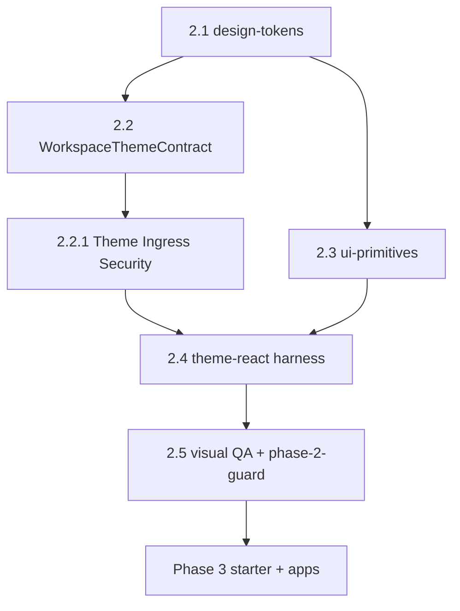

# AI-EXECUTION DOCUMENT — Phase 2 Design System & Enterprise Visual Layer

```yaml
document_meta:
  source_file: docs/phase-2-design-system.md
  canonical_markdoc: docs/phase-2-design-system.mdoc
  transformation_version: "2026-06-03"
  execution_priority: REPO_SCRIPTS_OVER_STALE_MD_WHERE_DOC_DRIFT
  doc_revision: "2026-06-03-phase-2-ai-exec"
  forensic_audit: docs/audits/phase-2-zero-debt-forensic-audit-2026-06-02.mdoc
  integrity_audit: docs/audits/phase-2-documentation-integrity-2026-06-03.mdoc
```

---

## STEP 1 — PHASE DETECTION (COMPLETE)

```yaml
phase_id: "2"
phase_name: "Design System & Enterprise Visual Layer"
north_star: "Platform semantics = generic tokens · Workspace brand = injectable theme · Tenant = visual boundary hook (phase 4)"
document_status_claim: "Hard outputs §4.1 delivered; phase-2:gate green; Security Seal via restricted subpath exports (SB-01 remediated)"
document_closure_claim: "Phase 2 technical DoD met for tokens + primitives + theme contract + harness; Select/Checkbox backlog → phase 3"
prerequisite_phase: "1"
prerequisite_gate: "pnpm run phase-1:gate — ALL exit criteria PASS (platform-core ≥132, g1–g13)"
legacy_truth: "@tour/ui tokens + subset components port to design-tokens / ui-primitives — NOT Denali widgets in core"
subphases:
  - id: "2.1"
    name: "packages/design-tokens"
    pr_label: "Phase: 2.1"
    max_lines_approx: 600
    ci_scope: build + validate-design-tokens
    depends_on: ["phase_1_DONE"]
  - id: "2.2"
    name: "WorkspaceThemeContract in workspace-sdk"
    pr_label: "Phase: 2.2"
    max_lines_approx: 400
    ci_scope: workspace-sdk test
    depends_on: ["2.1"]
  - id: "2.2.1"
    name: "Theme Ingress Security (nested under 2.2)"
    pr_label: "Phase: 2.2"
    parent_subphase: "2.2"
    max_lines_approx: 200
    ci_scope: workspace-sdk theme ingress tests T-1–T-7
    depends_on: ["2.2"]
    note: "Not a separate PR label — deliver with 2.2; rules T-1 through T-7 enforced in assertWorkspacePlugin + parseWorkspacePluginFromStorage"
  - id: "2.3"
    name: "packages/ui-primitives"
    pr_label: "Phase: 2.3"
    max_lines_approx: 800
    ci_scope: build + test + test:visual
    depends_on: ["2.1"]
    overlap_note: "May start after 2.1; must not block on 2.2 for primitive CSS work"
  - id: "2.4"
    name: "ThemeProvider chain (theme-react harness)"
    pr_label: "Phase: 2.4"
    max_lines_approx: 500
    ci_scope: theme-react build + test
    depends_on: ["2.2", "2.3"]
    implementation_path: "packages/theme-react (option A — recommended)"
  - id: "2.5"
    name: "Visual QA + phase-2-guard"
    pr_label: "Phase: 2.5"
    max_lines_approx: 300
    ci_scope: phase-2:gate + reports/phase-2-gate-*.json
    depends_on: ["2.1", "2.2", "2.3", "2.4"]
phase_detection_blocker: null
```

---

## STATE MODEL

```yaml
state_variables:
  current_phase:
    type: enum
    allowed: ["0", "1", "2", "3", "4", "5", "6", "7"]
    initial: "2"
  current_subphase:
    type: enum
    allowed: ["2.1", "2.2", "2.2.1", "2.3", "2.4", "2.5", "DONE"]
    initial: "2.1"
  phase_2_mode:
    type: enum
    allowed: ["visual_enterprise_layer"]
    value: "visual_enterprise_layer"
    meaning: "CSS tokens + React primitives + theme contract — NO apps/api production, NO Denali package"

transition_rules:
  - from_subphase: "2.1"
    to_subphase: "2.2"
    condition: ALL exit_criteria_2_1 PASS
  - from_subphase: "2.2"
    to_subphase: "2.2.1"
    condition: "WorkspaceThemeContract + plugin.theme field merged — ingress rules T-1–T-7 in same PR or immediate follow-up"
    enforcement_note: "2.2.1 is nested — gate requires T-1–T-7 tests before 2.5"
  - from_subphase: "2.2.1"
    to_subphase: "2.3"
    condition: ALL exit_criteria_2_2 AND exit_criteria_2_2_1 PASS
    parallel_allowed: "2.3 may have started after 2.1 if only CSS primitives"
  - from_subphase: "2.3"
    to_subphase: "2.4"
    condition: ALL exit_criteria_2_3 PASS AND subphase 2.2.1 PASS
  - from_subphase: "2.4"
    to_subphase: "2.5"
    condition: ALL exit_criteria_2_4 PASS
  - from_subphase: "2.5"
    to_subphase: "DONE"
    condition: ALL exit_criteria_2_5 PASS AND phase_3_entry_checklist technical items PASS
  - forbidden_transition:
      action: "start apps/web production wizard shell"
      blocked_until: "current_subphase == DONE AND phase_3_entry_checklist ALL PASS"
  - forbidden_transition:
      action: "import @app-tour/ui-primitives barrel root"
      blocked_always: true
      replacement: "subpaths only — button, input, field-shell, alert, badge"
  - forbidden_transition:
      action: "platform-core imports design-tokens or ui-primitives"
      blocked_always: true
      enforcement: p2_platform_core_no_tokens + depcruise downstream-only
```

---

## SUBPHASE DAG



```yaml
dag_edges:
  - { from: "2.1", to: "2.2" }
  - { from: "2.2", to: "2.2.1", nested: true }
  - { from: "2.1", to: "2.3" }
  - { from: "2.2.1", to: "2.4" }
  - { from: "2.3", to: "2.4" }
  - { from: "2.4", to: "2.5" }
  - { from: "2.5", to: "Phase 3.0 CASL + 3.1 starter" }
allowed_overlap:
  - "2.5 guard test scaffolding parallel with late 2.3 primitive PRs (guard-only)"
forbidden_overlap:
  - action: "apps/web production shell (phase 3)"
  - action: "packages/workspaces/denali (phase 6)"
  - action: "platform-core behavior change for RuleEngine / validateCanonical (phase 1 frozen)"
  - action: "merge subphases 2.1–2.4 in one PR without architect exception"
pr_rule:
  - rule: "one subphase = one PR (2.2.1 ships inside 2.2 PR)"
  - rule: "PR title/body MUST include label matching subphase id e.g. Phase: 2.3"
  - rule: "FORBIDDEN fast-forward multiple subphases in one merge"
barrel_import_law:
  forbidden: '@app-tour/ui-primitives'
  allowed_subpaths: [button, input, field-shell, alert, badge]
  enforcement: [guard:import-boundary, audit-boundary, p2_ui_primitives_no_barrel]
```

---

## FORENSIC TRUTH — §13 AUDIT SB-01 / SB-02 / SB-03

```yaml
forensic_truth_rules:
  - id: FT-P2-SB-01
    claim: "theme-react ./internal exported unvalidated DOM mappers — docs claimed Safety Seal"
    severity: CRITICAL
    remediation: "Removed ./internal export; deleted src/internal.ts"
    enforcement: p2_theme_react_no_internal_export
    guard_ids: [p2_theme_react_no_internal_export]
    status: REMEDIATED
  - id: FT-P2-SB-02
    claim: "dist/** deep-import surface — private meant not on index only"
    severity: HIGH
    remediation: "L-01 exports = . only; files whitelist; verify:exports; guard:artifact-surface in phase-2:gate"
    enforcement: [p2_artifact_surface_guard, p2_theme_react_export_allowlist_l01]
    guard_ids: [p2_artifact_surface_guard, p2_theme_react_export_allowlist_l01]
    status: REMEDIATED
    note: "ui-primitives uses subpath exports only — no barrel dist/index.js"
  - id: FT-P2-SB-03
    claim: "Harness helpers on production theme-react . export"
    severity: HIGH
    remediation: "Stripped harness from index.ts; harness not in exports"
    enforcement: p2_theme_react_export_allowlist_l01
    guard_ids: [p2_theme_react_export_allowlist_l01]
    status: REMEDIATED
  - id: FT-P2-01
    claim: "Phase 2 Security Seal = Satisfied via restricted subpath exports — not Fully satisfied until SB remediated"
    repo: "MAP Security & Compliance + audit history §13.2"
    enforcement: "all p2_* PASS + zero barrel violations"
  - id: FT-P2-02
    claim: "platform-core never reads theme CSS"
    repo: "parseWorkspacePluginFromStorage includeTheme:false at engine boundary"
    enforcement: p2_platform_core_no_tokens + phase-1 headless contracts
    guard_ids: [p2_platform_core_no_tokens]
  - id: FT-P2-03
    claim: "CASL before theme ingress at runtime (phase 3+)"
    repo: "phase 2 proves CSS safety; phase 3 proves actor authorization"
    enforcement: "providers.spec.tsx deny → ingress not called"
    status: PHASE_3_REQUIRED
  - id: FT-P2-04
    claim: "Select + Checkbox Complete in phase 2"
    repo: "BACKLOG — phase 3 — NOT gate blockers per §13.1"
    status: BACKLOG_NOT_COMPLETE
  - id: FT-P2-05
    claim: "workspace-sdk test floor 133 in stale Appendix G table"
    repo: "gate-thresholds.mjs WORKSPACE_SDK_TEST_MIN.phase2 = 50"
    enforcement: p2_workspace_sdk_tests
    resolution: REPO threshold 50 — not 133
  - id: FT-P2-06
    claim: "rgba in --shadow-* in primitives.css fails gate"
    repo: "P2-006 accepted backlog — token definition layer only"
    status: BACKLOG_ACCEPTED
```

---

## SECTION 1 — WHY PHASE 2 BEFORE APPS AND DENALI (§1)

```yaml
platform_order_law:
  phase_0: "workspace-sdk contract"
  phase_1: "platform-core headless — RenderPlan without color"
  phase_2: "visual enterprise layer — THIS DOCUMENT"
  phase_3: "starter workspace + apps/web shell + CASL ability.ts"
  phase_4: "tenant-kernel RLS + TenantThemeProvider production"
  phase_6: "Denali plugin — widgets + theme/tokens.css in workspace"

product_rule: "Denali = first product workspace — NOT first visual layer"
failure_if_skip_phase_2:
  - DenaliFieldRenderer pattern returns
  - hardcoded colors in shell
  - shell cannot stay generic

legacy_visual_failures:
  - problem: "@tour/ui + feature CSS var(--color-*) without platform/workspace split"
    phase_2_rule: "three token levels §5"
  - problem: "Denali widgets inside feature tree"
    phase_2_rule: "composite only in packages/workspaces/* phase 6"
  - problem: "tenant + workspace theme merged"
    phase_2_rule: "TenantThemeConfig phase 4 vs WorkspaceThemeContract phase 2"
  - problem: "no WorkspacePlugin.theme in new contract"
    phase_2_rule: "optional theme on WorkspacePlugin in SDK"

phase_2_one_liner: >
  Every generic component and every workspace plugin can have enterprise appearance
  without Denali import and without color in platform-core —
  only semantic CSS variables and theme contract.

visual_layer_architecture:
  design_tokens: "platform CSS source of truth"
  workspace_sdk: "WorkspaceThemeContract + validation — no design-tokens dep"
  ui_primitives: "semantic-only CSS Modules — subpath exports"
  theme_react: "PlatformThemeProvider → TenantThemeProvider → WorkspaceThemeProvider"
  apps_web: "phase 3+ consumes above"
```

---

## SECTION 2 — ENTERPRISE STANDARDS AS RULES (§2)

```yaml
enterprise_design_rules:
  microkernel_contribution:
    - id: E-2.1-01
      rule: "Stable core platform-core + WorkspacePlugin; capabilities swappable"
      source: "VS Code / Shopify embedded apps pattern"
    - id: E-2.1-02
      rule: "Plugins do not wire directly to plugins — host props + future event bus"
      phase: "4–5 for events"
    - id: E-2.1-03
      rule: "Manifest contract before loader — WorkspacePlugin + contractVersion MAP §8"
  multi_tenant_visual:
    - id: E-2.2-01
      rule: "SaaS pool: shared bundle + per-tenant CSS variables on subtree"
      phase: 4
    - id: E-2.2-02
      rule: "Workspace brand: plugin theme.cssVariables + optional stylesheet"
      phase: "2–3"
    - id: E-2.2-03
      rule: "Enterprise silo: dedicated DB/schema — NOT UI fork"
      phase: 7
    - id: E-2.2-04
      rule: "Tenant A must not load Tenant B stylesheet — scope [data-tenant-id] or provider subtree"
      phase: 4
    - id: E-2.2-05
      rule: "tenantId in phase 2 ONLY harness/test simulation — production enforcement phase 4"
  trust_model_ui:
    - id: E-2.3-01
      rule: "Phase 2 first-party only: @app-tour/design-tokens, @app-tour/ui-primitives"
    - id: E-2.3-02
      rule: "NO runtime npm marketplace plugins in phase 2"
    - id: E-2.3-03
      rule: "Third-party iframe/postMessage or signed manifest — after platform DoD MAP §9"
  design_tokens_w3c_practice:
    - id: E-2.4-01
      rule: "Primitives: spacing, radius, font-size, raw palette — stable names mutable values"
    - id: E-2.4-02
      rule: "Semantics: --color-surface, --color-text-primary — components read semantics ONLY"
    - id: E-2.4-03
      rule: "Workspace brand: --ws-color-accent, --ws-font-display — prefix --ws-"
    - id: E-2.4-04
      rule: "Dark mode: html class theme-light / theme-dark — legacy port pattern"
  accessibility_i18n_minimum:
    - id: E-2.5-01
      rule: "Focus ring via semantic --color-focus-ring"
    - id: E-2.5-02
      rule: "Contrast AA text/primary light AND dark — document in playground"
    - id: E-2.5-03
      rule: "RTL: logical properties margin-inline in primitives; Persian font phase 3 next/font"
    - id: E-2.5-04
      rule: "Motion: respect prefers-reduced-motion in token/harness"
  performance_budget_baseline:
    - id: E-2.6-01
      metric: "CSS tokens bundle gzip"
      target: "≤ 15 KB"
      note: "CSS only — no fonts in package"
    - id: E-2.6-02
      metric: "ui-primitives tree-shake"
      target: "each primitive separate package.json export subpath"
    - id: E-2.6-03
      metric: "First paint harness"
      target: "no network — Storybook/playground static"
```

---

## SECTION 3 — LEGACY PORT TABLE + ANTI-PATTERNS V1–V7 (§3)

```yaml
legacy_port_table:
  - asset: "Token CSS light/dark"
    legacy_path: legacy/packages/ui/src/tokens/*.css
    phase_2: port
    destination: packages/design-tokens
  - asset: validate-design-tokens
    legacy_path: legacy/scripts/validate-design-tokens.js
    phase_2: rewrite
    destination: scripts/guards/validate-design-tokens.mjs + tokens.meta.json
    forbidden_source: [legacy/scripts/validate-design-tokens.js, docs/10-product/design_system.md]
  - asset: "Button, Input, FormField, Alert, Badge, Card"
    legacy_path: legacy/packages/ui/src/components/*
    phase_2: subset
    destination: packages/ui-primitives
  - asset: TenantThemeConfig shape
    legacy_path: legacy/libs/core/.../tenant-config.ts
    phase_2: types_only
    destination: "WorkspaceThemeContract inspiration + phase 4 tenant"
  - asset: build-tenant-theme-style
    legacy_path: legacy/apps/web/lib/tenant/
    phase_2: defer_algorithm
    destination: "phase 4 TenantThemeProvider"
  - asset: "ThemeProvider / ThemeInjector"
    legacy_path: "legacy/apps/web/lib/theme, lib/tenant"
    phase_2: defer
    destination: "phase 3–4 apps/web"
  - asset: "AppLayout, WorkspaceShell"
    legacy_path: "legacy/apps/web, @tour/ui/layout"
    phase_2: defer
    destination: "phase 3 shell"
  - asset: JalaliDatePicker
    legacy_path: "@tour/ui"
    phase_2: defer
    destination: "phase 6 Denali or phase 3 if starter needs"
  - asset: Tailwind
    legacy_path: none
    phase_2: forbidden
    destination: "CSS Modules + vars"
  - asset: Tour catalog themes
    legacy_path: settings/tour-themes
    phase_2: forbidden
    destination: "domain data phase 6"

anti_patterns_pre_pr_check_ALL_must_be_false:
  - id: V1
    pattern: "--denali-* or denali-green in new packages"
    detect: 'rg -i denali packages/design-tokens packages/ui-primitives packages/theme-react/src'
    expect: 0 lines
    guard: p2_no_denali
    action: revert
  - id: V2
    pattern: "import @tour/ui from app-tour"
    detect: pnpm run guard:architecture
    action: forbidden
  - id: V3
    pattern: "hex color in platform-core"
    detect: 'rg "#[0-9a-fA-F]{3,8}" packages/platform-core'
    expect: 0
    action: revert
  - id: V4
    pattern: "primitive without semantic token"
    detect: code review
    rule: "only var(--color-*) in component modules"
    action: fix
  - id: V5
    pattern: "static import workspaces/denali in ui-primitives"
    detect: pnpm run guard:architecture
    rule: ui-primitives-no-workspaces
    action: revert
  - id: V6
    pattern: "WorkspacePlugin theme without validation"
    detect: "assertWorkspacePlugin extended + SDK tests"
    action: extend validation
  - id: V7
    pattern: "contrast break in dark — token removed"
    detect: visual QA Storybook light/dark
    action: block merge

barrel_ban_P3_E_BARREL:
  forbidden_import: '@app-tour/ui-primitives'
  allowed_subpaths: [button, input, field-shell, alert, badge]
  scripts:
    - pnpm run guard:import-boundary
    - pnpm run audit-boundary
  guard: p2_ui_primitives_no_barrel
  forensic: SB-02 leakage risk from barrel pulling undeclared dist/**
```

---

## SECTION 4 — HARD / SOFT OUTPUTS (§4)

```yaml
hard_outputs_delivered:
  - packages/design-tokens: "build + export CSS + tokens.meta.json"
  - packages/ui-primitives: "Button, Input, FieldShell, Alert — Complete §13"
  - packages/ui-primitives_backlog: "Select, Checkbox — phase 3 NOT Complete"
  - WorkspaceThemeContract: "on WorkspacePlugin optional theme"
  - assertWorkspacePlugin: "validates theme when present"
  - packages/theme-react: "provider chain path A — NOT apps/web-harness required"
  - phase-2-guard: "p2_* checks + reports/phase-2-gate-*.json"
  - dependency-cruiser: "design-tokens / ui-primitives / theme-react rules"
  - forbidden_in_phase_2: [apps/api, Postgres, packages/workspaces/denali]

soft_outputs:
  - Storybook_or_playground: "Storybook in ui-primitives — sanity visual"
  - render_plan_mapping_table: "§5.4 in doc — process may remain open"
  - reports: "reports/phase-2-gate-YYYY-MM-DD.json after phase-2:gate"

dod_one_liner: >
  Starter can render in phase 3 with semantic tokens and primitives
  without workspace-specific color in core;
  workspace theme injects only from plugin.
```

---

## SECTION 5 — MULTI-LAYER THEME ARCHITECTURE (§5)

```yaml
token_levels:
  level_1_platform:
    package: "@app-tour/design-tokens"
    variables: ["--spacing-*", "--font-size-*", "--color-surface", "--color-text-*"]
  level_2_tenant:
    phase: 4
    variables: ["logo", "accent override", "--color-primary* from TenantThemeConfig"]
    phase_2_role: "types stub only — mock TenantThemeProvider in harness"
  level_3_workspace:
    contract: WorkspaceThemeContract
    variables: ["--ws-color-accent", "--ws-font-display", optionalStylesheet]
    owner: WorkspacePlugin.theme

provider_chain_target:
  PlatformThemeProvider:
    imports: '@app-tour/design-tokens/styles.css'
    props: { mode: "light" | "dark" }
  TenantThemeProvider:
    props: TenantThemeConfig
    phase_2: "static test props — no BFF"
  WorkspaceThemeProvider:
    props: WorkspaceThemeContract
    dom: 'div data-workspace-theme={theme.id} + normalized cssVariables style'
    phase_3: "optionalStylesheet link tag"
    phase_3_security: "ability.can(access) BEFORE validateWorkspaceThemeIngress"

render_plan_to_ui_mapping:
  - kind: text
    primitive: "Input / Textarea"
    uiHints: "multiline?: boolean"
  - kind: number
    primitive: "Input type number"
    uiHints: [min, max]
  - kind: date
    primitive: "placeholder Input"
    uiHints: "Jalali phase 6"
  - kind: enum
    primitive: Select
    uiHints: options from registry
    backlog: "Select component phase 3"
  - kind: boolean
    primitive: Checkbox
    backlog: "Checkbox component phase 3"
  - kind: composite
    primitive: "FieldShell + slot"
    uiHints: "compositeId → plugin widget phase 6"

platform_core_rule: "platform-core does not know color; uiHints opaque for web renderer registry"

theme_ingress_two_layers:
  contract_validation:
    package: workspace-sdk
    when: "plugin load / parseWorkspacePluginFromStorage"
    rules: T-1 through T-7
  runtime_ingress:
    package: theme-react
    when: "before DOM"
    flow: validateWorkspaceThemeIngress → snapshotWorkspaceTheme
  handoff_order_phase_3:
    - defineAbilityFor(context)
    - ability.can(access, workspaceThemeSubject) — deny skips ingress
    - validateWorkspaceThemeIngress
    - snapshotWorkspaceTheme → WorkspaceThemeProvider
  forbidden_order: "ingress before CASL"
```

---

## THEME RULES T-1 THROUGH T-7 (§8.2.1)

```yaml
theme_validation_rules:
  mandatory_path: |
    parseWorkspacePluginFromStorage(raw)
      → ingress sanitizer (existing)
      → assertWorkspacePlugin(sanitized)  // includes theme when present
  platform_core_boundary: |
    PlatformWizardEngine.tryFromPlugin / create+tryInit
    parseWorkspacePluginFromStorage(..., { includeTheme: false })
    theme validated in SDK but IGNORED in engine — no CSS read

  - id: T-1
    field: theme.id
    requirement: "non-empty ASCII slug"
    error_code: INVALID_THEME_ID
    test_matrix_row: T-1
  - id: T-2
    field: theme.version
    requirement: "finite number ≥ 0"
    error_code: INVALID_THEME_VERSION
    test_matrix_row: T-2
  - id: T-3
    field: cssVariables keys count
    requirement: "Object.keys(cssVariables).length ≤ 64"
    error_code: THEME_CSS_VARIABLE_LIMIT
    test_scenario: "65th key rejects"
    test_matrix_row: T-2
  - id: T-4
    field: cssVariables keys
    requirement: "after normalize prefix --ws-; ASCII [a-z0-9-] only"
    error_code: INVALID_THEME_CSS_KEY
    test_scenario: "theme without --ws- prefix rejects; homoglyph rejects"
    test_matrix_row: [T-1, T-7]
  - id: T-5
    field: cssVariables values
    requirement: "string length ≤ 4096"
    error_code: INVALID_THEME_CSS_VALUE
  - id: T-6
    field: cssVariables values safety
    requirement: "forbidden substrings: expression(, url(javascript, url(data:, <, >"
    error_code: UNSAFE_THEME_CSS_VALUE
    test_scenario: "value with expression( rejects"
    test_matrix_row: T-3
  - id: T-7
    field: optionalStylesheet
    requirement: "if present: relative path; no ..; no ://"
    error_code: INVALID_THEME_STYLESHEET
    test_scenario: '../../../etc/passwd rejects'
    test_matrix_row: T-5

implementation_files:
  contract: packages/workspace-sdk/src/theme/workspace-theme.contract.ts
  plugin_field: packages/workspace-sdk/src/workspace-plugin.contract.ts
  validation: packages/workspace-sdk/src/workspace-plugin-validation.ts
  parse: packages/workspace-sdk/src/parse-workspace-plugin.ts
  starter_preset: packages/workspace-sdk/src/reference/starter-workspace.plugin.ts
  tests:
    - packages/workspace-sdk/test/theme.spec.ts
    - packages/workspace-sdk/test/theme-css-value-safety.spec.ts
  theme_react_ingress: packages/theme-react/src/ingress/theme-ingress-guard.ts
```

---

## SUBPHASE 2.1 — design-tokens (§7)

```yaml
subphase: "2.1"
goal: "Platform visual source of truth — independent of React and workspace"

package_tree:
  - packages/design-tokens/package.json
  - packages/design-tokens/src/primitives.css
  - packages/design-tokens/src/semantics.css
  - packages/design-tokens/src/themes/light.css
  - packages/design-tokens/src/themes/dark.css
  - packages/design-tokens/src/index.css
  - packages/design-tokens/dist/index.css
  - packages/design-tokens/tokens.meta.json

naming_layers:
  primitive_prefixes: ["--scale-", "--space-"]
  semantic_prefixes: ["--color-", "--font-"]
  workspace_prefix: "--ws-"
  workspace_rule: "NEVER defined inside design-tokens package"

legacy_port_source:
  css: legacy/packages/ui/src/tokens/light.css and dark.css
  port_changes:
    - "remove --color-denali-* → generic semantic"
    - "split primitives vs semantics files"
    - "html theme-light / theme-dark classes"

tokens_meta_json_schema:
  schemaVersion: 1
  themes:
    light:
      requiredVariables: ["--color-surface", "--color-text-primary"]
    dark:
      requiredVariables: ["--color-surface", "--color-text-primary"]
  sharedVariables: ["--spacing-4", "--radius-sm"]
  forbiddenPatterns: [denali, tour-green]

validate_design_tokens_behavior:
  script: scripts/guards/validate-design-tokens.mjs
  css_files_scanned:
    - src/primitives.css
    - src/semantics.css
    - src/themes/light.css
    - src/themes/dark.css
  steps:
    - "every requiredVariables + sharedVariables defined in combined CSS"
    - "every defined --* in CSS registered in meta — no orphans"
    - "forbiddenPatterns in var names → FAIL"
    - "optional TOKEN_COMPARE_REF — no token name removed vs base branch"

depcruise_rules_phase_2_1:
  - name: design-tokens-isolated
    from: "^packages/design-tokens"
    to: "^packages/(?!design-tokens)"
  - name: design-tokens-no-workspaces
  - name: design-tokens-no-apps

tasks_ordered:
  - id: T-2.1-01
    action: "scaffold @app-tour/design-tokens package.json"
  - id: T-2.1-02
    action: "port light/dark + semantics from legacy tokens"
  - id: T-2.1-03
    action: "author tokens.meta.json complete vs CSS"
  - id: T-2.1-04
    action: "wire build → dist/index.css"
  - id: T-2.1-05
    action: "add depcruise isolation rules in dependency-cruiser.config.js"

exit_criteria_2_1:
  - id: EC-21-1
    command: pnpm --filter @app-tour/design-tokens run build
    expect: exit 0
    artifact: packages/design-tokens/dist/index.css
  - id: EC-21-2
    check: tokens.meta.json complete and aligned with ported CSS
  - id: EC-21-3
    check: 'harness import "@app-tour/design-tokens/styles.css"'
  - id: EC-21-4
    command: pnpm run validate-design-tokens
    expect: exit 0
    guard: p2_validate_design_tokens
  - id: EC-21-5
    command: 'rg -i denali packages/design-tokens'
    expect: 0 lines
  - id: EC-21-6
    command: pnpm run guard:architecture
    expect: "design-tokens-isolated PASS"
  - id: EC-21-7
    check: p2_design_tokens_dist PASS after build
```

---

## SUBPHASE 2.2 — WorkspaceThemeContract (§8)

```yaml
subphase: "2.2"
goal: "Workspace brand contract — validate, versioned, no React"

tasks_ordered:
  - id: T-2.2-01
    file: workspace-sdk/src/theme/workspace-theme.contract.ts
    action: define WorkspaceThemeContract
  - id: T-2.2-02
    file: workspace-sdk/src/workspace-plugin.contract.ts
    action: "theme?: WorkspaceThemeContract on WorkspacePlugin"
  - id: T-2.2-03
    file: workspace-sdk/src/workspace-plugin-validation.ts
    action: "validation keys --ws-*, finite version, string values"
  - id: T-2.2-04
    file: workspace-sdk/src/reference/starter-workspace.plugin.ts
    action: 'starterWorkspacePlugin theme: workspaceThemePresets["platform-primary"]'
  - id: T-2.2-05
    file: workspace-sdk/test/theme.spec.ts
    action: "unit tests reject invalid accept valid"
  - id: T-2.2-06
    file: workspace-sdk/src/parse-workspace-plugin.ts
    action: "assertWorkspacePlugin + parseWorkspacePluginFromStorage with theme"

contract_shape:
  WorkspaceThemeContract:
    id: string
    version: number
    cssVariables: Readonly<Record<string, string>>
    optionalStylesheet: string optional
  WorkspacePlugin_extension:
    theme: WorkspaceThemeContract optional
  rules:
    - "theme optional — starter may use platform tokens only"
    - "cssVariables keys must normalize to --ws-* prefix"
    - "platform-core NEVER reads theme"

tenant_vs_workspace_split:
  workspace_theme:
    owner: WorkspacePlugin
    scope: "all tenants using workspace type"
    css_prefix: "--ws-*"
    provider_phase: "2 contract · 3 starter CSS"
  tenant_theme:
    owner: tenant-kernel / DB
    scope: single organization
    css_prefix: "--color-primary* semantic override"
    provider_phase: 4

exit_criteria_2_2:
  - id: EC-22-1
    command: pnpm --filter @app-tour/workspace-sdk test
    expect: "theme tests present — gate floor ≥ 50 total package tests"
    guard: p2_workspace_sdk_tests
  - id: EC-22-2
    check: assertWorkspacePlugin + parseWorkspacePluginFromStorage valid/invalid theme
  - id: EC-22-3
    check: platform-core behavior unchanged — theme ignored at engine
  - id: EC-22-4
    check: WorkspaceThemeContract exported from workspace-sdk index
  - id: EC-22-5
    command: 'rg "design-tokens" packages/platform-core/package.json packages/platform-core/src'
    expect: 0
    guard: p2_platform_core_no_tokens
```

---

## SUBPHASE 2.2.1 — Theme Ingress Security (§8.2.1)

```yaml
subphase: "2.2.1"
parent: "2.2"
goal: "Theme in plugin has same ingress sensitivity as canonical — validate before runtime"

enforcement: "ALL theme_validation_rules T-1 through T-7 in THEME RULES section"

required_tests_minimum:
  theme_ingress_rows: 7
  specs:
    - packages/workspace-sdk/test/theme.spec.ts
    - packages/workspace-sdk/test/theme-css-value-safety.spec.ts

exit_criteria_2_2_1:
  - id: EC-221-1
    check: "T-1 invalid theme id → INVALID_THEME_ID"
  - id: EC-221-2
    check: "T-2/T-3 65th key → THEME_CSS_VARIABLE_LIMIT"
  - id: EC-221-3
    check: "T-3 expression( in value → UNSAFE_THEME_CSS_VALUE"
  - id: EC-221-4
    check: "T-4 parseWorkspacePluginFromStorage valid theme deep-freeze pass"
  - id: EC-221-5
    check: "T-5 optionalStylesheet path traversal reject"
  - id: EC-221-6
    check: "T-6 plugin without theme passes"
  - id: EC-221-7
    check: "T-7 homoglyph non-ASCII key reject"
  - id: EC-221-8
    check: "platform-core still includeTheme:false — no regression"
```

---

## SUBPHASE 2.3 — ui-primitives (§9)

```yaml
subphase: "2.3"
goal: "Generic components reading semantic tokens only — wizard shell foundation phase 3"

mvp_components:
  - name: Button
    priority: P0
    legacy: "@tour/ui/Button"
    export_subpath: "./button"
    status: Complete
  - name: Input
    priority: P0
    legacy: "@tour/ui/Input"
    export_subpath: "./input"
    status: Complete
  - name: FieldShell
    priority: P0
    legacy: "FormField + label/error"
    export_subpath: "./field-shell"
    status: Complete
  - name: Alert
    priority: P1
    legacy: "@tour/ui/Alert"
    export_subpath: "./alert"
    status: Complete
  - name: Badge
    priority: P2
    legacy: "@tour/ui/Badge"
    export_subpath: "./badge"
    status: Complete
    note: "internal token maps — NOT barrel export; P2-005 remediated"
  - name: Select
    priority: P1
    status: BACKLOG phase 3
  - name: Checkbox
    priority: P1
    status: BACKLOG phase 3

package_structure:
  - packages/ui-primitives/package.json
  - packages/ui-primitives/src/Button/Button.tsx
  - packages/ui-primitives/src/Button/Button.module.css
  - packages/ui-primitives/src/Input/
  - packages/ui-primitives/src/FieldShell/
  - packages/ui-primitives/src/Alert/
  - packages/ui-primitives/src/Badge/

styling_law:
  method: CSS Modules
  allowed: "var(--color-*) semantic tokens"
  forbidden_in_src_modules: "literal #fff hex — rg hex in src → 0"
  P2-006_note: "rgba in --shadow-* allowed in design-tokens primitives.css only"

dependencies:
  allowed:
    - "@app-tour/design-tokens": "workspace:*"
  peerDependencies:
    - react: "^19.0.0"
    - react-dom: "^19.0.0"
  forbidden_runtime:
    - "@app-tour/platform-core"
    - packages/workspaces/*

accessibility_contract:
  - forwardRef for focus
  - "FieldShell aria-invalid aria-describedby"
  - "focus visible --color-focus-ring"

depcruise:
  - ui-primitives-only-design-tokens
  - ui-primitives-no-workspaces

exit_criteria_2_3:
  - id: EC-23-1
    command: pnpm --filter @app-tour/ui-primitives build
    expect: exit 0
    artifact: packages/ui-primitives/dist/Button/Button.js
    guard: p2_ui_primitives_dist
  - id: EC-23-2
    command: pnpm --filter @app-tour/ui-primitives test
    expect: "count ≥ 12"
    guard: p2_ui_primitives_tests
  - id: EC-23-3
    command: pnpm --filter @app-tour/ui-primitives run test:visual
    expect: "count ≥ 4"
    guard: p2_visual_regression
  - id: EC-23-4
    check: Storybook or playground light/dark per component
  - id: EC-23-5
    command: pnpm run guard:architecture
    expect: ui-primitives-only-design-tokens PASS
  - id: EC-23-6
    command: 'rg "#[0-9a-fA-F]{6}" packages/ui-primitives/src'
    expect: 0
  - id: EC-23-7
    command: pnpm run audit-boundary
    expect: exit 0
    guard: p2_ui_primitives_no_barrel
  - id: EC-23-8
    check: "no dist/index.js barrel — exports subpaths only"
```

---

## SUBPHASE 2.4 — theme-react harness (§10)

```yaml
subphase: "2.4"
goal: "Prove three-level cascade without full apps/web"
implementation: "packages/theme-react — option A recommended"

api_exports:
  PlatformThemeProvider:
    props: { mode: "light" | "dark", children }
    imports_css: "@app-tour/design-tokens/styles.css"
  TenantThemeProvider:
    props: { theme: TenantThemeConfig, children }
    phase_2: "mock — port build-tenant-theme-style pure function"
  WorkspaceThemeProvider:
    props: { theme: WorkspaceThemeContract, children }
    behavior:
      - 'div data-workspace-theme={theme.id}'
      - style from normalized cssVariables
      - optionalStylesheet link phase 3 only
  ThemeProviderChain:
    phase_3: "passes ability to WorkspaceThemeProvider"

package_law_L01:
  exports_allowed: ["."]
  forbidden_exports: ["./internal", "./harness"]
  files: "whitelist array required"
  verify: packages/theme-react/scripts/verify-export-allowlist.mjs
  guards: [p2_theme_react_export_allowlist_l01, p2_theme_react_no_internal_export]

dependencies_allowed:
  - "@app-tour/design-tokens"
  - "@app-tour/workspace-sdk"
  forbidden:
    - packages/workspaces/*

exit_criteria_2_4:
  - id: EC-24-1
    command: pnpm --filter @app-tour/theme-react build
    expect: exit 0
    artifact: packages/theme-react/dist/index.js
    guard: p2_theme_react_dist
  - id: EC-24-2
    command: pnpm --filter @app-tour/theme-react test
    expect: "count ≥ 4 including ingress guard specs"
    guard: p2_theme_react_tests
  - id: EC-24-3
    check: "cascade platform → tenant mock → workspace in tests"
    test_ids: [TR-1, TR-2]
  - id: EC-24-4
    check: "--ws-color-accent scoped to workspace subtree only"
  - id: EC-24-5
    command: 'rg "legacy/" packages/theme-react'
    expect: 0 imports from legacy
  - id: EC-24-6
    guard: p2_theme_react_no_internal_export
    expect: PASS
```

---

## SUBPHASE 2.5 — Visual QA + phase-2-guard (§11)

```yaml
subphase: "2.5"
goal: "Full phase-2:gate green + gate report JSON"

visual_qa:
  tool: "Storybook 8+ in ui-primitives"
  screenshot: optional — NOT blocking first PR
  contrast: "document AA in playground light+dark"

ci_workflow:
  file: .github/workflows/phase-2-gate.yml
  trigger: [push main, pull_request]
  command: pnpm run phase-2:gate
  artifact: reports/phase-2-gate-*.json

pre_commit_note:
  ci_integrity: "does NOT include full phase-2:gate by default — optional future"
  required_for_merge: "pnpm run phase-2:gate in CI workflow"

exit_criteria_2_5:
  - id: EC-25-1
    command: pnpm run phase-2:gate
    expect: exit 0
  - id: EC-25-2
    check: reports/phase-2-gate-YYYY-MM-DD.json exists with gitSha
  - id: EC-25-3
    check: all p2_* checks required true in report
  - id: EC-25-4
    check: anti_patterns V1-V7 false
```

---

## TEST MATRIX APPENDIX F (DT-1..G-1)

```yaml
test_matrix_appendix_F:
  - id: DT-1
    layer: design-tokens
    scenario: validate-design-tokens vs tokens.meta.json
    expect: PASS
    command: pnpm run validate-design-tokens
  - id: DT-2
    layer: design-tokens
    scenario: orphan --* in CSS without meta entry
    expect: FAIL guard
  - id: DT-3
    layer: design-tokens
    scenario: rg -i denali packages/design-tokens
    expect: 0
    guard: p2_no_denali
  - id: T-1
    layer: workspace-sdk
    scenario: theme without --ws- prefix after normalize
    expect: reject INVALID_THEME_CSS_KEY
  - id: T-2
    layer: workspace-sdk
    scenario: 65th cssVariable key
    expect: THEME_CSS_VARIABLE_LIMIT
  - id: T-3
    layer: workspace-sdk
    scenario: value with expression(
    expect: UNSAFE_THEME_CSS_VALUE
  - id: T-4
    layer: workspace-sdk
    scenario: parseWorkspacePluginFromStorage + valid theme
    expect: deep-freeze + pass
  - id: T-5
    layer: workspace-sdk
    scenario: 'optionalStylesheet: "../../../etc/passwd"'
    expect: reject INVALID_THEME_STYLESHEET
  - id: T-6
    layer: workspace-sdk
    scenario: plugin without theme
    expect: pass optional
  - id: T-7
    layer: workspace-sdk
    scenario: homoglyph in CSS key name
    expect: reject ASCII-only
  - id: UI-1
    layer: ui-primitives
    scenario: Button light/dark snapshot or RTL class
    expect: render
    command: pnpm --filter @app-tour/ui-primitives run test:visual
  - id: UI-2
    layer: ui-primitives
    scenario: FieldShell aria-invalid
    expect: a11y attrs present
  - id: TR-1
    layer: theme-react
    scenario: cascade platform → tenant mock → workspace
    expect: "--ws-* scoped"
  - id: TR-2
    layer: theme-react
    scenario: workspace override subtree only
    expect: sibling unchanged
  - id: PC-1
    layer: platform-core
    scenario: regression suite
    expect: "≥ 132 pass; no design-tokens import"
    command: pnpm --filter @app-tour/platform-core test
    guard: p2_platform_core_no_tokens
  - id: G-1
    layer: guards
    scenario: phase-2:guard all p2_* checks
    expect: PASS
    command: pnpm run phase-2:guard

gate_count_floors:
  source: scripts/guards/gate-thresholds.mjs
  workspace_sdk_phase2: 50
  ui_primitives_phase2: 12
  theme_react_phase2: 4
  ui_primitives_visual_phase2: 4
  design_tokens_guard_jobs: 1
  note: "Doc §13.1 backlog Select/Checkbox does NOT block G-1 unless PR declares otherwise"
```

---

## GUARDS — FULL p2_* LIST (phase-2-guard.mjs)

```yaml
phase_2_guard_entrypoint:
  package_json: "node scripts/phase-2-guard.mjs"
  delegates_to: scripts/guards/phase-2-guard.mjs
  report: reports/phase-2-gate-YYYY-MM-DD.json

thresholds_file: scripts/guards/gate-thresholds.mjs
WORKSPACE_SDK_TEST_MIN_phase2: 50
UI_PRIMITIVES_TEST_MIN_phase2: 12
THEME_REACT_TEST_MIN_phase2: 4
UI_PRIMITIVES_VISUAL_TEST_MIN_phase2: 4

phase_2_guard_checks_execution_order:
  - id: p2_design_tokens_dist
    description: design-tokens dist/index.css exists
    prerequisite: pnpm build
    artifact: packages/design-tokens/dist/index.css
    fail_detail: "run pnpm --filter @app-tour/design-tokens build"
  - id: p2_validate_design_tokens
    description: pnpm run validate-design-tokens
    command: pnpm run validate-design-tokens
    script: scripts/guards/validate-design-tokens.mjs
  - id: p2_ui_primitives_dist
    description: ui-primitives dist/Button/Button.js exists (subpath build; no barrel)
    artifact: packages/ui-primitives/dist/Button/Button.js
  - id: p2_ui_primitives_no_barrel
    description: "ui-primitives: no barrel export; apps use subpaths only (audit-boundary)"
    checks:
      - 'package.json exports must not include "."'
      - "package.json must not set main/types barrel fields"
      - "dist/index.js must not exist"
      - scripts/guards/audit-ui-primitives-boundary.mjs PASS
  - id: p2_artifact_surface_guard
    description: theme-react + ui-primitives dist matches files/exports allowlist
    command: node scripts/guards/artifact-surface-guard.mjs
    note: "also runs on postbuild — duplicated in gate step 6"
  - id: p2_theme_react_dist
    description: theme-react dist/index.js exists
    artifact: packages/theme-react/dist/index.js
  - id: p2_workspace_sdk_tests
    description: workspace-sdk tests ≥ 50 (enforced count)
    command: pnpm --filter @app-tour/workspace-sdk run test
    threshold: 50
  - id: p2_ui_primitives_tests
    description: ui-primitives tests ≥ 12 (enforced count)
    command: pnpm --filter @app-tour/ui-primitives run test
    threshold: 12
  - id: p2_theme_react_tests
    description: theme-react tests ≥ 4 (includes theme ingress guard)
    command: pnpm --filter @app-tour/theme-react run test
    threshold: 4
  - id: p2_visual_regression
    description: ui-primitives test:visual ≥ 4 (enforced count)
    command: pnpm --filter @app-tour/ui-primitives run test:visual
    threshold: 4
  - id: p2_no_denali
    description: rg -i denali phase-2 package src/ → 0
    scan_dirs:
      - packages/design-tokens/src
      - packages/ui-primitives/src
      - packages/theme-react/src
  - id: p2_theme_react_export_allowlist_l01
    description: "theme-react strict exports (.) + files whitelist + blocked subpaths (L-01)"
    checks:
      - 'exports keys only "."'
      - "files array present non-empty"
      - "files must not include dist/harness"
      - packages/theme-react/scripts/verify-export-allowlist.mjs PASS
  - id: p2_theme_react_no_internal_export
    description: no @app-tour/theme-react/internal export or imports
    checks:
      - 'package.json must not export ./internal'
      - 'rg @app-tour/theme-react/internal in packages apps → 0 (excl guard scripts)'
    remediation: SB-01
  - id: p2_platform_core_no_tokens
    description: platform-core must not depend on design-tokens
    command: 'rg design-tokens packages/platform-core/package.json packages/platform-core/src'
    expect: 0

guard_ids_binding_summary:
  - p2_design_tokens_dist
  - p2_validate_design_tokens
  - p2_ui_primitives_dist
  - p2_ui_primitives_no_barrel
  - p2_artifact_surface_guard
  - p2_theme_react_dist
  - p2_workspace_sdk_tests
  - p2_ui_primitives_tests
  - p2_theme_react_tests
  - p2_visual_regression
  - p2_no_denali
  - p2_theme_react_export_allowlist_l01
  - p2_theme_react_no_internal_export
  - p2_platform_core_no_tokens

not_in_phase_2_guard_script:
  - guard:architecture
  - guard:import-boundary
  note: "These run in phase-2:gate outer chain BEFORE phase-2:guard"
```

---

## CI PIPELINE — phase-2:gate CANONICAL CHAIN (package.json REPO TRUTH)

```yaml
phase_2_gate:
  name: pnpm run phase-2:gate
  source: package.json scripts.phase-2:gate
  steps_ordered:
    - step: 1
      run: pnpm build
      includes:
        - "@app-tour/design-tokens dist"
        - "@app-tour/ui-primitives subpath dist"
        - "@app-tour/theme-react dist"
        - platform-core + workspace-sdk via root build chain
      postbuild_hook: "pnpm run guard:artifact-surface runs after build via postbuild"
    - step: 2
      run: pnpm test
      includes: "monorepo package tests — platform-core regression PC-1"
    - step: 3
      run: pnpm run guard:architecture
      validates:
        - design-tokens-isolated
        - design-tokens-no-workspaces
        - design-tokens-no-apps
        - ui-primitives-only-design-tokens
        - ui-primitives-no-workspaces
        - theme-react-allowed-deps
        - theme-react-no-workspaces
        - platform-core-no-workspaces
        - no-legacy-imports
    - step: 4
      run: pnpm run guard:import-boundary
      validates: "AST — no @app-tour/ui-primitives barrel (P3-E-BARREL)"
    - step: 5
      run: pnpm run validate-design-tokens
      script: scripts/guards/validate-design-tokens.mjs
      guard_id: p2_validate_design_tokens
      note: "Also re-run inside phase-2:guard — intentional duplicate"
    - step: 6
      run: pnpm run guard:artifact-surface
      script: scripts/guards/artifact-surface-guard.mjs
      guard_id: p2_artifact_surface_guard
      remediation: SB-02
    - step: 7
      run: pnpm run audit-boundary
      script: scripts/guards/audit-ui-primitives-boundary.mjs
      note: "Also invoked inside p2_ui_primitives_no_barrel"
    - step: 8
      run: pnpm run phase-2:guard
      expands_to: node scripts/phase-2-guard.mjs → scripts/guards/phase-2-guard.mjs
      writes: reports/phase-2-gate-YYYY-MM-DD.json

phase_2_gate_NOT_in_repo_chain:
  - guard:symlink
  note: "Stale mdoc §11.1 and Appendix G JSON list guard:symlink — REPO omits it"

github_workflow:
  file: .github/workflows/phase-2-gate.yml
  node: "24 from .nvmrc"
  steps:
    - checkout
    - pnpm/action-setup@v4
    - actions/setup-node@v4 cache pnpm
    - node scripts/guards/check-node-engine.mjs
    - pnpm install --frozen-lockfile
    - pnpm run phase-2:gate
    - upload reports/phase-2-gate-*.json

gate_order_relative:
  - "phase-1:gate green before starting phase 2.1"
  - "Phase 2 PRs 2.1–2.4: build + targeted tests per subphase"
  - "From PR 2.5+: phase-2:gate required in CI"

pr_policy:
  title_body_label: "Phase: 2.x"
  one_subphase_per_pr: true
  merge_blocked_when:
    - phase-2-guard red
    - any anti-pattern V1–V7 true
    - barrel import detected
```

---

## FORBIDDEN ACTIONS (§12)

```yaml
forbidden_actions:
  - id: F2-00
    forbidden: 'barrel import @app-tour/ui-primitives'
    correct: "subpaths only §5.6"
    enforcement: [guard:import-boundary, audit-boundary, p2_ui_primitives_no_barrel]
  - id: F2-01
    forbidden: apps/api
    correct_phase: "3"
  - id: F2-02
    forbidden: Postgres in phase 2
    correct_phase: "3"
  - id: F2-03
    forbidden: packages/workspaces/denali
    correct_phase: "6"
  - id: F2-04
    forbidden: "full wizard + RHF canonical dual-write"
    correct_phase: "3"
  - id: F2-05
    forbidden: "modify RuleEngine / validateCanonical behavior"
    correct_phase: "1 frozen"
  - id: F2-05b
    forbidden: "platform-core → design-tokens / ui-primitives dependency"
    correct_phase: "downstream-only visual"
    enforcement: p2_platform_core_no_tokens
  - id: F2-06
    forbidden: "static workspace import in shell"
    correct_phase: "3 dynamic bootstrap"
  - id: F2-07
    forbidden: Tailwind in primitives
    correct: "CSS Modules + vars"
  - id: F2-08
    forbidden: "production Vazirmatn font in package"
    correct_phase: "3 apps/web next/font"
  - id: F2-09
    forbidden: Module Federation marketplace
    correct_phase: "7+ evaluate"
  - id: F2-10
    forbidden: "@app-tour/theme-react/internal export or import"
    enforcement: p2_theme_react_no_internal_export
    forensic: SB-01
  - id: F2-11
    forbidden: "theme-react exports beyond ."
    enforcement: p2_theme_react_export_allowlist_l01
  - id: F2-12
    forbidden: "read legacy/scripts/validate-design-tokens.js or docs/10-product/design_system.md for guard SoT"
    correct: packages/design-tokens/tokens.meta.json
  - id: F2-13
    forbidden: "CASL-only OR ingress-only security in phase 3 runtime"
    correct: "both layers — CASL before ingress"
  - id: F2-14
    forbidden: modify design-tokens/ui-primitives/theme-react without docs-first Markdoc per .cursorrules
    correct: docs/phase-2-design-system.mdoc first
```

---

## DEFINITION OF DONE — PHASE 2 (§13)

```yaml
dod_security_seal:
  status: "Satisfied via restricted subpath exports"
  not: "Fully satisfied (archived SB-01 breach)"
  map_ref: MIGRATION-MAP Security & Compliance + Audit & Remediation History

dod_delivered_verified:
  - "@app-tour/design-tokens CSS light/dark + semantics + tokens.meta.json"
  - "@app-tour/ui-primitives Button Input FieldShell Alert Complete"
  - "WorkspaceThemeContract + SDK validation"
  - "@app-tour/theme-react provider chain + L-01 verify:exports"
  - "phase-2:gate green — reports/phase-2-gate-*.json"
  - "depcruise rules for new packages"
  - "platform-core + workspace-sdk regression — PC-1 ≥132"
  - "zero denali in design-tokens ui-primitives theme-react src"
  - "RenderPlan → primitive mapping §5.4 documented"

dod_backlog_not_complete_not_gate_blockers:
  - id: P2-006
    topic: "rgba in --shadow-* in primitives.css"
    status: BACKLOG_ACCEPTED
  - id: Select
    status: BACKLOG phase 3
  - id: Checkbox
    status: BACKLOG phase 3

dod_remediated_audit_items:
  - P2-001
  - P2-002
  - P2-003
  - P2-004
  - P2-005
  - P2-007
  - P2-008
  - SB-01
  - SB-02
  - SB-03

phase_2_complete_when_ALL:
  - current_subphase: DONE
  - pnpm run phase-2:gate: exit 0
  - all_p2_guard_checks: PASS
  - anti_patterns_V1_V7: all false
  - forbidden_actions_§12: none violated
  - test_matrix_G1: PASS
  - thresholds:
      workspace_sdk: "≥ 50"
      ui_primitives: "≥ 12"
      theme_react: "≥ 4"
      visual: "≥ 4"
```

---

## PHASE 3 ENTRY CHECKLIST (§14)

```yaml
phase_3_entry_checklist:
  all_technical_must_pass: true
  items:
    - id: P3E-01
      condition: "phase-2-design-system.mdoc subphases 2.1–2.5 hard outputs + exit criteria aligned §13"
      verify: guard:doc-sync
    - id: P3E-02
      condition: "pnpm run phase-2:gate exit 0"
      verify: pnpm run phase-2:gate
    - id: P3E-03
      condition: "pnpm run phase-1:gate exit 0 — platform-core ≥132"
      verify: pnpm run phase-1:gate
    - id: P3E-04
      condition: "phase-1 technical DoD §10.1–10.2 + phase-1-guard closure"
      verify: reports/phase-1-closure-readiness-*.md
    - id: P3E-05
      condition: "MAP §14.1 architect sign-off (A1)"
      status: OPEN_HUMAN
      note: "sole official blocker for Phase 1 Complete label — not phase-2 gate"
    - id: P3E-06
      condition: "starterWorkspacePlugin optional theme — platform-primary preset"
      verify: workspace-sdk reference/starter-workspace.plugin.ts
    - id: P3E-07
      condition: "team agreement phase 3 = packages/workspaces/starter + apps/web + apps/api"
      verify: MIGRATION-MAP §11
    - id: P3E-08
      condition: "no raw input in wizard shell — ESLint + guard-no-raw-wizard-input.mjs"
      verify: apps/web/scripts/guard-no-raw-wizard-input.mjs
    - id: P3E-09
      condition: "CASL ability.ts + WorkspaceThemeProvider authz before ingress"
      verify: packages/workspace-sdk/src/auth/ability.ts + theme-react providers.spec.tsx
    - id: P3E-10
      condition: "accessibleByTourWhere + prisma-accessible-by reference tests"
      verify: apps/api test/casl/

on_all_technical_pass:
  next_document: docs/phase-3-design-system.md / MIGRATION-MAP phase 3
  next_subphase: "3.0 CASL then 3.1 starter workspace"
  pipeline_note: |
    Phase 2: what CSS may enter subtree (ingress guard)
    Phase 3: what actor may apply that CSS (CASL) + starter apps
```

---

## PHASE 3 ROADMAP PREVIEW — CASL × INGRESS (§15) — EXECUTION DEFERRED

```yaml
phase_3_preview_not_phase_2_scope:
  authorization_policy:
    - "all RBAC/ABAC in workspace-sdk CASL — no if (user.role) in routes"
    - "ability.ts single SoT for apps/api apps/web theme-react"
    - "platform-core stays headless — no CASL"
  casl_entities_minimum:
    - Workspace: [read, update, publish]
    - Tenant: [read, manage]
    - Plugin: [install, configure, read]
    - WorkspaceTheme: [access, update]
  cross_layer_security:
    order:
      - defineAbilityFor(context)
      - ability.can(access, workspaceThemeSubject)
      - validateWorkspaceThemeIngress
      - snapshotWorkspaceTheme
    skip_casl_only: "safe CSS leaks to unauthorized actor"
    skip_ingress_only: "authorized actor may inject unsafe CSS"
    ingress_before_casl: FORBIDDEN
  workspace_theme_provider_contract_sketch:
    props: [plugin, theme?, ability, workspaceThemeSubject, children]
    deny_behavior: "render children without workspace theme wrapper — ingress NOT called"
  database_guardrails_phase_3:
    rule: "Prisma findMany/update use accessibleBy(ability)"
    raw_sql: forbidden phase 3 unless RLS + review phase 4+
  map_subphases:
    - "3.0 ability.ts + theme provider gate + accessibleBy sample"
    - "3.1–3.5 starter api web canonical logging"
```

---

## OUT OF SCOPE — MIGRATION-MAP §5–§10 (§16)

```yaml
deferred_not_implemented_phase_2:
  - map_section: 5
    topic: Infra Docker
    phase_2_role: "no Docker in phase 2"
  - map_section: 7
    topic: Tenant routing production
    phase_2_role: "tenant types stub in SDK; TenantThemeProvider real phase 4"
  - map_section: 8
    topic: Plugin versioning
    phase_2_role: "theme.version aligns with plugin.version field"
  - map_section: 9
    topic: Trust marketplace
    phase_2_role: "first-party CSS only"
  - map_section: 10
    topic: Observability structured log
    phase_2_role: "no structured logging in visual packages"

phase_3_next_bridge:
  document: MIGRATION-MAP § phase 3 starter workspace + apps minimal
  sequence: "3.0 CASL → starter with theme/tokens.css under ability.can(access, WorkspaceTheme)"
```

---

## APPENDIX A — DEPENDENCY GRAPH (§17.A)

```yaml
dependency_graph_phase_2_plus:
  design-tokens:
    depends_on_packages: none
  workspace-sdk:
    depends_on_design_tokens: false
    note: "theme types + auth/ability.ts phase 3 — no CSS import"
  ui-primitives:
    depends_on: ["@app-tour/design-tokens"]
    may_peer: theme-react for ingress harness tests only
  theme-react:
    depends_on: ["@app-tour/design-tokens", "@app-tour/workspace-sdk"]
  platform-core:
    depends_on: workspace-sdk only
    forbidden: [design-tokens, ui-primitives]
    rule: "visual downstream of headless core MAP §2"
  workspaces_star:
    depends_on: [workspace-sdk, platform-core, design-tokens]
    note: "theme.css only in workspace — phase 3 starter phase 6 denali"
  apps_web:
    phase: 3
    depends_on: [theme-react, ui-primitives, platform-core, design-tokens]
```

---

## APPENDIX B — VERIFICATION COMMANDS (§17.B)

```bash
nvm use && corepack enable
pnpm install
pnpm build
pnpm test
pnpm run guard:architecture
pnpm run guard:import-boundary
pnpm run validate-design-tokens
pnpm run guard:artifact-surface
pnpm run audit-boundary
pnpm run phase-2:guard
pnpm run phase-2:gate
rg -i denali packages/design-tokens packages/ui-primitives packages/theme-react/src
rg "design-tokens" packages/platform-core/package.json packages/platform-core/src
rg "#[0-9a-fA-F]{6}" packages/ui-primitives/src
```

---

## APPENDIX C — PR TEMPLATE SNIPPET (§17.C)

```markdown
Phase: 2.x

## Sub-phase (phase-2-design-system.mdoc §7–11)
- [ ] …

## Visual anti-patterns (§3.2)
- [ ] V1–V7

## Theme rules (§8.2.1) when touching SDK theme
- [ ] T-1–T-7 tests added or updated

## Barrel ban (§5.6)
- [ ] No import from `@app-tour/ui-primitives` root — subpaths only

## Tests added: N
## Gate floors: workspace-sdk ≥50 · ui-primitives ≥12 · theme-react ≥4 · visual ≥4
```

---

## APPENDIX D — EXTERNAL REFERENCES SUMMARY (§17.D)

```yaml
appendix_D_research_summary:
  microkernel_plugin_host:
    - contribution points not direct plugin wiring
    - event bus phase 4-5
  multi_tenant_widgets:
    - tenant config enables extensions
    - manifest registry before loader
  loader_strategies:
    - first_party: dynamic import / compile-time allowlist phase 3-6
    - third_party: iframe postMessage MAP §9 after platform DoD
  w3c_design_tokens:
    - community format optional future
    - phase 2 CSS custom properties sufficient
```

---

## APPENDIX E — DENALI PHASE 6 (§17.E)

```yaml
phase_6_denali_visual_rule:
  design_tokens_semantics: UNCHANGED
  denali_adds:
    - packages/workspaces/denali/theme/tokens.css with --ws-* overrides
    - composite widgets via uiHints.compositeId lazy from plugin
  platform_core_changes: NONE
  architectural_dod: "If phase 6 requires platform-core PR for visual, phases 1-5 failed"
```

---

## APPENDIX F — TEST MATRIX BINDING (§17.F)

```yaml
appendix_F_execution_binding:
  reference: TEST MATRIX APPENDIX F section above
  gate_command: pnpm run phase-2:gate
  guard_command: pnpm run phase-2:guard
  minimum_counts_source: scripts/guards/gate-thresholds.mjs
  row_to_guard_map:
    DT-1: p2_validate_design_tokens
    DT-2: p2_validate_design_tokens
    DT-3: p2_no_denali
    T-1_T-7: p2_workspace_sdk_tests
    UI-1: p2_visual_regression
    UI-2: p2_ui_primitives_tests
    TR-1_TR-2: p2_theme_react_tests
    PC-1: "pnpm test includes platform-core + p2_platform_core_no_tokens"
    G-1: "all p2_* in phase-2-guard report"
```

---

## APPENDIX G — phase-2:gate REPO vs STALE DOC (§17.G)

```yaml
appendix_G_repo_truth:
  package_json_scripts:
    validate-design-tokens: node scripts/guards/validate-design-tokens.mjs
    guard:artifact-surface: node scripts/guards/artifact-surface-guard.mjs
    audit-boundary: node scripts/guards/audit-ui-primitives-boundary.mjs
    phase-2:guard: node scripts/phase-2-guard.mjs
    phase-2:gate: |
      pnpm build &&
      pnpm test &&
      pnpm run guard:architecture &&
      pnpm run guard:import-boundary &&
      pnpm run validate-design-tokens &&
      pnpm run guard:artifact-surface &&
      pnpm run audit-boundary &&
      pnpm run phase-2:guard

  stale_md_appendix_G_json:
    claimed_chain: "build + test + guard:architecture + guard:import-boundary + guard:symlink + phase-2:guard"
    missing_in_stale: [validate-design-tokens, guard:artifact-surface, audit-boundary]
    extra_in_stale: [guard:symlink]
    wrong_guard_table: "numbered checks 1-10 without p2_* ids"
    wrong_workspace_sdk_floor: "133 monorepo min in table narrative"
    correct_workspace_sdk_floor: 50
    wrong_phase_2_guard_path_in_mdoc: "node scripts/guards/phase-2-guard.mjs direct"
    correct_package_json: "node scripts/phase-2-guard.mjs delegates to guards/"

  phase_2_guard_checks_use_p2_ids:
    - p2_design_tokens_dist
    - p2_validate_design_tokens
    - p2_ui_primitives_dist
    - p2_ui_primitives_no_barrel
    - p2_artifact_surface_guard
    - p2_theme_react_dist
    - p2_workspace_sdk_tests
    - p2_ui_primitives_tests
    - p2_theme_react_tests
    - p2_visual_regression
    - p2_no_denali
    - p2_theme_react_export_allowlist_l01
    - p2_theme_react_no_internal_export
    - p2_platform_core_no_tokens

  report_output:
    path: reports/phase-2-gate-YYYY-MM-DD.json
    fields: [generatedAt, gitSha, phase, checks, exit]
    phase_field_value: "2.5"
```

---

## AGENT EXECUTION ALGORITHM

```yaml
algorithm:
  1: "VERIFY phase_1 DONE — pnpm run phase-1:gate exit 0"
  2: "SET current_subphase from repo by running exit_criteria checks 2.1→2.5"
  3: "IF modifying packages/design-tokens packages/ui-primitives packages/theme-react packages/workspace-sdk theme files THEN update docs/phase-2-design-system.mdoc FIRST per Zero-Debt Covenant"
  4: "EXECUTE only tasks for current_subphase; 2.2.1 T-1–T-7 MUST ship with 2.2"
  5: "FORBIDDEN barrel @app-tour/ui-primitives — subpaths only"
  6: "FORBIDDEN platform-core dependency on design-tokens"
  7: "AFTER subphase 2.5 OR any phase-2 package change RUN pnpm run phase-2:gate"
  8: "BIND guards to p2_* IDs in phase-2-guard.mjs — never stale Appendix G numbered table 1-10"
  9: "BIND thresholds workspace-sdk 50 ui-primitives 12 theme-react 4 visual 4 from gate-thresholds.mjs"
  10: "IF all phase_3_entry_checklist technical items PASS SET current_subphase DONE"
  11: "APPEND: Architect, documentation status: [Updated/Not Needed]. Link to docs: [URL]"
```

---

## DOC_DRIFT REGISTER (SOURCE MD/Mdoc vs REPO)

```yaml
doc_drift:
  - id: DRIFT-P2-01
    source: "md/mdoc Appendix G phase-2:gate JSON omits validate-design-tokens guard:artifact-surface audit-boundary"
    repo: "package.json phase-2:gate includes all three between import-boundary and phase-2:guard"
    resolution: "Execute package.json chain in CI_PIPELINE section — not stale JSON block"
  - id: DRIFT-P2-02
    source: "md/mdoc Appendix G and §11.1 include guard:symlink in phase-2:gate"
    repo: "package.json phase-2:gate has NO guard:symlink"
    resolution: "Do NOT add symlink to phase-2:gate unless package.json changes"
  - id: DRIFT-P2-03
    source: "Appendix G guard table uses numbered checks 1-10 without p2_* ids"
    repo: "scripts/guards/phase-2-guard.mjs emits p2_design_tokens_dist through p2_platform_core_no_tokens"
    resolution: "Use GUARDS section p2_* list for agent binding"
  - id: DRIFT-P2-04
    source: "Appendix G check 3 workspace-sdk count < 133 monorepo min narrative"
    repo: "gate-thresholds.mjs WORKSPACE_SDK_TEST_MIN.phase2 = 50 enforced by p2_workspace_sdk_tests"
    resolution: "Enforce 50 for phase-2-guard — 133 is stale monorepo wording"
  - id: DRIFT-P2-05
    source: "mdoc Appendix G phase-2:guard path scripts/guards/phase-2-guard.mjs only"
    repo: "package.json phase-2:guard → scripts/phase-2-guard.mjs delegates to guards/"
    resolution: "pnpm run phase-2:guard uses package.json entrypoint"
  - id: DRIFT-P2-06
    source: "phase-2-guard table lists guard:architecture and guard:import-boundary as checks 6-7 inside guard"
    repo: "phase-2-guard.mjs does NOT invoke depcruise — only phase-2:gate steps 3-4"
    resolution: "Run full phase-2:gate for depcruise; phase-2:guard alone is insufficient"
  - id: DRIFT-P2-07
    source: "§11.1 summary phase-2:gate = build + test + architecture + import-boundary + symlink + phase-2:guard"
    repo: "eight-step chain with validate-design-tokens artifact-surface audit-boundary"
    resolution: "REPO_SCRIPTS_OVER_STALE_MD"
  - id: DRIFT-P2-08
    source: "Test matrix T-2 row label 65th key vs rule T-3 THEME_CSS_VARIABLE_LIMIT"
    repo: "both refer to css variable count limit — align tests to theme.spec.ts"
    resolution: "Execute T-3 rule id for 65th key scenario"
  - id: DRIFT-P2-09
    source: "md §9.3 shows packages/ui-primitives/src/index.ts barrel"
    repo: "barrel forbidden — p2_ui_primitives_no_barrel"
    resolution: "subpath exports only — no src/index.ts barrel in production policy"
```

---

## COMPLETION CHECKLIST (PHASE 2 FULL)

```yaml
phase_2_complete_when_ALL:
  - subphase_2_1: ALL EC-21-* PASS
  - subphase_2_2: ALL EC-22-* PASS
  - subphase_2_2_1: ALL EC-221-* PASS
  - subphase_2_3: ALL EC-23-* PASS
  - subphase_2_4: ALL EC-24-* PASS
  - subphase_2_5: ALL EC-25-* PASS
  - phase_2_gate: pnpm run phase-2:gate exit 0
  - phase_2_guard: all p2_* PASS in reports/phase-2-gate-*.json
  - thresholds:
      workspace_sdk: "≥ 50"
      ui_primitives: "≥ 12"
      theme_react: "≥ 4"
      visual: "≥ 4"
  - forensic_remediation: [SB-01, SB-02, SB-03]
  - anti_patterns_V1_V7: all false
  - forbidden_actions_§12: none violated
  - theme_rules_T_1_T_7: enforced in SDK tests
  - test_matrix_DT_1_through_G_1: PASS
  - platform_core_regression: "≥ 132 — phase-1 floor unchanged"
  - phase_3_entry_technical: ALL PASS except P3E-05 human sign-off
  - doc_sync: "if protected visual code touched — phase-2-design-system.mdoc updated first"
```

---

## FAIL CONDITIONS

```yaml
fail_assessment:
  phase_identification: PASS
  subphase_detection: PASS
  guard_binding: PASS when using package.json + phase-2-guard.mjs + gate-thresholds.mjs
  actionable_steps: PASS with DOC_DRIFT register DRIFT-P2-01 through DRIFT-P2-09

hard_fail_triggers:
  - condition: "Agent runs stale Appendix G phase-2:gate JSON without validate-design-tokens artifact-surface audit-boundary"
    result: FAIL — misses SB-02 enforcement and token drift guard
  - condition: "Agent adds guard:symlink to phase-2:gate because mdoc §11.1 says so"
    result: FAIL — DRIFT-P2-02 repo omits symlink
  - condition: "Agent binds guards to numbered table 1-10 instead of p2_* ids"
    result: FAIL — DRIFT-P2-03
  - condition: "Agent enforces workspace-sdk ≥133 in phase-2-guard"
    result: FAIL — DRIFT-P2-04 repo floor is 50
  - condition: "Agent imports @app-tour/ui-primitives barrel in apps or packages"
    result: FAIL — V1 barrel ban + p2_ui_primitives_no_barrel
  - condition: "Agent exports @app-tour/theme-react/internal"
    result: FAIL — SB-01 p2_theme_react_no_internal_export
  - condition: "Agent adds design-tokens dependency to platform-core"
    result: FAIL — p2_platform_core_no_tokens + F2-05b
  - condition: "Agent marks Select/Checkbox Complete and blocks gate on their absence"
    result: FAIL — §13.1 backlog explicitly not gate blockers
  - condition: "Agent runs only phase-2:guard without phase-2:gate for merge approval"
    result: FAIL — DRIFT-P2-06 misses depcruise and duplicate token validation in outer chain
  - condition: "Agent validates theme ingress before CASL in phase 3 production path"
    result: FAIL — §15.3 order law
  - condition: "Agent uses stale phase-2-design-system.md Appendix G only"
    result: FAIL — DRIFT-P2-07

conditional_pass:
  - "MAP §14.1 architect sign-off open while phase-2 technical gate green"
  - "Select/Checkbox backlog open while phase-2:gate green"
  - "P2-006 rgba shadows in primitives.css accepted backlog"

verdict: "PASS for AI execution when bound to repo scripts; FAIL if any hard_fail_triggers fire"
```

---

**END AI-EXECUTION DOCUMENT**
