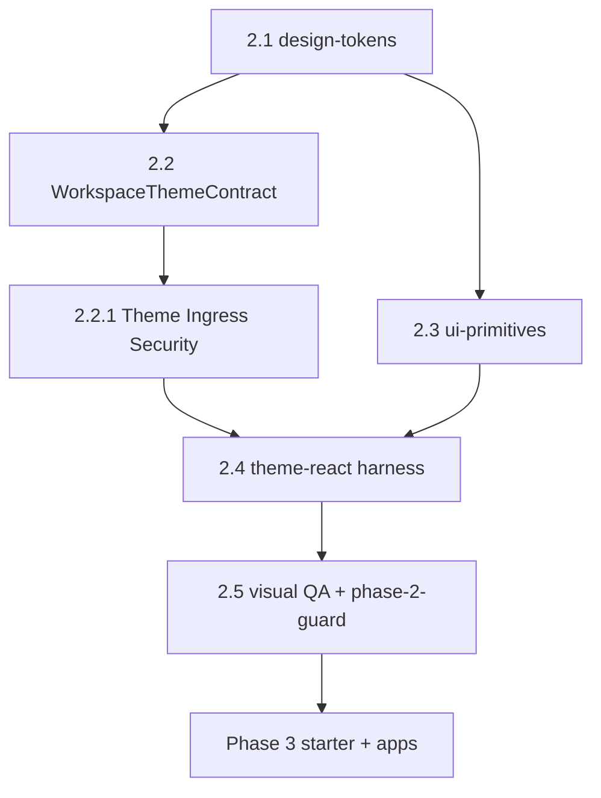

# Phase 2 — State Machine & DAG

## STATE MODEL

```yaml
execution_mode:
  type: enum
  allowed: [AI_EXEC, HUMAN_REVIEW]
  default: AI_EXEC
  rule: "REPO_SCRIPTS_OVER_STALE_MD — bind gates to package.json + p2_* ids"

completion_state:
  type: enum
  allowed: [IN_PROGRESS, DONE, BLOCKED, FAILED]
  initial: IN_PROGRESS
  DONE_when: "current_subphase == DONE AND pnpm run phase-2:gate exit 0"

forbidden_states:
  - id: FS-P2-BARREL
    trigger: 'import from "@app-tour/ui-primitives" root'
    enforcement: [guard:import-boundary, p2_ui_primitives_no_barrel]
  - id: FS-P2-PC-TOKENS
    trigger: platform-core depends on design-tokens
    enforcement: p2_platform_core_no_tokens
  - id: FS-P2-INTERNAL
    trigger: "@app-tour/theme-react/internal export or import"
    enforcement: p2_theme_react_no_internal_export

blocked_states:
  - id: BL-P2-PHASE3-SHELL
    until: "current_subphase == DONE AND phase_3_entry_checklist technical PASS"
    action: apps/web production wizard shell
  - id: BL-P2-DENALI
    until: "phase 6"
    action: packages/workspaces/denali

failure_states:
  - id: FF-P2-GATE
    trigger: "pnpm run phase-2:gate exit non-zero"
    recovery: "fix failing p2_* or outer chain step; re-run full phase-2:gate"
  - id: FF-P2-GUARD-ONLY
    trigger: "merge approved after phase-2:guard alone"
    recovery: "run full phase-2:gate — DRIFT-P2-06"

state_variables:
  current_phase:
    type: enum
    allowed: ["0", "1", "2", "3", "4", "5", "6", "7"]
    initial: "2"
  current_subphase:
    type: enum
    allowed: ["2.1", "2.2", "2.2.1", "2.3", "2.4", "2.5", "DONE"]
    initial: "2.1"
  phase_2_mode:
    type: enum
    allowed: ["visual_enterprise_layer"]
    value: "visual_enterprise_layer"
    meaning: "CSS tokens + React primitives + theme contract — NO apps/api production, NO Denali package"

transition_rules:
  - from_subphase: "2.1"
    to_subphase: "2.2"
    condition: ALL exit_criteria_2_1 PASS
  - from_subphase: "2.2"
    to_subphase: "2.2.1"
    condition: "WorkspaceThemeContract + plugin.theme field merged — ingress rules T-1–T-7 in same PR or immediate follow-up"
    enforcement_note: "2.2.1 is nested — gate requires T-1–T-7 tests before 2.5"
  - from_subphase: "2.2.1"
    to_subphase: "2.3"
    condition: ALL exit_criteria_2_2 AND exit_criteria_2_2_1 PASS
    parallel_allowed: "2.3 may have started after 2.1 if only CSS primitives"
  - from_subphase: "2.3"
    to_subphase: "2.4"
    condition: ALL exit_criteria_2_3 PASS AND subphase 2.2.1 PASS
  - from_subphase: "2.4"
    to_subphase: "2.5"
    condition: ALL exit_criteria_2_4 PASS
  - from_subphase: "2.5"
    to_subphase: "DONE"
    condition: ALL exit_criteria_2_5 PASS AND phase_3_entry_checklist technical items PASS
  - forbidden_transition:
      action: "start apps/web production wizard shell"
      blocked_until: "current_subphase == DONE AND phase_3_entry_checklist ALL PASS"
  - forbidden_transition:
      action: "import @app-tour/ui-primitives barrel root"
      blocked_always: true
      replacement: "subpaths only — button, input, field-shell, alert, badge"
  - forbidden_transition:
      action: "platform-core imports design-tokens or ui-primitives"
      blocked_always: true
      enforcement: p2_platform_core_no_tokens + depcruise downstream-only
```

---

## SUBPHASE DAG



```yaml
dag_edges:
  - { from: "2.1", to: "2.2" }
  - { from: "2.2", to: "2.2.1", nested: true }
  - { from: "2.1", to: "2.3" }
  - { from: "2.2.1", to: "2.4" }
  - { from: "2.3", to: "2.4" }
  - { from: "2.4", to: "2.5" }
  - { from: "2.5", to: "Phase 3.0 CASL + 3.1 starter" }
allowed_overlap:
  - "2.5 guard test scaffolding parallel with late 2.3 primitive PRs (guard-only)"
forbidden_overlap:
  - action: "apps/web production shell (phase 3)"
  - action: "packages/workspaces/denali (phase 6)"
  - action: "platform-core behavior change for RuleEngine / validateCanonical (phase 1 frozen)"
  - action: "merge subphases 2.1–2.4 in one PR without architect exception"
pr_rule:
  - rule: "one subphase = one PR (2.2.1 ships inside 2.2 PR)"
  - rule: "PR title/body MUST include label matching subphase id e.g. Phase: 2.3"
  - rule: "FORBIDDEN fast-forward multiple subphases in one merge"
barrel_import_law:
  forbidden: '@app-tour/ui-primitives'
  allowed_subpaths: [button, input, field-shell, alert, badge]
  enforcement: [guard:import-boundary, audit-boundary, p2_ui_primitives_no_barrel]
```
