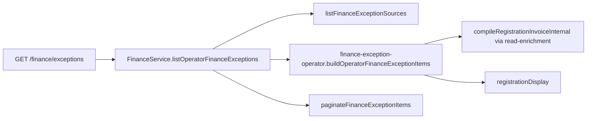

# Finance exception read path (PR23-C2)

```yaml
doc_id: FINANCE_EXCEPTION_READ_PATH_PR23_C2
version: "2026-08-09-v1"
status: READY_FOR_PR23_C3_UI
phase: PR23-C2
related:
  - docs/phase-20/p7/appendices/FINANCE_EXCEPTION_INBOX_AUDIT_PR23_C.md
  - docs/phase-20/p7/appendices/FINANCE_EXCEPTION_CONTRACT_PR23_C1.md
locks:
  mutation: forbidden
  lifecycle: forbidden
  settlement_recalc: forbidden
  case_ownership: forbidden
  sla_assignment: forbidden
  balance_sot: registration_invoice_compile_only
```

## Purpose

Read-only operator exception aggregation for:

| Type | Rule |
| ---- | ---- |
| `REJECTED_RECEIPT_PENDING_PAYMENT` (E1) | Payment `Pending` **and** latest receipt **for that payment** is `Rejected` |
| `CANCELLED_PAYMENT_WITH_BALANCE` (E2) | Payment `Cancelled` **and** invoice `balanceDueMinor > 0` |

## Read pipeline



Application split (god-file hygiene): exception row assembly + identity attach live in
`packages/finance-core/src/application/finance-exception-operator.ts`. Shared list
read helpers (`normalizeListLimit`, invoice compile try/catch, booking payment status)
live in `finance-read-enrichment.ts` and are reused by outstanding/tour paths.

```text
HTTP GET /finance/exceptions
  → FinanceService.listOperatorFinanceExceptions(auth, { cursor?, limit? })
      → gate + assertOperatorAccess
      → repository.listFinanceExceptionSources(tenantId)
           E1: Pending payments whose payment-scoped latest receipt is Rejected
           E2: Cancelled payment rows (+ optional cancel reason from outbox)
      → for each candidate:
           bookingPaymentStatus ← IBookingPaymentPort.getPaymentStatus (nullable)
           balanceDueMinor ← compileRegistrationInvoiceInternal (facts + obligation)
           E2 only kept when isPositiveBalanceDueMinor(balanceDueMinor)
           identity ← RegistrationDisplayPort.getByRegistrationIds
      → paginateFinanceExceptionItems (typePriority, occurredAt, id keyset)
  → { items, nextCursor, hasMore }
```

## E1 payment-scoped receipt (hard)

Forbidden:

- registration latest receipt (`findLatestReceiptForRegistration`)
- any rejected receipt belonging to a different payment on the same registration

Prisma uses `DISTINCT ON (payment_id) … ORDER BY payment_id, created_at DESC, id DESC`, then filters `receipt_status = 'Rejected'`. In-memory mirrors the same latest-per-payment rule.

## E2 balance SoT

Invoice compile remains the only remaining-balance authority. Cancelled payments do not invent obligations; if compile fails or balance is missing/zero, the row is **absent**.

## Ownership

| Layer | Responsibility |
| ----- | -------------- |
| `finance-core` domain helpers | types, cursor encode/decode, sort, paginate, href builders |
| `FinanceRepositoryPort.listFinanceExceptionSources` | tenant-scoped E1/E2 **source** rows only |
| `FinanceService.listOperatorFinanceExceptions` | enrich + E2 balance filter + keyset page |
| `finance-http` `handleFinanceListExceptions` | auth/tenant parity with other finance reads |
| Web BFF `GET /api/finance/exceptions` | proxy only |

**Not** Case/Meaning ownership, ExceptionService engine, SLA, assignment, or repair commands.

## HTTP / BFF

- API: `GET /finance/exceptions?limit=&cursor=`
- BFF: `apps/web/app/api/finance/exceptions` → `proxyFinanceApiGet(…, "/finance/exceptions")`
- Response shape:

```json
{ "items": [], "nextCursor": null, "hasMore": false }
```

Error behavior: same tenant/auth rules as existing finance reads (`gate` + operator access).

## Ordering / cursor

1. Type priority: E1 (`0`) then E2 (`1`)
2. Within type: `occurredAt ASC`, then exception `id ASC` (`TYPE:paymentId`)
3. Opaque keyset cursor (base64url): `typePriority` + `occurredAt` ISO + `id`
4. No offset pagination

## Explicit non-goals

Mutations, lifecycle transitions, settlement recalculation, ledger writes, SLA, assignee, severity scores, recommended create-payment, Case commands, operator UI (→ PR23-C3).

## Tests

`packages/finance-core/test/finance-exceptions-pr23c2.spec.ts` — E1 include/exclude, E2 include/exclude/no-invoice, tenant isolation, cursor continuation, stable ordering, no mutations.

## Status

`READY_FOR_PR23_C3_UI`
