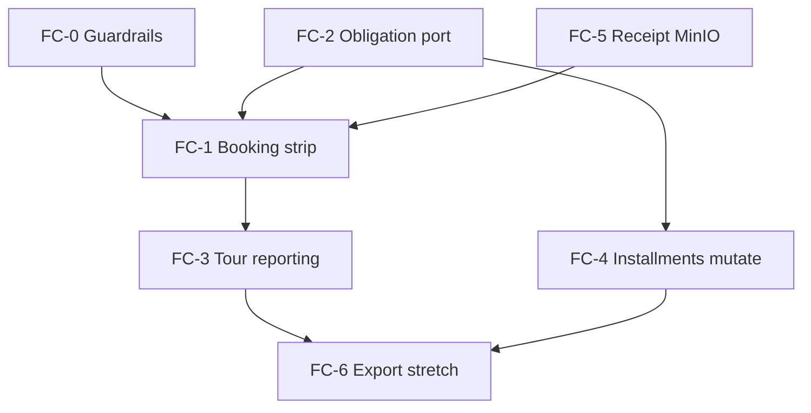

# Finance Ops Completion Roadmap — multi-workspace (offline receipt)

```yaml
doc_id: FINANCE_OPS_COMPLETION_ROADMAP
version: "1.0"
date: "2026-07-21"
status: proposed
scope: Denali + future finance-enabled workspaces
excludes:
  - online / gateway payment ingress (PSP redirect, webhook capture)
authority:
  - FINANCE-OPS-UX.md
  - PAYMENT-LEDGER-BOUNDARY.md
  - FINANCE_PLATFORM_DEVELOPER_GUIDE.md
  - FINANCE_WORKSPACE_ONBOARDING_LIFECYCLE.md
  - ADR-001 (Option C approve atomicity)
  - ADR-008 (reconciliation repair)
constraints:
  - no change to ledger domainEventId / journalId formulas
  - no change to Option C approve TX order
  - no Nest legacy finance tree
  - workspace-specific CoA stays in packages/workspaces/<id>
  - generic web must not import workspace packages (generated bindings only)
```

> **Goal:** Close finance ops gaps identified in Denali audit (tour/reporting, booking strip,
> invoice binding, installments ops, receipt upload, recon guardrails) with a **phased,
> workspace-agnostic** plan so a second workspace (e.g. `finance-ws5`) can onboard without
> rewriting the spine.

---

## 1. Problem statement (audit 2026-07-21)

| Gap | Impact | Multi-WS risk if ad-hoc |
| --- | ------ | ------------------------ |
| Booking ↔ payment drift | UI mismatch (2 Paid vs 1 paid booking) | Each WS copies repair scripts |
| No booking financial strip | Ops jumps between `/bookings` and `/finance` | Denali-only embed in bookings page |
| No tour-level finance view | Cannot roll up payments by tour | Per-WS SQL / dashboards |
| Payment amount not bound to obligation | Manual amount ≠ tour price | WS2 uses different pricing rules → silent drift |
| Installments board without mutate | Generate-only; no waive/reschedule | Duplicate schedule tables per WS |
| Receipt upload via raw `fileKey` | Ops friction; no MinIO parity | Urban/Denali diverge upload paths |
| Recon auto-repair off by default | Drift stays open until manual triage | Production repeats Denali incident |

**In scope:** offline receipt spine (manual payment · receipt review · ledger · prepay · schedule).  
**Out of scope:** online payment ingress (document only as future `paymentMode: gateway` port).

---

## 2. Design principles (locked for all phases)

### 2.1 Anchor entity

```text
Tour ──► Registration (operator_registrations) ──► Finance facts
              │                                      ├─ payments
              │                                      ├─ receipts
              │                                      ├─ schedules
              │                                      └─ ledger outbox (registrationId)
```

- **Money mutations** always keyed by `registrationId` (+ `tenantId`).
- **Tour** is a **dimension** for reporting and obligation resolution — never a ledger account root.

### 2.2 Layer ownership

| Concern | Owner | Workspace may override |
| ------- | ----- | ------------------------ |
| Approve TX (Option C) | Host `PrismaFinanceRepository` | No |
| Ledger capture formulas | Platform stable ids | CoA accounts only (`FinanceLedgerPolicyPort`) |
| Receipt defaults (currency, suggested amount) | `FinanceReceiptDefaultsPort` | Yes |
| **Commercial obligation** (invoice total source) | **`FinanceObligationPort` (new)** | Yes |
| Registration display | `RegistrationDisplayPort` | No (booking fields) |
| Ops panel visibility | `FinanceOpsManifest` | Yes (panels on/off) |
| Tour-level rollups | Host read APIs | Filter only; no WS SQL |

### 2.3 Multi-workspace contract surface (target)

Add to `@app-tour/finance-http-contracts` (Phase FC-2):

```typescript
/** Workspace resolves what the registration owes (minor units). */
export type FinanceObligationPort = {
  resolveRegistrationObligation(input: {
    readonly tenantId: string;
    readonly registrationId: string;
  }): Promise<{
    readonly currency: string;
    readonly obligationMinor: string;
    readonly source: "tour_canonical" | "schedule" | "operator_override" | "unknown";
  } | null>;
};
```

- **Denali:** read tour canonical `pricing` + registration intake; `offline_receipt` only.
- **WS2 fixture:** stub/minimal obligation for isolation tests.
- **Host:** uses obligation at `createManualPayment` (warn) and `reviewReceipt` approve (block if overpay beyond tolerance).

Reporting extension (Phase FC-3) — host-only, no workspace code:

```typescript
export type FinanceListScope = {
  readonly registrationId?: string;
  readonly tourId?: string;
  readonly paymentStatus?: "Pending" | "Paid";
  readonly method?: "Manual";
};
```

### 2.4 UI boundary

| Component | Location | Rule |
| --------- | -------- | ---- |
| `FinanceRegistrationIdentity` | `apps/web` | Generic; uses `registrationContext` |
| `BookingFinancialStrip` | `apps/web` | Generic; BFF to existing finance APIs |
| `FinanceTourFilter` | `apps/web` | Generic; `tourId` query param |
| CoA / ledger policy | `packages/workspaces/<id>` | Never imported by web panels |

---

## 3. Phase map (implementation order)

```text
FC-0 Guardrails     ──► prevent drift recurrence (ops, no product UI)
FC-1 Booking strip  ──► registration-centric ops UX
FC-2 Obligation     ──► pricing bind (workspace port)
FC-3 Tour reporting ──► tourId dimension (host read model)
FC-4 Installments   ──► schedule mutate + template
FC-5 Receipt media  ──► MinIO upload + signed URL parity
FC-6 Ledger export  ──► CSV + advanced KPIs (stretch)
```

Each phase is **mergeable independently**; later phases must not break earlier contracts.

---

## 4. FC-0 — Reconciliation guardrails (P0)

**Status:** implemented (2026-07-21) · **Risk:** low · **Workspace code:** none

### Deliverables

| Item | Detail |
| ---- | ------ |
| Env | Document + prod enable `FINANCE_RECON_AUTO_REPAIR=1` for `D-PAID-BOOKING-DRIFT` + `D-PAID-NO-LEDGER` |
| Alerts | Wire `FinanceReconciliationMismatch` + finding `D-PAID-BOOKING-DRIFT` open count |
| Runbook | Extend `FINANCE-OPS-RUNBOOK.md` § booking drift |
| Cron | Ensure recon runner tick (R3 every 15m) in dev/prod |

### Proof

- `finance-recon-runner` auto-repair spec with flag on
- Smoke: inject drift in test DB → auto-heal within one scan

### Multi-WS

Identical for all tenants; no manifest change.

---

## 5. FC-1 — Booking financial strip (P1)

**Duration:** 3–5 days · **Risk:** low · **Depends:** existing invoice/payments/receipts APIs

### UX

Embed on `(app)/bookings` detail drawer / deep-link `?bookingId=`:

```text
┌ Booking detail ─────────────────────────────┐
│ Status · Guest · Tour                        │
├ Financial strip (registrationId) ───────────┤
│ InvoiceBalanceCard (existing)                │
│ Last payments (GET /finance/payments?registrationId) │
│ Pending receipt badge → /finance?tab=receipts      │
│ Link: full finance hub                     │
└─────────────────────────────────────────────┘
```

### API

No new mutation endpoints. Optional:

- `GET /finance/payments?registrationId=&limit=5` (already supported via query filter)

### Web files

- `apps/web/src/finance/booking-financial-strip.tsx` (new, generic)
- Wire in `bookings-page-client.tsx` when `selectedBooking` set

### Proof

- `apps/web/test/booking-financial-strip.spec.ts`
- SMK: booking detail shows paid amount consistent with finance hub

### Multi-WS

Strip renders when `finance-nav-enablement` + booking has registration id. Hidden for Urban.

---

## 6. FC-2 — Commercial obligation port (P1)

**Status:** implemented (2026-07-21) · **Risk:** medium · **Workspace:** Denali adapter + host factory

### Behavior

| Step | Rule |
| ---- | ---- |
| Create manual payment | Default amount = obligationMinor; warn if operator overrides > tolerance |
| Approve receipt | Block if `payment.amount > obligationMinor + tolerance` (configurable strict mode) |
| Invoice compile | `invoiceTotalMinor` prefers schedule sum → **obligation port** → payment sum fallback |

### Denali adapter

`RegistrationFinanceObligationAdapter` (ex-Denali name; P3.5):

- Load registration → tour canonical `pricing` / published fare
- Respect `paymentMode: offline_receipt` (PC-07)
- Party size multiplier if canonical defines per-person pricing

### Host wiring

```text
resolveFinanceServiceForTenant
  └─ obligation: registry.obligationFactory(workspaceType)
FinanceService.createManualPayment / reviewReceipt
  └─ optional obligation check (fail-closed in prodlike)
```

### Proof

- `apps/api/test/finance-obligation-denali.spec.ts`
- `packages/workspaces/denali/test/finance-obligation.spec.ts`
- `apps/web/test/finance-invoice-prefill.spec.ts` — manual payment / prepayment amount prefill from invoice
- WS2 fixture implements minimal port (isolation)

### Multi-WS

Second workspace only implements `FinanceObligationPort`; host enforcement unchanged.

---

## 7. FC-3 — Tour-level reporting (P1)

**Status:** implemented (2026-07-21) · **Risk:** low · **Host read-only**

### Product

| Surface | Feature |
| ------- | ------- |
| Finance overview | KPI strip `paidByTour` top-N (optional) |
| Payments / Ledger tabs | Filter `?tourId=` |
| New read endpoint | `GET /finance/reports/by-tour?tourId=&from=&to=` |

### Read model (host SQL)

Aggregate on `payments` JOIN `operator_registrations` GROUP BY `tour_id`:

```sql
SELECT r.tour_id, r.tour_title,
       COUNT(p.id) FILTER (WHERE p.status = 'Paid') AS paid_count,
       SUM(p.amount::bigint) FILTER (WHERE p.status = 'Paid') AS paid_minor
FROM payments p
JOIN operator_registrations r ON r.id = p.registration_id AND r.tenant_id = p.tenant_id
WHERE p.tenant_id = $1 AND ($2::uuid IS NULL OR r.tour_id = $2)
GROUP BY r.tour_id, r.tour_title;
```

No ledger mutation; RLS via admin or tenant-scoped join.

### Web

- `FinanceTourFilter` combobox (reuse tours catalog BFF or bookings tour chips)
- Persist `tourId` in finance hub query string alongside `registrationId`

### Proof

- `apps/api/test/finance-reports-by-tour.spec.ts`
- `apps/web/test/finance-tour-filter.spec.ts`
- `apps/web/test/finance-tour-filter-extended.spec.ts` — receipts / prepayments / installments panels

### Multi-WS

Works for any WS using shared `payments` + bookings table; tour title from registration snapshot.

---

## 8. FC-4 — Installments ops completion (P2)

**Status:** core implemented (2026-07-21) · **Stretch:** link-payment · settings template wiring · **Risk:** medium · **Depends:** FC-2 obligation recommended

### API (host)

| Method | Path | Action |
| ------ | ---- | ------ |
| PATCH | `/finance/schedules/{registrationId}/items/{itemId}` | waive · reschedule dueAt |
| POST | `/finance/schedules/{registrationId}/items/{itemId}/link-payment` | optional link to Paid payment |

### Domain rules

- Sum(schedule items) must equal `obligationMinor` (±0 tolerance)
- Waive requires admin + audit reason (outbox or `finance_schedule_audit` table — prefer outbox event `finance.schedule.item_waived`)
- Reschedule does not mutate ledger; overdue queue recalculates from `dueAt`

### Settings (Denali R3)

- Tour payment plan template in `(app)/settings` (deposit % · N installments · grace days)
- Already in `FinanceOpsManifest.installmentDefaults`; wire to schedule generator

### Proof

- Extend `apps/api/test/finance-prepayments.spec.ts` / new `finance-schedule-mutate.spec.ts`
- `apps/web/test/finance-installments-panel.spec.ts` waive/reschedule flows

### Multi-WS

Schedule tables shared; mutate logic in host `FinanceService`. WS toggles `panels.installments` off if product does not use installments.

---

## 9. FC-5 — Receipt media (MinIO) (P2)

**Status:** core implemented (2026-07-21) · **Stretch:** portal E2E smoke · **Risk:** medium · **Host infra**

### Flow

```text
Portal / operator upload → POST /finance/receipts/upload (multipart)
  → MinIO put tenant-scoped key
  → returns fileKey
  → existing submitReceipt(fileKey)
```

### Ports

`ReceiptProofStoragePort` (exists) — ensure prod adapter uses MinIO; web uses upload BFF not raw fileKey field in operator happy path.

### Proof

- Integration with MinIO test container or mock
- SMK portal receipt upload → appears in finance receipts queue

### Multi-WS

Storage port is host-level; all finance-enabled workspaces share upload spine.

---

## 10. FC-6 — Ledger export & advanced KPIs (P3 stretch)

**Status:** client CSV export implemented in finance ledger panel · advanced KPIs stretch remaining

| Item | Detail |
| ---- | ------ |
| CSV export | `finance-ledger-panel` → download filtered ledger lines |
| Redis summary cache | Optional for overview KPI at scale |
| Reconciliation R4 advanced | Ledger adjust (human GL) — ticket only, no auto |

---

## 11. Dependency graph



**Recommended merge sequence:** FC-0 → FC-1 → FC-3 → FC-2 → FC-5 → FC-4 → FC-6

---

## 12. Workspace onboarding checklist (after roadmap)

When adding workspace `ws-x`:

1. Manifest: `workspaceFinance.supported` + ledger + receipt + **obligation** export (FC-2+)
2. Implement `FinanceObligationPort` (pricing source of truth for that product)
3. Optional: `opsManifest` panel toggles
4. Run codegen + finance isolation specs (`finance-ws*` pattern)
5. No changes to approve TX, recon codes, or registration anchor

---

## 13. Proof matrix (Definition of Done)

| Phase | ID | Proof |
| ----- | -- | ----- |
| FC-0 | CP-FC0-01 | Auto-repair heals injected `D-PAID-BOOKING-DRIFT` |
| FC-0 | CP-FC0-02 | Alert fires on open drift finding |
| FC-1 | CP-FC1-01 | Booking detail strip matches invoice API |
| FC-1 | CP-FC1-02 | Urban tenant: strip hidden |
| FC-2 | CP-FC2-01 | Denali manual pay defaults to tour obligation |
| FC-2 | CP-FC2-02 | Approve blocks overpay (strict mode) |
| FC-2 | CP-FC2-03 | WS2 fixture obligation port isolation green |
| FC-3 | CP-FC3-01 | `by-tour` report matches SQL golden |
| FC-3 | CP-FC3-02 | Finance hub `tourId` filter narrows lists |
| FC-4 | CP-FC4-01 | Waive emits audit + schedule sum invariant |
| FC-4 | CP-FC4-02 | Reschedule moves board column |
| FC-5 | CP-FC5-01 | Upload → submit → approve → ledger unchanged path |
| FC-6 | CP-FC6-01 | CSV export row count = ledger list |

---

## 14. Explicit non-goals (this roadmap)

- PSP / online checkout / webhook capture (future `FinancePaymentIngressPort`)
- Full GL subledger / multi-currency FX
- Replacing Option C with async booking sync (Option B)
- Per-workspace finance DB schema forks

---

## 15. Traceability

| REQ | Phase |
| --- | ----- |
| FINANCE-OPS-UX §5.0b registration context | FC-1, FC-3 |
| FINANCE-OPS-UX §5.0c invoice card | FC-1 |
| FINANCE-OPS-UX booking financial strip | FC-1 |
| Hostile audit — payment vs obligation | FC-2 |
| Recon ADR-008 | FC-0 |
| Phase 9.7 R3 installments | FC-4 |
| Phase 9.7 R1 receipt upload | FC-5 |

---

**Next step:** Architect approval on phase order → implement **FC-0** + **FC-1** first (lowest risk, highest ops value).
