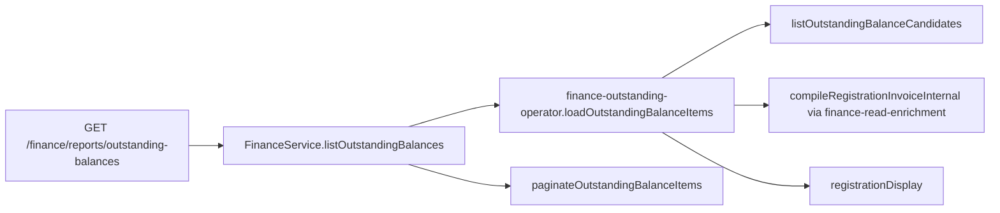

# Outstanding balance read model (PR23-D1)

```yaml
doc_id: FINANCE_OUTSTANDING_BALANCE_READ_MODEL_PR23_D1
version: "2026-08-09-v1"
status: READY_FOR_PR23_D2
phase: PR23-D1
related:
  - docs/phase-20/p7/appendices/FINANCE_EXCEPTION_OPERATOR_UI_PR23_C3.md
locks:
  mutation: forbidden
  balance_sot: registration_invoice_compile_only
  ledger_as_ar: forbidden
  payment_sum_as_debt: forbidden
  online_gateway: out_of_scope
  collection_mode: manual_offline_first
```

## Purpose

First AR capability: **who owes money and how much?**

Read-only list of registrations with `invoice.balanceDueMinor > 0`, compiled from Invoice SoT.

## Manual collection boundary

Denali Finance is **manual/offline collection first**.

Payment lifecycle in scope:

```text
Manual Payment → Pending → Receipt review → Paid
                 Pending → Cancelled
```

**Out of scope for this slice (and product boundary):**

- Online payment gateway / PSP / card flows
- External payment intents
- Gateway Failed lifecycle
- Capture / refund flows

## Invoice as AR SoT

| Field | Source |
| ----- | ------ |
| `invoice.totalMinor` | `compileRegistrationInvoice.invoiceTotalMinor` |
| `invoice.paidMinor` | `compileRegistrationInvoice.paidAmountMinor` |
| `invoice.remainingMinor` | `compileRegistrationInvoice.balanceDueMinor` |

Forbidden:

- summing payment rows to invent debt
- using ledger as AR
- treating Cancelled payments as the debt source (invoice remains authoritative)
- a second settlement model

## Read pipeline



D1 load + identity attach live in `packages/finance-core/src/application/finance-outstanding-operator.ts`.
Shared read helpers (`tryCompileRegistrationInvoiceInternal`, booking payment status, identity attach)
are in `finance-read-enrichment.ts` (same module as exceptions).

```text
HTTP GET /finance/reports/outstanding-balances
  → FinanceService.listOutstandingBalances(auth, { cursor?, limit? })
      → gate + assertOperatorAccess
      → loadOutstandingBalanceItems(deps, tenantId)
           repository.listOutstandingBalanceCandidates(tenantId)
           registrationId + occurredAt (registration createdAt / candidate clock)
      → for each candidate:
           invoice ← compileRegistrationInvoiceInternal (facts + obligation + schedule)
           keep only isPositiveBalanceDueMinor(balanceDueMinor)
           bookingPaymentStatus ← IBookingPaymentPort.getPaymentStatus (nullable)
           identity ← RegistrationDisplayPort
      → paginateOutstandingBalanceItems (occurredAt ASC, registrationId ASC)
  → { items, nextCursor, hasMore }
```

## Ordering / cursor

1. Inclusion: remaining > 0 only (“remaining exists” gate)
2. Within page universe: `occurredAt ASC`, then `registrationId ASC`
3. Opaque keyset cursor: `occurredAt` + `registrationId`
4. No offset pagination; do not sort by payment rows

## HTTP / BFF

- API: `GET /finance/reports/outstanding-balances?limit=&cursor=`
- BFF: `apps/web/app/api/finance/reports/outstanding-balances`

## Next

PR23-D2 — tour-level collection aggregation **from this outstanding model** (not from payment pending counts).

## Status

`READY_FOR_PR23_D2`
