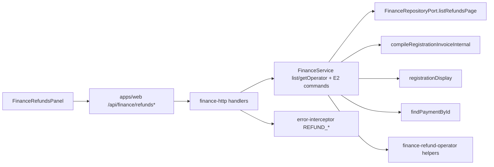

# Refund operator workflow (PR23-E3)

```yaml
doc_id: FINANCE_REFUND_OPERATOR_WORKFLOW_PR23_E3
version: "2026-08-09-v2"
status: IMPLEMENTED
verdict: READY_FOR_PR23_E4
phase: PR23-E3
related:
  - docs/phase-20/p7/appendices/FINANCE_REFUND_DOMAIN_IMPLEMENTATION_PR23_E2.md
  - docs/phase-20/p7/appendices/FINANCE_PENDING_MANUAL_PAYMENT_CANCEL_HTTP_PR23_A3.md
  - docs/phase-20/p7/appendices/FINANCE_EXCEPTION_OPERATOR_UI_PR23_C3.md
locks:
  collection_mode: manual_offline_first
  online_gateway: forbidden
  refund_psp: forbidden
  money_sot: registration_invoice_compile_only
  money_mutation: finance_service_e2_commands_only
  client_money_arithmetic: forbidden
  e2_semantics: frozen_unless_failing_invariant
```

## Purpose

Operator-facing **HTTP + BFF + UI** for the E2 refund aggregate.

Does **not** change money semantics. Complete remains the only money gate.
E2 money math in `compile-invoice-balances` / `refundable-cap` stays frozen.

## Architecture (E3 HTTP + enrichment)



### Application module split (god-file hygiene)

Operator refund **read enrichment** and **E2 cap/source helpers** live in
`packages/finance-core/src/application/finance-refund-operator.ts`.
`FinanceService` keeps HTTP-facing command methods (`requestRefund`, lifecycle
transitions, `listOperatorRefunds`, `getOperatorRefund`) and delegates to the
module via a small deps bag (`repository`, `compileRegistrationInvoice`,
`registrationDisplay`). Behavior and error codes are unchanged.

### Repository — `listRefundsPage`

Added to `FinanceRepositoryPort` (implementations: Prisma + all in-memory / stubs):

```ts
listRefundsPage(query: {
  tenantId: string;
  registrationId?: string;
  status?: RefundStatus;
  limit: number;
  cursor?: { requestedAt: string; id: string } | null;
}): Promise<{ rows: FinanceRefundRow[]; hasMore: boolean }>
```

- Order: `requestedAt DESC`, `id DESC`
- Keyset: rows strictly older than cursor `(requestedAt, id)` under that order
  (`requestedAt < cursor` OR same `requestedAt` and `id < cursor.id`)
- Opaque cursor encode/decode: `encodeOperatorRefundCursor` /
  `decodeOperatorRefundCursor` in `packages/finance-core/src/domain/refund/`

### Service — operator reads

| Method | Behavior |
| ------ | -------- |
| `listOperatorRefunds(auth, { limit?, cursor?, registrationId?, status? })` | Page via `listRefundsPage`; enrich each row |
| `getOperatorRefund(auth, refundId)` | Same item shape or `REFUND_NOT_FOUND` |

**Enriched item (server-authored):**

- Mapped refund ISO fields (`mapRefundRow`)
- `identity` from `registrationDisplay.getByRegistrationIds`
- `invoice`: `{ totalMinor, paidMinor, remainingMinor, refundedMinor, currency }`
  from `compileRegistrationInvoiceInternal` (null if compile fails)
- `href.payments` / `href.receipts` via existing exception href builders
- `linkedPayment`: `{ id, amount, currency, status, method } \| null` via `findPaymentById`

**Browser must not compute refundable caps or nets.**

### Mutations (E2 already exists — HTTP wire only)

| Method | Path | Service |
| ------ | ---- | ------- |
| `GET` | `/finance/refunds` | `listOperatorRefunds` |
| `GET` | `/finance/refunds/:refundId` | `getOperatorRefund` |
| `POST` | `/finance/refunds` | `requestRefund` (**Idempotency-Key** required) |
| `POST` | `/finance/refunds/:refundId/approve` | `approveRefund` |
| `POST` | `/finance/refunds/:refundId/complete` | `completeRefund` (+ `invoice` in HTTP body) |
| `POST` | `/finance/refunds/:refundId/reject` | `rejectRefund` |
| `POST` | `/finance/refunds/:refundId/cancel` | `cancelRefund` |

### List query

- `registrationId` (optional UUID)
- `status` (optional: Requested\|Approved\|Completed\|Rejected\|Cancelled)
- `limit`, `cursor` (opaque keyset; order `requestedAt DESC`, `id DESC`)

### Mutation responses

Return refund row (+ `replay`). Complete HTTP response also includes `invoice`
snapshot after the money effect (`getOperatorRefund` after `completeRefund`).

### HTTP contracts

`finance-http-contracts` zod:

- `requestRefundBodySchema` — registrationId, sourceKind `payment|prepayment`,
  paymentId optional, amountMinor, reasonCode enum, reasonNote / evidence\* optional
- `rejectRefundBodySchema` — rejectNote optional
- `completeRefundBodySchema` — completionNote optional

### Host wiring

1. `FINANCE_HTTP_ROUTE_MANIFEST` + handlers in `finance.routes.ts` / `index.ts`
2. `FinanceServicePort` extended with list/get + mutation methods used by handlers
3. Denali `workspace.manifest.json` staticHandlers + paramHandlers
4. `pnpm run generate:workspace-registry`
5. `HANDLER_DISPATCH_KIND` in `workspace-route-registrar.ts` (`finance` vs `finance-param`)
6. `error-interceptor.ts` maps `REFUND_*` (below)

## Error mapping

| Code | HTTP |
| ---- | ---- |
| `REFUND_NOT_FOUND` | 404 |
| `REFUND_REASON_INVALID` / `REFUND_INVALID_AMOUNT` / `REFUND_SOURCE_INVALID` / `REFUND_CURRENCY_MISMATCH` | 400 |
| `REFUND_OVER_CAP` / `REFUND_PAYMENT_NOT_PAID` / `REFUND_PAYMENT_NOT_MANUAL` / `REFUND_NOT_TRANSITIONABLE` | 409 |
| `FINANCE_PAYMENT_NOT_FOUND` | 404 |
| `IDEMPOTENCY_KEY_REQUIRED` (request) | 400 |

## UI

- Finance Command Center tab **Refunds** (`panels.refunds: true` on Denali default)
- BFF proxies under `apps/web/app/api/finance/refunds/**`
- List + status filter + request form + lifecycle actions
- Complete confirmation shows amount, source, linked Paid payment or prepayment
  explicit copy, and server invoice remaining/refunded — no browser arithmetic
- Cap / transition errors: show server code message and **refresh list** (no blind retry)
- Evidence: display `evidenceFileKey` when present; **no upload** in E3
- i18n `finance.refunds.*` FA/EN — status labels Requested/Approved/Completed/Rejected/Cancelled
  (FA: درخواست‌شده / تأییدشده / تکمیل‌شده / ردشده / لغوشده) — distinct from payment Pending

### Lifecycle → UI actions

| Status | Approve | Complete | Reject | Cancel |
| ------ | ------- | -------- | ------ | ------ |
| Requested | yes | yes (E2 allows Requested→Completed) | yes | yes |
| Approved | no | yes | yes | yes |
| Completed / Rejected / Cancelled | no | no | no | no |

Money effect: **Complete only** (E2).

## Verification (targeted)

```bash
pnpm --filter @app-tour/finance-http-contracts run build
pnpm --filter @app-tour/finance-core run build
pnpm --filter @app-tour/finance-http run build
pnpm --filter @app-tour/workspace-denali run build
pnpm run generate:workspace-registry
# web
NODE_ENV=test node --import tsx --import ./test/register-dom.mjs --test \
  test/finance-refunds-pr23e3.spec.ts test/finance-page.spec.ts
# api
pnpm --filter @apps/api run test:file src/middleware/error-interceptor.spec.ts
# e2 freeze
NODE_ENV=test node --import tsx --test packages/finance-core/test/refund-domain-pr23e2.spec.ts
```

Results (2026-08-09): web 22/22 pass; error-interceptor 11/11; E2 refund domain 13/13.

## Safety absences verified

- No PSP / Stripe / gateway / chargeback CTAs in refund panel or logic
- No client `walletNet` / refundable-cap arithmetic
- No ledger-as-refund-state mutation path
- Mutations only call E2 service commands via HTTP handlers above

## Non-goals

PSP, gateway, chargeback, multi-currency, ledger-as-state, Case ownership, evidence upload invention, E4 reporting, E2 money-math changes.
