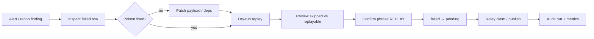

# Phase 3.17 — Production outbox replay

```yaml
doc_id: OUTBOX_PRODUCTION_REPLAY
version: "1.0"
date: "2026-07-19"
phase: "3.17"
extends: DEC-086 / outbox-failed-replay.md
status: implemented
constraints:
  - do not redesign outbox schema, claim, or relay
  - mutation remains failed → pending (payload immutable)
  - auto-retry of failed remains forbidden
```

## Goal

Promote admin replay from **dev-only HTTP** to a **production-safe ops capability** with scoped selection, dry-run, confirmation, audit, and metrics — without changing outbox durability semantics.

## Non-goals

- New outbox statuses / payload mutation APIs
- Automatic heal of poison without human confirm
- Redesign of DEC-110 transient retry

## Modes

| Mode | Selection | Required fields |
| ---- | --------- | --------------- |
| **single** | One `outbox_events.id` | `tenantId`, `outboxId` |
| **batch** | Explicit id list (same tenant) | `tenantId`, `outboxIds[]` (≤500) |
| **tenant** | All `failed` for tenant | `tenantId` |
| **workspace** | All `failed` for tenants with `workspace_type` | `workspaceType` |
| **date_range** | `failed` with `created_at` in `[from, to]` | `from`, `to` (+ optional `tenantId` / `workspaceType`) |

Optional filters (all multi-row modes): `eventTypePrefix` (e.g. `finance.`).

Hard caps: batch ≤500; scan/apply ≤2000 per run.

## Safety

| Control | Behavior |
| ------- | -------- |
| **Idempotent** | Only `status=failed` → `pending`. Non-failed rows are **skipped** (not errors) in multi modes; single mode still 409 `OUTBOX_REPLAY_NOT_FAILED` for explicit ops feedback |
| **Dry run** | Default `dryRun: true` — select + classify only; no status writes |
| **Confirmation** | Apply (`dryRun: false`) requires `confirm: true` **and** `confirmPhrase: "REPLAY"` |
| **Auth** | Prod: ops JWT scope `outbox:replay`. Non-prod: provisioning-dev gate (same family as recon) |
| **Audit** | Every run writes `outbox_replay_runs` (+ structured `outbox.replay.*` logs) |
| **Payload** | Never rewritten by replay — poison fix remains a separate DBA/ops step |

## HTTP

| Method | Path | Role |
| ------ | ---- | ---- |
| `POST` | `/internal/outbox/{outboxId}/replay` | Single-event (Phase 3.17 auth + dry-run/confirm) |
| `POST` | `/internal/outbox/replay` | Batch / tenant / workspace / date_range |
| `GET` | `/internal/outbox/replay/runs/{runId}` | Read audit run |

### Apply body (single)

```json
{
  "tenantId": "<uuid>",
  "dryRun": false,
  "confirm": true,
  "confirmPhrase": "REPLAY",
  "actorUserId": "ops@example"
}
```

### Apply body (bulk)

```json
{
  "mode": "tenant",
  "tenantId": "<uuid>",
  "from": "2026-07-01T00:00:00.000Z",
  "to": "2026-07-19T00:00:00.000Z",
  "eventTypePrefix": "finance.",
  "dryRun": true
}
```

## Observability

| Metric | Type | Labels |
| ------ | ---- | ------ |
| `outbox_replay_runs_total` | counter | `mode`, `result` (`ok`\|`error`\|`rejected`) |
| `outbox_replay_events_total` | counter | `outcome` (`replayed`\|`skipped`\|`error`) |
| `outbox_replay_duration_ms` | gauge/observe | `mode`, `dry_run` |

Logs: `outbox.replay.run` with run id, counts, duration.

## Operator UX (production flow)

```text
1. Detect
   - Alert: outbox_failed_total / finance recon D-OUTBOX-FAILED
   - Inspect last_error + payload (read-only)

2. Fix poison (if needed)
   - Correct payload / deps OUTSIDE replay API
   - Replay never mutates payload

3. Dry-run
   - POST /internal/outbox/replay { mode, …, dryRun: true }
   - Review wouldReplay / wouldSkip lists

4. Confirm apply
   - Same body with dryRun:false, confirm:true, confirmPhrase:"REPLAY"
   - Capture runId from response

5. Verify
   - Relay drains → status done
   - Re-run dry-run → zero wouldReplay
   - GET /internal/outbox/replay/runs/:runId for audit
```



## Modules

| Module | Role |
| ------ | ---- |
| `outbox/outbox-replay.ts` | Core single failed→pending (no env gate) |
| `outbox/outbox-prod-replay.ts` | Selection, dry-run, confirm, batch apply, metrics |
| `outbox/outbox-replay-audit.ts` | Persist `outbox_replay_runs` |
| `routes/internal/outbox-replay.ts` | HTTP + ops JWT |

## Remaining risks

| Risk | Mitigation / residual |
| ---- | --------------------- |
| Replay without poison fix → fail loop | Dry-run + runbook; metrics show re-fail |
| Oversized workspace scan | Hard cap 2000; prefer tenant/date filters |
| Dual-control (two humans) | Phrase confirm only in v1 — not second JWT |
| CLI `outbox:replay-failed` | Still break-glass; prefer HTTP audit path in prod |

## Tests

- Unit: confirm gate, dry-run no-write, skip non-failed, date/workspace filter shaping
- Integration: existing INT-SAGA-03 heal (core) remains green
