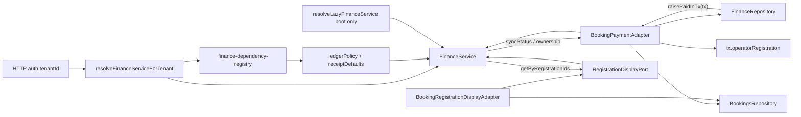

# Payment ingress vs ledger (P7 frozen)

```yaml
boundary_id: PAYMENT-LEDGER-BOUNDARY
pack: P7
version: "1.0"
authority: FINANCE-OPS-UX.md · FINANCE-OPS-P6-NOTE.md · platform-workspace-commerce.mdoc
payment_mode_p7: offline_receipt
```

## Two layers (do not conflate)

```text
┌─────────────────────────────────────────────────────────┐
│ Payment ingress (HOW money arrives) — mode-dependent      │
│   P7: offline_receipt only                               │
│   member upload → operator review                        │
│   Future: gateway PSP redirect/webhook (P5-D)            │
└──────────────────────────┬──────────────────────────────┘
                           │ capture confirmed
                           ▼
┌─────────────────────────────────────────────────────────┐
│ Ledger / accounting (WHAT happened) — stable spine       │
│   InvoiceReadModel · BookingWallet · double-entry        │
│   Outbox: finance.ledger.double_entry_applied              │
└─────────────────────────────────────────────────────────┘
```

Switching workspace `paymentMode` (future, non-Denali) changes **ingress only**. Ledger accounts, outbox event type, and wallet projection **stay the same**.

---

## P7 payment model

| Fact | Detail |
| ---- | ------ |
| Denali frozen | `offline_receipt` only (PC-07) |
| Member path | Portal BFF → `POST /bookings/{id}/receipts` |
| Operator path | `GET /finance/receipts/pending` · `PATCH .../review` approve |
| API SoT | `apps/api/src/workspace-finance/` |
| HTTP request contracts | `@app-tour/finance-http-contracts` (Phase 1.4) — Denali `http/schemas` re-exports only |
| HTTP handlers | `@app-tour/finance-http` (Phase 1.4 C2) — Denali re-exports; codegen `handlerPackage` |
| Tenant-aware composition | HTTP → `resolveFinanceServiceForTenant` (Phase 1.5 C2A); registry + tenant→workspaceType (C1); `resolveLazyFinanceService` = boot/non-HTTP only |
| Legacy forbidden | `apps/api/src/denali-finance/` — tombstone only (`README.md`); do not resurrect adapters |
| Booking projection port | `IBookingPaymentPort` — Finance must not call `getBookingsRepository()`; infra `BookingPaymentAdapter` injected at boot |
| Registration display port | `RegistrationDisplayPort` (Phase 1.6) — list `registrationContext` enrichment; `BookingRegistrationDisplayAdapter` only touches Booking repo |
| TourCreated finance reaction | `WorkspaceFinanceEventReactionPort` (Phase 1.7 C2); Denali adapter wraps legacy consumer; host process/reader must not import Denali consumer names or Denali outbox types |

---

## Ledger spine (unchanged in P7)

| Step | Behavior |
| ---- | -------- |
| 1 | Manual `PaymentIntent` status `Pending` |
| 2 | `PaymentReceipt` submitted with `fileKey` |
| 3 | Operator approve → **one** `withTenantRls` TX: payment `Paid` · booking `paid` · receipt `Approved` · outbox last |
| 4 | Outbox: `finance.ledger.double_entry_applied` (`enqueueOutboxEvent` on same `tx`) |
| 5 | Relay consumes outbox; summary KPI reflects `Paid` |

Implementation: `apps/api/src/workspace-finance/finance.service.ts` → `reviewReceipt()`.

### Finance ↔ bookings dependency (hexagonal — locked)

`FinanceService` must not Service-Locate the bookings repository. **Option C (Phase 0):** Prisma approve keeps booking raise **inside** the same `withTenantRls` TX, but Booking owns the Prisma mutation via a TX-aware port method — FinanceRepository must not import `operatorRegistration` or `raiseBookingPaymentStatus`.

| Layer | Artifact | Role |
| ----- | -------- | ---- |
| **Port** | `IBookingPaymentPort` (`ports/booking-payment.port.ts`) | Application contract — `syncStatus` (non-TX), `raisePaidInTx(tx, …)` (approve TX), ownership/read helpers |
| **Port** | `RegistrationDisplayPort` (`ports/registration-display.port.ts`) | Batch list identity enrichment — not payment projection |
| **Adapter** | `BookingPaymentAdapter` (`infrastructure/booking-payment.adapter.ts`) | Non-TX: `BookingsRepository.updatePaymentStatus`. TX: `tx.operatorRegistration` find/update + `raiseBookingPaymentStatus` |
| **Adapter** | `BookingRegistrationDisplayAdapter` | `BookingsRepository.getByIds` → finance `registrationContext` DTO |
| **Composition** | `finance-dependency-registry` + `createFinanceService` + `createFinanceRepository` + `resolveFinanceServiceForTenant` (HTTP) / `resolveLazyFinanceService` (boot only) | Registry selects ledger policy + receipt defaults by `workspaceType` (`denali` + architecture-fixture `finance-ws2`). Same booking payment + display adapter instances injected into service. HTTP must not use boot type as SoT; boot must not import Denali adapter classes. |
| **Approve wiring** | `reviewReceipt` → `approveManualReceiptAtomic` | Memory: `syncStatus` (Phase 3B norm, not TX-equivalent). Prisma: `raisePaidInTx` inside the ambient RLS TX (atomicity preserved; MISS still rolls back) |



**`reviewReceipt` approve consistency:**

| Driver | Payment + receipt + ledger | Booking `paid` |
| ------ | -------------------------- | -------------- |
| **Prisma** | One `withTenantRls` / `$transaction`; order: Paid → booking raise → Approved → outbox last | Same TX via `IBookingPaymentPort.raisePaidInTx(tx, …)` — **not** direct FinanceRepository booking writes |
| **Memory** | Fail-closed compensate (revert payment if sync fails) | Via injected `IBookingPaymentPort.syncStatus` — **no** `getBookingsRepository` in service or memory finance repo |

**Forbidden in `FinanceService`:** `import { getBookingsRepository }` or any direct bookings repository call; constructing Denali (or any workspace) ledger/receipt adapters; reading `workspaceType`. Soft-fail prepayment sync and fail-closed approve errors still map from port results (`null` / MISS → `FINANCE_BOOKING_PAYMENT_SYNC_MISS`; thrown infra errors → `FINANCE_BOOKING_PAYMENT_SYNC_FAILED`). Member receipt ownership checks go through the same port (`memberOwnsRegistration`) so the Service Locator stays only inside Infrastructure.

**Composition registry (Phase 1.1 + 1.3):** `apps/api/src/workspace-finance/finance-dependency-registry.ts` maps `workspaceType` → policy/defaults/booking for composition proofs. Registered: **`denali`** (production) and architecture-fixture **`finance-ws2`** (adapters + unit tests only). **Enablement SoT** is manifest `workspaceFinance.supported` → API `WORKSPACE_FINANCE_BINDINGS` + web nav bindings — Denali only today. Fixture must not appear in nav/gate. Unregistered type fails closed at composition; empty type → `FINANCE_WORKSPACE_TYPE_REQUIRED`.

**Forbidden in `FinanceRepository` (Prisma):** `tx.operatorRegistration` and `raiseBookingPaymentStatus` imports — booking projection mutations belong on the TX-capable booking port (Option C).

---

## Workspace commerce (future — not P7)

| Mode | Ingress | P7 |
| ---- | ------- | -- |
| `offline_receipt` | receipt upload + review | **active** |
| `gateway` | PSP + webhook | blocked (GU-02 until P5-D) |

Schema: `packages/workspace-sdk/src/metadata/commerce-schema.ts`  
Denali resolver: `DENALI_FROZEN_COMMERCE_CONFIG` in `resolve-workspace-commerce-for-tenant.ts`.

---

## P7 verification tiers (finance)

| Tier | Command | When |
| ---- | ------- | ---- |
| T1 | `p6:gate` · `p6-offline-receipt-gate.spec.ts` | every PR |
| T3 | `finance-ops.spec.ts` + staging `DATABASE_URL` | P7-3 pre-sign-off |
| T4 | [first-customer-operator.md](../../phase-19/p6/runbooks/first-customer-operator.md) VS-07 | manual sign-off |

---

## References

- [FINANCE-OPS-P6-NOTE.md](../../phase-19/p6/appendices/FINANCE-OPS-P6-NOTE.md)
- [platform-workspace-commerce.mdoc](../../phase-18/platform-workspace-commerce.mdoc)
- [POST-P7-HORIZON.md](POST-P7-HORIZON.md) — P5-D gateway
