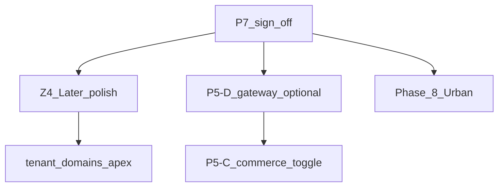

# Post-P7 horizon (boundaries only)

```yaml
horizon_id: POST-P7-HORIZON
pack: P7
version: "1.0"
authority: platform-denali-customer-delivery.mdoc
trigger: P7-3-N-005 sign-off complete
```

> **No nanos here.** This appendix defines what comes **after** first customer delivery — not in P7 scope.

---

## Flow



---

## Horizon map

| Horizon | Doc anchor | Trigger | In P7? |
| ------- | ---------- | ------- | ------ |
| **Z4 Later** | [platform-denali-customer-delivery.mdoc](../platform-denali-customer-delivery.mdoc) §Zones | After customer sign-off | No |
| **P5-D Gateway** | [platform-integrations-plane.mdoc](../../phase-18/platform-integrations-plane.mdoc) | Second customer or business request | No |
| **P5-C Commerce** | [platform-workspace-commerce.mdoc](../../phase-18/platform-workspace-commerce.mdoc) | Non-Denali workspace toggle | No |
| **Urban** | [phase-8/phase-8-charter.md](../../phase-8/phase-8-charter.md) | Separate program | No |
| **Metadata cutover** | [platform-workspace-cutover.mdoc](../../phase-16/platform-workspace-cutover.mdoc) | Architect enable | No |

---

## Z4 Later (after sign-off)

| Item | Notes |
| ---- | ----- |
| Dashboard polish | KPI widgets · UX |
| Settings depth | modules beyond P0 |
| Custom apex domain | `tenant_domains` · profile C production |
| framer-motion wizard | deferred from wizard-experience |
| Finance installments UI | Phase 9.7 R2/R3 |

---

## P5-D Gateway (payment ingress change)

| Fact | Detail |
| ---- | ------ |
| Denali in v1 | Stays `offline_receipt` (PC-07) until Architect lifts |
| Ledger | Unchanged — see [PAYMENT-LEDGER-BOUNDARY.md](PAYMENT-LEDGER-BOUNDARY.md) |
| Guard | GU-02 lift · `P5_D_GATEWAY_ACTIVATION_ENABLED=true` |
| Portal | New checkout branch by `paymentMode` |

**Deferred until second customer needs PSP** — per integrations plane doc.

---

## Platform hardening roadmap (P8 · P9 · P10)

After customer sign-off, infra standardization is **not** ad-hoc — see:

→ **[POST-P7-PLATFORM-ROADMAP.md](../../POST-P7-PLATFORM-ROADMAP.md)**

| Pack | Folder | Charter |
| ---- | ------ | ------- |
| P8 Surface hardening | [phase-21/](../../phase-21/) | ingress · session · env |
| P9 Code consolidation | [phase-22/](../../phase-22/) | dedup · legacy removal |
| P10 Production grade | [phase-23/](../../phase-23/) | DNS · TLS · CI |

Denali workspace (Z3/Z4) may run **in parallel** with P8 — product track, not infra.

---

## Phase-21+ packs (scaffold v1.0)

Created 2026-06 — draft EPICs and gap registries only. Expand nanos when P7 exits.

---

## References

- [P6-P7-BOUNDARY.md](P6-P7-BOUNDARY.md)
- [IMPLEMENTATION-TRUTH-P7.md](IMPLEMENTATION-TRUTH-P7.md)
