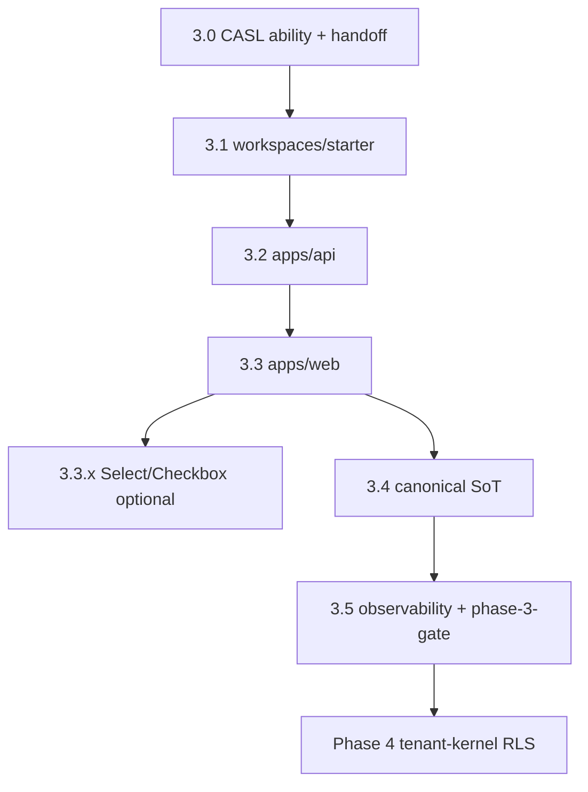

# AI-EXECUTION DOCUMENT — Phase 3 Design System & App Integration

```yaml
document_meta:
  source_file: docs/phase-3-design-system.md
  canonical_markdoc: docs/phase-3-design-system.mdoc
  transformation_version: "2026-06-03"
  execution_priority: REPO_SCRIPTS_OVER_STALE_MD_WHERE_DOC_DRIFT
  doc_revision: "2026-06-03-phase-3-ai-exec"
  forensic_audit: docs/audits/phase-3-zero-debt-forensic-audit.mdoc
  integrity_audit: docs/audits/phase-3-documentation-integrity-2026-06-03.mdoc
  document_status_claim: "Closed: Zero-Debt Verified (2026-06-03)"
  backlog_soft:
    - Playwright create tour + CASL deny DOM (non-blocking in phase-3-guard)
    - Select/Checkbox subpaths 3.3.x (p3_ui_select_checkbox_optional required:false)
```

---

## STEP 1 — PHASE DETECTION (COMPLETE)

```yaml
phase_id: "3"
phase_name: "Design System & App Integration"
north_star: "Platform shell = generic · Workspace = injectable plugin · Authority = CASL before ingress · Visual = subpath-only primitives"
document_status_claim: "Closed: Zero-Debt Verified — platform scaffold 3.0–3.5 — pnpm run phase-3:gate exit 0"
document_closure_claim: "Starter workspace + apps/api + apps/web prove engine, tokens, primitives, theme chain, CASL — no barrel, no dist leakage, no false Security Seal"
prerequisite_phase: "2"
prerequisite_gate: "pnpm run phase-2:gate — ALL exit criteria PASS (Closed: Zero-Debt Verified)"
legacy_truth: "First real consumer of @app-tour/ui-primitives + @app-tour/theme-react — NOT Denali until phase 6"
subphases:
  - id: "3.0"
    name: "CASL & authority layer"
    pr_label: "Phase: 3.0"
    max_lines_approx: 500
    ci_scope: workspace-sdk auth tests + theme-react provider CASL deny
    depends_on: ["phase_2_DONE"]
    enforcement_ids: [P3-E-CASL-01]
  - id: "3.1"
    name: "packages/workspaces/starter"
    pr_label: "Phase: 3.1"
    max_lines_approx: 600
    ci_scope: "@app-tour/workspace-starter build + test + depcruise P3-E-WS-01"
    depends_on: ["3.0"]
    docs_prerequisite: "pnpm run doc-gate green before merge (MAP §19)"
  - id: "3.2"
    name: "apps/api"
    pr_label: "Phase: 3.2"
    max_lines_approx: 800
    ci_scope: phase-3:api-gate
    depends_on: ["3.0", "3.1"]
    enforcement_ids: [P3-E-DB-01, P3-E-API-01]
  - id: "3.3"
    name: "apps/web"
    pr_label: "Phase: 3.3"
    max_lines_approx: 1000
    ci_scope: phase-3:web-gate + predev/prebuild/prelint guards
    depends_on: ["3.0", "3.1", "3.2"]
    enforcement_ids: [P3-E-BARREL, P3-E-APP-HOOK]
    note: "Split per app area if PR exceeds size — scaffold verified 2026-06-03"
  - id: "3.3.x"
    name: "Select/Checkbox primitives (optional)"
    pr_label: "Phase: 3.3.x"
    depends_on: ["3.3"]
    enforcement_ids: [P3-E-PRIM-NEW, P3-E-PRIM-BARREL, P3-E-CSS-01]
    gate_blocking: false
    invariants: [P3-UI-01, P3-UI-02]
  - id: "3.4"
    name: "canonical SoT only"
    pr_label: "Phase: 3.4"
    max_lines_approx: 400
    depends_on: ["3.2", "3.3"]
    enforcement_ids: [P3-E-CANONICAL-34]
  - id: "3.5"
    name: "observability + phase-3-gate"
    pr_label: "Phase: 3.5"
    depends_on: ["3.0", "3.1", "3.2", "3.3", "3.4"]
    enforcement_ids: [P3-E-GATE, P3-E-DOC-GATE]
    ci_scope: phase-3:gate + reports/phase-3-gate-*.json
phase_detection_blocker: null
```

---

## STATE MODEL

```yaml
state_variables:
  current_phase:
    type: enum
    allowed: ["0", "1", "2", "3", "4", "5", "6", "7"]
    initial: "3"
  current_subphase:
    type: enum
    allowed: ["3.0", "3.1", "3.2", "3.3", "3.3.x", "3.4", "3.5", "DONE"]
    initial: "3.0"
    closed_state: "DONE — document claims Closed: Zero-Debt Verified 2026-06-03"
  phase_3_mode:
    type: enum
    allowed: ["app_integration_consumer"]
    value: "app_integration_consumer"
    meaning: "starter plugin + apps/web + apps/api — first consumer of phase 2 visual layer"

transition_rules:
  - from_subphase: "3.0"
    to_subphase: "3.1"
    condition: ALL exit_criteria_3_0 PASS
  - from_subphase: "3.1"
    to_subphase: "3.2"
    condition: ALL exit_criteria_3_1 PASS AND doc-gate PASS for 3.1+ code PRs
  - from_subphase: "3.2"
    to_subphase: "3.3"
    condition: ALL exit_criteria_3_2 PASS
  - from_subphase: "3.3"
    to_subphase: "3.4"
    condition: ALL exit_criteria_3_3 required items PASS
    parallel_optional: "3.3.x Select/Checkbox may ship after 3.3 without blocking 3.4"
  - from_subphase: "3.4"
    to_subphase: "3.5"
    condition: ALL exit_criteria_3_4 PASS
  - from_subphase: "3.5"
    to_subphase: "DONE"
    condition: ALL exit_criteria_3_5 PASS AND phase_3_dod ALL hard items PASS
  - forbidden_transition:
      action: "static import packages/workspaces/denali"
      blocked_until: "phase 6"
      enforcement: p3_no_denali
  - forbidden_transition:
      action: "import @app-tour/ui-primitives barrel root"
      blocked_always: true
      replacement: "subpaths only — button, input, field-shell, alert, badge [, select, checkbox when 3.3.x]"
  - forbidden_transition:
      action: "validateWorkspaceThemeIngress before ability.can(access, WorkspaceTheme)"
      blocked_always: true
      replacement: "§6.3 security handoff order"
  - forbidden_transition:
      action: "change phase 2 export surface without remediation PR + phase-2:gate"
      blocked_always: true
  - forbidden_transition:
      action: "overlap packages/workspaces/denali feature work"
      blocked_always: true
```

---

## SUBPHASE DAG



```yaml
dag_edges:
  - { from: "3.0", to: "3.1" }
  - { from: "3.1", to: "3.2" }
  - { from: "3.0", to: "3.2", note: "CASL required for API" }
  - { from: "3.2", to: "3.3" }
  - { from: "3.3", to: "3.3.x", optional: true, blocking: false }
  - { from: "3.2", to: "3.4" }
  - { from: "3.3", to: "3.4" }
  - { from: "3.4", to: "3.5" }
  - { from: "3.5", to: "Phase 4 tenant-kernel" }
allowed_overlap:
  - "3.5 guard scaffolding parallel with late 3.3 polish (guard-only PRs)"
forbidden_overlap:
  - action: "packages/workspaces/denali"
  - action: "phase 2 export surface change without remediation"
  - action: "barrel imports in apps/**"
pr_rule:
  - rule: "one subphase = one PR (3.3.x separate optional PRs)"
  - rule: "PR title/body MUST include label Phase: 3.x"
  - rule: "FORBIDDEN fast-forward multiple subphases in one merge without architect exception"
  - rule: "Docs-as-Code: code PRs 3.1+ require doc-gate + matching docs/ update per Zero-Debt Covenant"
barrel_import_law:
  forbidden: '@app-tour/ui-primitives'
  allowed_subpaths: [button, input, field-shell, alert, badge]
  optional_subpaths_3_3_x: [select, checkbox]
  enforcement: [guard:import-boundary, audit-boundary, P3-E-BARREL, apps/web ESLint no-restricted-imports]
```

---

## FORENSIC TRUTH — §3 PHASE 2 LESSONS

```yaml
forensic_truth_rules:
  - id: FT-P3-P2-DEBT-94
    claim: "Phase 2 Debt Score 94/100 — residual consumer + root build gaps"
    dimensions:
      SB-02_dist: { score: "30/30", phase_3_action: "repeat files + prune-dist for every new publishable" }
      CSS_literals: { score: "25/25", phase_3_action: "P3-UI-00 + P3-E-CSS-01 on every primitive" }
      Barrel_imports: { score: "22/25", gap: "-3 until apps/* tested", phase_3_action: "P3-APP-01 zero barrel in apps/**" }
      CI_enforcement: { score: "17/20", gap: "-3 root build without artifact guard", phase_3_action: "P3-CI-01 phase-3:gate includes guard:artifact-surface" }
    audit_ref: docs/audits/phase-2-zero-debt-forensic-audit-2026-06-02.mdoc
  - id: FT-P3-SB-01
    claim: "theme-react ./internal was public bypass — not private-on-disk"
    phase_3_rule: "every theme-react wrapper via provider + ingress — FORBIDDEN new mapper export"
    enforcement: P3-E-L01
    invariant: P3-THM-01
  - id: FT-P3-SB-02
    claim: "dist/** deep-import — private ≠ absent from index only"
    phase_3_rule: "guard:artifact-surface + files whitelist every publishable build"
    enforcement: P3-E-ARTIFACT
    invariant: P3-PKG-01
  - id: FT-P3-BARREL
    claim: "Barrel index pulls full resolve surface — bundler + human error"
    phase_3_rule: "subpath + absent exports['.'] for ui-primitives; sideEffects CSS whitelist"
    enforcement: P3-E-BARREL
    invariant: P3-APP-01
  - id: FT-P3-CONSUMER
    claim: "apps/web must show 0 barrel violations in next forensic"
    verify: [test/barrel-hunt.spec.ts, audit-ui-primitives-boundary.mjs, ESLint]
  - id: FT-P3-ROOT-BUILD
    claim: "phase-3:gate must force artifact + import boundary — not rely on bare pnpm build"
    enforcement: P3-CI-01
  - id: FT-P3-MAPPER-ON-DISK
    claim: "theme-react on-disk mappers in files whitelist outside exports — OK if npm resolve blocked"
    enforcement: P3-E-L01 verify:exports
    status: ACCEPTED_L01
  - id: FT-P3-CASL-ORDER
    claim: "Theme without CASL = ingress-only security theater"
    repo_handoff: "ability.can BEFORE validateWorkspaceThemeIngress BEFORE DOM"
    enforcement: P3-E-CASL-01
    invariant: P3-SEC-01
```

---

## SECTION 1 — WHY PHASE 3 AFTER ZERO-DEBT PHASE 2 (§1)

```yaml
platform_order_law:
  phase_0: "workspace-sdk contract"
  phase_1: "platform-core headless"
  phase_2: "visual layer — Closed: Zero-Debt Verified"
  phase_3: "starter workspace + apps/* + CASL — THIS DOCUMENT"
  phase_4: "tenant-kernel RLS + subdomain"
  phase_6: "Denali plugin"

product_rule: "Phase 3 = first real consumer of @app-tour/ui-primitives and @app-tour/theme-react"
failure_if_skip_phase_2:
  - SB-01 mapper bypass in apps/web
  - SB-02 dist/ leakage in apps
  - barrel pollution in shell

phase_2_to_3_risk_mitigation:
  - risk: "Barrel @app-tour/ui-primitives for convenience"
    rule: "subpath only + AST guard from first line apps/*"
  - risk: "dist/tokens/ or mapper on disk"
    rule: "guard:artifact-surface + files whitelist"
  - risk: "CSS literal in primitive"
    rule: "wiring test + dist grep — P3-E-CSS-01"
  - risk: "Theme without CASL"
    rule: "ability.can before validateWorkspaceThemeIngress"
  - risk: "Denali in shell"
    rule: "static workspaces/denali FORBIDDEN until phase 6 — p3_no_denali"

phase_3_one_liner: >
  Starter workspace + thin web + api apps prove engine, tokens, primitives,
  theme chain, and CASL work together — no barrel, no dist leakage,
  no false Security Seal language.
```

---

## SECTION 2 — ENTERPRISE STANDARDS AS RULES (§2)

```yaml
enterprise_integration_rules:
  monorepo_boundaries:
    - id: E-3.2-01
      rule: "pnpm-workspace.yaml + depcruise packages apps explicit graph"
      enforcement: [guard:architecture, P3-E-WS-01]
    - id: E-3.2-02
      rule: "dependency-cruiser.config.js + import-boundary-ast.mjs enforce import law"
      enforcement: P3-E-BARREL
    - id: E-3.2-03
      rule: "phase-3:gate on merge + phase-2:gate frozen baseline inside chain"
      ci: .github/workflows/phase-3-gate.yml
  design_system_packaging:
    - id: E-3.2-04
      rule: "NO root barrel export * for ui-primitives or theme-react mapper subpaths"
      decision: "REJECTED single-package barrel — SB-01/SB-03"
    - id: E-3.2-05
      rule: "subpath exports @app-tour/ui-primitives/{button,input,...} ONLY"
      status: REQUIRED
    - id: E-3.2-06
      rule: "sideEffects false + explicit *.module.css paths per primitive"
      status: REQUIRED
  apps_barrel_prevention:
    - id: E-3.2-07
      rule: "ESLint no-restricted-imports @app-tour/ui-primitives in apps/web"
      file: apps/web/.eslintrc.cjs
    - id: E-3.2-08
      rule: "import-boundary-ast ui-primitives-barrel-import = FAIL"
    - id: E-3.2-09
      rule: "audit-ui-primitives-boundary.mjs real import/require only"
    - id: E-3.2-10
      rule: "apps/web predev/prebuild/prelint run guards before Next.js"
      enforcement: P3-E-APP-HOOK
  ci_zero_debt:
    - id: E-3.2-11
      rule: "Per-PR phase-3:gate subset via workflow"
    - id: E-3.2-12
      rule: "Per-sub-phase PR label Phase: 3.x + enforcement row §13"
    - id: E-3.2-13
      rule: "postbuild prune-dist + guard:artifact-surface per publishable"
    - id: E-3.2-14
      rule: "Doc-Code: Phase Gate Audit Table update same PR when closing sub-phase"
      enforcement: P3-E-DOC-01
    - id: E-3.2-15
      rule: "Forensic audit archived docs/audits/ before phase close"
  esm_cjs_decision:
    - id: E-3.2-16
      rule: "Phase 3.3 default A — CJS dist via tsc; Next 15 transpilePackages"
      forbidden_until_eval: "ESM-only or dual-package without P3-PKG-02 PR"
    - id: E-3.2-17
      rule: "P3-PKG-02 evaluate ESM/dual in 3.4+ — must keep guard:artifact-surface + @apps/web build green"
      status: OPTIONAL_PR
```

---

## SECTION 4 — PHASE 2 DEBT → PHASE 3 INVARIANTS (§4)

```yaml
phase_3_invariants:
  invariant_vs_backlog: "Invariant = blocking in phase-3:gate or sub-gate; Backlog = optional/non-blocking"
  items:
    - phase2_id: Select_P1_9_2
      phase2_status: Backlog_not_Complete
      phase3_id: P3-UI-01
      requirement: "subpath ./select + tokenized CSS + wiring test"
      subphase: "3.3.x"
      enforcement: P3-E-PRIM-NEW
      gate: "p3_ui_select_checkbox_optional required:false"
    - phase2_id: Checkbox_P1_9_2
      phase3_id: P3-UI-02
      requirement: "subpath ./checkbox + a11y contract"
      subphase: "3.3.x"
      enforcement: P3-E-PRIM-NEW
      gate: optional
    - phase2_id: P2-005_CSS_literals
      phase3_id: P3-UI-00
      requirement: "zero literal in src and dist CSS"
      enforcement: P3-E-CSS-01
    - phase2_id: Badge_global
      phase3_id: P3-UI-03
      requirement: "FORBIDDEN :global(.theme-*) in primitives"
      enforcement: P3-E-CSS-02
    - phase2_id: SB-02
      phase3_id: P3-PKG-01
      requirement: "dist/ subset of files"
      enforcement: P3-E-ARTIFACT
    - phase2_id: Barrel_packages
      phase3_id: P3-APP-01
      requirement: "0 barrel in apps/**"
      enforcement: P3-E-BARREL
    - phase2_id: SB-01
      phase3_id: P3-THM-01
      requirement: "theme-react exports only ."
      enforcement: P3-E-L01
    - phase2_id: CASL_before_ingress
      phase3_id: P3-SEC-01
      requirement: "non-swappable handoff order §6.3"
      enforcement: P3-E-CASL-01
      status: Verified_3_0
    - phase2_id: Consumer_minus_3
      phase3_id: P3-APP-02
      requirement: "@apps/web guards from first line — predev hooks"
      enforcement: P3-E-APP-HOOK
    - phase2_id: Root_build_minus_3
      phase3_id: P3-CI-01
      requirement: "phase-3:gate includes artifact-surface"
      enforcement: P3-E-GATE
    - phase2_id: ESM_tree_shake
      phase3_id: P3-PKG-02
      requirement: "evaluate ESM/dual 3.4+"
      enforcement: optional_PR
```

---

## SECTION 5 — HARD / SOFT OUTPUTS (§5)

```yaml
hard_outputs:
  - id: H1
    artifact: "ability layer + tests"
    paths:
      - packages/workspace-sdk/src/auth/ability.ts
      - packages/workspace-sdk/src/auth/casl/index.ts
      - packages/workspace-sdk/test/auth/
    note: "defineAbilityFor in casl/index.ts — NOT legacy src/auth/ability.spec.ts path in stale md"
  - id: H2
    artifact: "@app-tour/workspace-starter plugin"
    path: packages/workspaces/starter/
  - id: H3
    artifact: "@apps/api health + POST /tours + CASL queries"
    path: apps/api/
    sot: "in_memory.tour_records — NOT Postgres Prisma accessibleBy runtime in 3.2"
  - id: H4
    artifact: "@apps/web ThemeProviderChain + wizard host + subpath primitives"
    path: apps/web/
  - id: H5
    artifact: "canonical-only write path"
    rule: "no dual-write — LegacyCanonicalAdapter.write throws DUAL_WRITE_FORBIDDEN"
  - id: H6
    artifact: "phase-3:gate + phase-3-guard report JSON"
    script: scripts/guards/phase-3-guard.mjs
    report: reports/phase-3-gate-YYYY-MM-DD.json
  - id: H7
    artifact: "Phase Gate Audit Table row Closed"
    location: MIGRATION-MAP.md §18

soft_outputs:
  - Playwright_create_tour_happy_path
  - Playwright_theme_denied_when_CASL_fails
  - ESLint_no_restricted_imports_apps_web: "implemented — blocking via lint"
  - optional_root_build_artifact_guard: "covered by phase-3:gate not bare pre-commit ci:integrity"

dod_one_liner: >
  Starter on real engine with web/api shells proving CASL, ingress, subpath primitives,
  canonical SoT — Phase Gate Audit Table metrics 0 for blocking columns.
```

---

## SECTION 6 — INTEGRATION ARCHITECTURE (§6)

```yaml
layer_stack:
  apps:
    packages: [apps/web, apps/api]
    pre_hooks: [guard:import-boundary, audit-boundary]
    web_additional: guard:no-raw-wizard-input
    features: [ThemeProviderChain, WorkspaceWizardHost, routes]
  workspaces_starter:
    path: packages/workspaces/starter
    role: "first-party plugin — theme/tokens.css fieldRegistry ruleSet"
  platform_packages:
    platform_core: "← workspace-sdk"
    theme_react: "← design-tokens"
    ui_primitives: "← design-tokens subpaths only"

apps_web_target_structure:
  app/: "Next.js App Router"
  src/shell/: "layout nav — NO Denali"
  src/wizard/: "WorkspaceWizardHost loader"
  src/providers/: "AppProviders ThemeProviderChain"
  src/bootstrap/: "listBootstrapWorkspacePlugins() — NO static workspaces/*"
  package_json_hooks:
    predev: "guard:import-boundary && audit-boundary && guard:no-raw-wizard-input"
    prebuild: same
    prelint: same

verified_scaffold_2026_06_03:
  - app/layout.tsx
  - src/providers/app-providers.tsx
  - src/shell/home-shell.tsx
  - src/wizard/workspace-wizard-host.tsx
  - route: /tours/new
  - src/bootstrap/workspace-plugins.ts
  - src/session/dev-app-session.ts

security_handoff_non_swappable:
  order:
    - step: 1
      action: "Resolve actor + tenant context"
    - step: 2
      action: "ability.can('access', WorkspaceTheme) OR TenantAuthz equivalent"
      subphase: "3.0"
      repo: "defineAbilityFor in packages/workspace-sdk/src/auth/casl/index.ts"
    - step: 3
      action: "validateWorkspaceThemeIngress(...)"
      phase: "2.2.1 ingress rules"
    - step: 4
      action: "snapshotWorkspaceTheme → Provider → DOM"
  forbidden_order: "ingress before CASL"
  theme_react: "WorkspaceThemeProvider CASL gate before useThemeIngressGuard"

import_law_apps:
  allowed:
    - "@app-tour/ui-primitives/button"
    - "@app-tour/ui-primitives/input"
    - "@app-tour/ui-primitives/field-shell"
    - "@app-tour/ui-primitives/alert"
    - "@app-tour/ui-primitives/badge"
    - "@app-tour/theme-react"
    - "@app-tour/workspace-sdk"
    - "@app-tour/design-tokens/styles.css"
  forbidden:
    - "@app-tour/ui-primitives"
    - "@app-tour/theme-react/internal"
    - "packages/workspaces/denali static"
    - "legacy/*"
```

---

## SUBPHASE 3.0 — CASL & authority layer (§8)

```yaml
subphase: "3.0"
goal: "Prove WHO before WHAT (ingress)"
policy_ref: [phase-2-design-system.md §15, MIGRATION-MAP Phase 3 CASL]

tasks:
  - id: T-30-1
    action: "Implement defineAbilityFor in workspace-sdk CASL bridge"
    file: packages/workspace-sdk/src/auth/casl/index.ts
    export: defineAbilityFor(context: TenantAuthContext): AppAbility
    entry_comment: packages/workspace-sdk/src/auth/ability.ts documents handoff order
  - id: T-30-2
    action: "Subjects: Workspace, Tenant, Plugin, WorkspaceTheme, CanonicalDocument"
    file: packages/workspace-sdk/src/auth/subjects.ts
  - id: T-30-3
    action: "Unit tests deny cross-tenant theme"
    path: packages/workspace-sdk/test/auth/
    files:
      - ability.spec.ts
      - ability.red-team.spec.ts
      - casl.adapter.spec.ts
      - parse-auth-record.spec.ts
      - validate-auth-context.spec.ts
    stale_md_wrong_path: packages/workspace-sdk/src/auth/ability.spec.ts
  - id: T-30-4
    action: "Contract test ThemeProviderChain fails closed without ability.can"
    package: theme-react providers tests

casl_runtime_deps:
  - "@casl/ability ^6.7.3 in workspace-sdk"
  - "NO React/Prisma in packages/workspace-sdk/src/auth/**"

exit_criteria_3_0:
  - id: EC-30-1
    check: "@casl/ability in workspace-sdk pure runtime dep"
    expect: PASS
    status: verified
  - id: EC-30-2
    check: "ability tests ≥ 8 (gate enforces ≥ 100 total workspace-sdk tests)"
    command: pnpm --filter @app-tour/workspace-sdk test
    guard: p3_workspace_sdk_tests
    threshold: 100
    stale_md_claims: ["≥8 ability only", "23 in src/auth/ability.spec.ts", "15 in §15.0 table"]
    repo_resolution: "test/auth/ suite — monorepo floor 100 not ability-only count"
  - id: EC-30-3
    check: "Documented handoff in theme-react + ability.ts comment"
    expect: "ability before ingress before DOM"
    status: verified
  - id: EC-30-4
    check: "P3-E-CASL-01 green"
    includes: [workspace-sdk auth tests, theme-react cross-tenant deny provider test, phase-2:gate regression]
    status: verified
  - id: EC-30-5
    check: "phase-2:gate PASS — no phase 2 regression"
    command: pnpm run phase-2:gate
    note: "also embedded in phase-3:gate"

subphase_3_0_seal: "Verified (engineering audit 2026-06-02)"
whole_phase_3_note: "In progress until 3.1–3.5 DoD — document now claims Closed 2026-06-03"
```

---

## SUBPHASE 3.1 — workspaces/starter (§9)

```yaml
subphase: "3.1"
goal: "First complete non-Denali workspace plugin with theme/tokens.css under CASL"
package: "@app-tour/workspace-starter"

structure:
  packages/workspaces/starter/:
    package.json: required
    src/index.ts: WorkspacePlugin export
    theme/tokens.css: "--ws-* overrides only"

rules:
  - "--ws-* prefix mandatory on theme variables"
  - "NO import from ui-primitives in plugin — host renders"
  - "assertWorkspacePlugin + theme validation from SDK"

docs_as_code_before_merge:
  command: pnpm run doc-gate
  enforcement: P3-E-DOC-GATE
  includes: [documentation-sync, markdoc-validate, audit-boundary]

exit_criteria_3_1:
  - id: EC-31-1
    check: "plugin consumed via listBootstrapWorkspacePlugins in apps/web"
    status: verified
  - id: EC-31-2
    check: "theme/tokens.css --ws-* only validated in package test"
    status: verified
  - id: EC-31-3
    check: "P3-E-WS-01"
    deps_allowed: [workspace-sdk, platform-core, design-tokens]
    forbidden: [apps/* import from starter reverse, ui-primitives in starter]
    command: pnpm run guard:architecture
    guard: p3_starter_build + p3_starter_tests
    threshold_starter_tests: 15
```

---

## SUBPHASE 3.2 — apps/api (§10)

```yaml
subphase: "3.2"
goal: "Thin API — in-memory canonical SoT, health, POST /tours, accessibleBy on queries"
postgres_prisma_accessibleBy_runtime: "Phase 4+ — NOT phase 3.2 runtime"

guard_first:
  pretest_prebuild: [guard:import-boundary, guard:api-queries]
  ci: phase-3:api-gate via p3_api_gate

exit_criteria_3_2:
  - id: EC-32-1
    check: "GET /health integration test"
    expect: "200"
    test_id: API-1
  - id: EC-32-2
    check: "POST /tours with canonical validation"
    path: ToursService → CanonicalTourService → ScopedTourRepository → in_memory.tour_records
  - id: EC-32-3
    check: "tenant A cannot read tenant B record"
    expect: "403 FORBIDDEN_TOUR_READ_CROSS_TENANT — NOT masked 404"
    test_id: API-2
  - id: EC-32-4
    check: "no raw findMany({}) in handlers"
    guards: [guard:api-queries, ScopedTourRepository]
  - id: EC-32-5
    check: "apps/api tests ≥ 20"
    enforced_via: phase-3:api-gate test suite inside p3_api_gate
    threshold: APPS_API_TEST_MIN.phase3

api_boundary_definitions:
  write_path:
    allowed: "POST /tours → ToursService → CanonicalTourService → ScopedTourRepository → in_memory.tour_records"
    forbidden: "Direct db/* repository import from tours.routes / tours.service"
  casl:
    allowed: "createApiAbility + accessibleByTourWhere in apps/api/src/casl/api-ability.ts"
    forbidden: "procedural if (role === …) in handlers"
  tenant_binding:
    allowed: |
      Authorization Bearer dev.<payload> OR explicit headers:
      x-authenticated-tenant-id, x-user-id, x-actor-role, x-membership-status, x-workspace-id
    forbidden: "missing headers with defaults"
    missing: "401 UNAUTHORIZED_*"
    mismatch: "403"
  cross_tenant_read:
    allowed: "ScopedTourRepository.findFirst scoped"
    forbidden: "cross-tenant read masked as 404"
    expect: "403 FORBIDDEN_TOUR_READ_CROSS_TENANT"
  legacy_tables:
    allowed: "LegacyCanonicalAdapter read mirror — write throws DUAL_WRITE_FORBIDDEN"
    forbidden: "Prisma workspace_tour* in apps/api/src handlers"
  import_surface:
    allowed: ["@app-tour/workspace-sdk", "@app-tour/platform-core", "@app-tour/workspace-starter validation only"]
    forbidden: ["@app-tour/ui-primitives", packages/workspaces/denali]
    enforcement: P3-E-API-01

api_gate_script:
  name: phase-3:api-gate
  chain: "build && test && guard:import-boundary && guard:api-queries && validate:canonical-sync"
  source: apps/api/package.json
```

---

## SUBPHASE 3.3 — apps/web (§11)

```yaml
subphase: "3.3"
goal: "Production-first shell — first line under import-boundary"

scaffold_status:
  package: verified
  ThemeProviderChain_starterWorkspacePlugin: "src/providers/app-providers.tsx"
  subpath_Button: "src/shell/home-shell.tsx"
  predev_prebuild_prelint_guards: verified
  WorkspaceWizardHost: "src/wizard/workspace-wizard-host.tsx + /tours/new"
  Select_Checkbox: backlog P3-UI-01/02 optional
  ESLint_restricted_imports: "apps/web/.eslintrc.cjs"
  Playwright_smoke: soft_non_blocking
  dev_session: "src/session/dev-app-session.ts — createTenantAbility admin local wizard"

primitives_backlog_3_3_x:
  - component: Select
    subpath: "@app-tour/ui-primitives/select"
    invariant: P3-UI-01
  - component: Checkbox
    subpath: "@app-tour/ui-primitives/checkbox"
    invariant: P3-UI-02
  per_PR_requirements:
    - "package.json exports + files + sideEffects entry"
    - "tsconfig.build include folder; tokens/ excluded from dist"
    - "component-token-maps + wiring spec"
    - "Storybook/visual entry"
    - "P3-E-PRIM-NEW + P3-E-PRIM-BARREL"

renderer_wiring:
  engine: PlatformWizardEngine + RenderPlan
  map: "uiHints → subpath imports via registry in shell"
  forbidden: "<input> raw — ESLint + guard:no-raw-wizard-input"

web_gate_script:
  name: phase-3:web-gate
  chain: "prelint && lint && test && build"
  prelint_expands: "guard:import-boundary && audit-boundary && guard:no-raw-wizard-input"
  threshold: APPS_WEB_TEST_MIN.phase3 = 10

exit_criteria_3_3:
  - id: EC-33-1
    check: "Scaffold + lifecycle guard scripts"
    status: verified
  - id: EC-33-2
    check: "WorkspaceWizardHost renders starter step"
    status: verified
  - id: EC-33-3
    check: "Playwright create tour"
    status: backlog_soft
    blocking: false
  - id: EC-33-4
    check: "Playwright CASL deny → no --ws-* on DOM"
    status: backlog_soft
  - id: EC-33-5
    check: "0 barrel imports apps/web"
    verify: [test/barrel-hunt.spec.ts, ESLint, audit-boundary]
    status: verified
  - id: EC-33-6
    check: "WorkspaceWizardHost CASL deny-by-default"
    file: test/workspace-wizard-host.security.spec.tsx
    status: verified
  - id: EC-33-7
    check: "Select + Checkbox shipped"
    status: optional
    gate: p3_ui_select_checkbox_optional required false
```

---

## SUBPHASE 3.4–3.5 — canonical SoT + observability (§12)

```yaml
subphase_3_4:
  id: "3.4"
  goal: "canonical-only state — no dual-write"
  exit_criteria:
    - id: EC-34-1
      check: "single write path in_memory.tour_records via CanonicalTourService"
      status: verified
    - id: EC-34-2
      check: "LegacyCanonicalAdapter.writeLegacyTour throws"
      status: verified
    - id: EC-34-3
      check: "validateCanonicalLegacySync at end of API write pipeline"
      command: pnpm --filter @apps/api run validate:canonical-sync
      guard: p3_canonical_sync
    - id: EC-34-4
      check: "apps/web CanonicalClientService canonical shapes only"
      command: pnpm --filter @apps/web run validate:canonical-sot
      status: verified
  enforcement: P3-E-CANONICAL-34

subphase_3_5:
  id: "3.5"
  goal: "observability baseline + phase-3-gate closure"
  exit_criteria:
    - id: EC-35-1
      check: "structured logging api pino + withRequestLogging"
      status: verified
    - id: EC-35-2
      check: "GET /health"
      status: verified
    - id: EC-35-3
      check: "phase-3-guard.mjs + reports/phase-3-gate-*.json"
      command: pnpm run phase-3:guard
      guard: P3-E-GATE
    - id: EC-35-4
      check: "forensic archived docs/audits/phase-3-zero-debt-forensic-audit.mdoc"
      status: verified
    - id: EC-35-5
      check: "pnpm run phase-3:gate exit 0"
      enforcement: P3-E-GATE
```

---

## PHASE 3 ENFORCEMENT — §13 ALL P3-E-* IDs

```yaml
covenant_to_enforcement_MAP_18:
  Safety_First: [P3-E-CASL-01, P3-E-L01]
  Guard_First: "P3-E-* all"
  Honest_Reporting: P3-E-DOC-01
  Artifact_Check: P3-E-ARTIFACT
  Doc_Code_Parity: [P3-E-DOC-01, P3-E-DOC-GATE]

enforcement_table:
  - enforcement_id: P3-E-BARREL
    sub_task: "Any PR touching apps/**"
    ci_command: [pnpm run guard:import-boundary, pnpm run audit-boundary]
    fail_if: "ui-primitives-barrel-import detected"
    guard_ids: [p3_import_boundary, p3_audit_boundary]
  - enforcement_id: P3-E-APP-HOOK
    sub_task: "@apps/web dev/build/lint"
    ci_command: "pnpm --filter @apps/web run lint"
    fail_if: "pre* guards fail"
    guard_ids: [p3_apps_web_lint, p3_web_gate]
  - enforcement_id: P3-E-PRIM-NEW
    sub_task: "New ui-primitive"
    ci_command: [ui-primitives test, P3-E-CSS-01]
    fail_if: "missing wiring spec; barrel . export; dist/tokens/"
  - enforcement_id: P3-E-PRIM-BARREL
    sub_task: "New primitive barrel leakage test"
    ci_command: "audit-ui-primitives-boundary + fixture test"
    fail_if: "forbidden barrel import passes audit"
    pr_text_required: "If new primitive, CI MUST prove zero barrel via P3-E-BARREL + P3-E-PRIM-NEW"
  - enforcement_id: P3-E-CSS-01
    sub_task: "Edit *.module.css primitives"
    ci_command: component-token-maps-wiring.spec.ts + optional dist grep
    fail_if: "forbidden literal patterns"
    invariant: P3-UI-00
  - enforcement_id: P3-E-CSS-02
    sub_task: "Badge/Alert global coupling"
    ci_command: "rg ':global' packages/ui-primitives/src"
    fail_if: "any match"
    invariant: P3-UI-03
  - enforcement_id: P3-E-ARTIFACT
    sub_task: "Publishable package build"
    ci_command: pnpm run guard:artifact-surface
    fail_if: "file outside files whitelist"
    invariant: P3-PKG-01
    guard_id: p3_artifact_surface
  - enforcement_id: P3-E-L01
    sub_task: "theme-react export change"
    ci_command: "pnpm --filter @app-tour/theme-react run verify:exports"
    fail_if: "./internal ./harness stray dist/"
    invariant: P3-THM-01
    guard_id: p3_theme_react_verify_exports
  - enforcement_id: P3-E-WS-01
    sub_task: "New workspace package / starter"
    ci_command: [pnpm run guard:architecture, depcruise starter]
    fail_if: "apps import from workspaces reverse; starter forbidden deps"
    guard_ids: [p3_guard_architecture, p3_starter_build, p3_starter_tests, p3_no_denali]
  - enforcement_id: P3-E-CASL-01
    sub_task: "CASL + theme"
    ci_command: [workspace-sdk tests ≥100, theme-react provider deny test]
    fail_if: "theme DOM without ability pass"
    guard_id: p3_workspace_sdk_tests
  - enforcement_id: P3-E-DB-01
    sub_task: "API DB query / tenant scope"
    ci_command: [phase-3:api-gate, accessibleBy integration tests]
    fail_if: "cross-tenant read"
    guard_ids: [p3_api_gate, p3_apps_api_exists]
  - enforcement_id: P3-E-API-01
    sub_task: "API package boundary"
    ci_command: apps/api/test/package-boundary.spec.ts + depcruise
    fail_if: "ui-primitives or denali in api deps"
  - enforcement_id: P3-E-CANONICAL-34
    sub_task: "canonical-only 3.4"
    ci_command: "pnpm --filter @apps/api run validate:canonical-sync"
    fail_if: "dual-write or legacy write path"
    guard_id: p3_canonical_sync
  - enforcement_id: P3-E-DOC-01
    sub_task: "Phase 3 close / sub-phase seal"
    ci_command: "manual Phase Gate Audit Table + forensic archive"
    fail_if: "audit table not updated; no archived forensic"
  - enforcement_id: P3-E-DOC-GATE
    sub_task: "Docs-as-Code 3.1+"
    ci_command: pnpm run doc-gate
    fail_if: "registry missing; broken links; markdoc fail; audit-boundary fail"
    guard_id: p3_doc_gate
    note: "REPO includes doc-gate in phase-3:gate AND phase-3-guard — stale md §13.4 omits doc-gate"
  - enforcement_id: P3-E-GATE
    sub_task: "Full phase gate"
    ci_command: pnpm run phase-3:gate
    fail_if: "any required p3_* check false"

P3-E-PRIM-BARREL_contract:
  required_one_of:
    - "Guard regression fixture packages/ui-primitives/test/ or scripts/guards/"
    - "apps/web integration proving guard:ui-primitives-boundary in CI"
  existing: audit-ui-primitives-boundary.mjs
```

---

## GUARDS — FULL p3_* LIST (phase-3-guard.mjs)

```yaml
phase_3_guard_entrypoint:
  package_json: "node scripts/guards/phase-3-guard.mjs"
  alias: pnpm run phase-3:guard
  report: reports/phase-3-gate-YYYY-MM-DD.json
  env: "PHASE_3_GATE_REPORT=YYYY-MM-DD optional slug"

thresholds_file: scripts/guards/gate-thresholds.mjs
WORKSPACE_SDK_TEST_MIN_phase3: 100
WORKSPACE_STARTER_TEST_MIN_phase3: 15
APPS_API_TEST_MIN_phase3: 20
APPS_WEB_TEST_MIN_phase3: 10
note: "API/Web mins enforced inside phase-3:api-gate / phase-3:web-gate test runs invoked by guard — not separate p3_* count parsers for api/web"

phase_3_guard_checks_execution_order:
  - id: p3_doc_gate
    enforcementId: P3-E-DOC-GATE
    command: pnpm run doc-gate
    steps: [documentation-sync, markdoc-validate, audit-boundary]
  - id: p3_apps_web_exists
    enforcementId: P3-E-APP-HOOK
    check: apps/web/package.json exists
  - id: p3_apps_api_exists
    enforcementId: P3-E-DB-01
    check: apps/api/package.json exists
  - id: p3_apps_web_lint
    enforcementId: P3-E-APP-HOOK
    command: pnpm --filter @apps/web run lint
    note: "runs prelint guards"
  - id: p3_audit_boundary
    enforcementId: P3-E-BARREL
    command: pnpm run audit-boundary
  - id: p3_import_boundary
    enforcementId: P3-E-BARREL
    command: pnpm run guard:import-boundary
  - id: p3_guard_architecture
    enforcementId: P3-E-WS-01
    command: pnpm run guard:architecture
  - id: p3_artifact_surface
    enforcementId: P3-E-ARTIFACT
    command: pnpm run guard:artifact-surface
  - id: p3_workspace_sdk_tests
    enforcementId: P3-E-CASL-01
    command: pnpm --filter @app-tour/workspace-sdk test
    threshold: 100
  - id: p3_starter_build
    enforcementId: P3-E-WS-01
    command: pnpm --filter @app-tour/workspace-starter build
  - id: p3_starter_tests
    enforcementId: P3-E-WS-01
    command: pnpm --filter @app-tour/workspace-starter test
    threshold: 15
  - id: p3_theme_react_verify_exports
    enforcementId: P3-E-L01
    command: pnpm --filter @app-tour/theme-react run verify:exports
  - id: p3_api_gate
    enforcementId: P3-E-DB-01
    command: pnpm --filter @apps/api run phase-3:api-gate
  - id: p3_web_gate
    enforcementId: P3-E-APP-HOOK
    command: pnpm --filter @apps/web run phase-3:web-gate
  - id: p3_canonical_sync
    enforcementId: P3-E-CANONICAL-34
    command: pnpm --filter @apps/api run validate:canonical-sync
  - id: p3_ui_select_checkbox_optional
    enforcementId: P3-UI-01/02
    required: false
    check: "./select and ./checkbox in ui-primitives exports"
  - id: p3_no_denali
    enforcementId: P3-E-WS-01
    scan: "rg -i denali phase-3 src paths excl tests"
    paths:
      - apps/web/src
      - apps/web/app
      - apps/api/src
      - packages/workspace-sdk/src
      - packages/platform-core/src
      - packages/workspaces/starter/src
      - packages/theme-react/src
      - packages/ui-primitives/src

guard_ids_binding_summary:
  - p3_doc_gate
  - p3_apps_web_exists
  - p3_apps_api_exists
  - p3_apps_web_lint
  - p3_audit_boundary
  - p3_import_boundary
  - p3_guard_architecture
  - p3_artifact_surface
  - p3_workspace_sdk_tests
  - p3_starter_build
  - p3_starter_tests
  - p3_theme_react_verify_exports
  - p3_api_gate
  - p3_web_gate
  - p3_canonical_sync
  - p3_ui_select_checkbox_optional
  - p3_no_denali

not_in_phase_3_guard_script:
  - pnpm build
  - pnpm test
  - phase-2:gate
  note: "These run in outer phase-3:gate chain BEFORE phase-3:guard"
```

---

## CI PIPELINE — phase-3:gate CANONICAL CHAIN (package.json REPO TRUTH)

```yaml
phase_3_gate:
  name: pnpm run phase-3:gate
  source: package.json scripts.phase-3:gate
  steps_ordered:
    - step: 1
      run: pnpm build
      includes: [design-tokens, ui-primitives, theme-react, platform-core, workspace-sdk, starter, apps]
      postbuild: guard:artifact-surface on publishable packages via postbuild hooks
    - step: 2
      run: pnpm test
      includes: monorepo package tests
    - step: 3
      run: pnpm run guard:architecture
      validates: [depcruise rules P3-E-WS-01, P3-E-API-01, no-legacy-imports, ...]
    - step: 4
      run: pnpm run guard:import-boundary
      validates: "AST barrel ban P3-E-BARREL"
    - step: 5
      run: pnpm run guard:artifact-surface
      guard_id: p3_artifact_surface
      remediation: SB-02
    - step: 6
      run: pnpm run audit-boundary
      script: scripts/guards/audit-ui-primitives-boundary.mjs
    - step: 7
      run: pnpm run phase-2:gate
      note: "frozen baseline — phase 3 must not regress phase 2"
      includes: [validate-design-tokens, phase-2:guard, ...]
    - step: 8
      run: pnpm run doc-gate
      guard_id: p3_doc_gate
      note: "REPO TRUTH — stale md §13.4 JSON block OMITS this step"
    - step: 9
      run: pnpm run phase-3:guard
      expands_to: node scripts/guards/phase-3-guard.mjs
      writes: reports/phase-3-gate-YYYY-MM-DD.json

phase_3_gate_NOT_in_stale_md_13_4:
  - doc-gate
  note: "Execute package.json — not §13.4 stale JSON"

github_workflow:
  file: .github/workflows/phase-3-gate.yml
  trigger: [push main, pull_request]
  node: "24 from .nvmrc"
  command: pnpm run phase-3:gate
  artifact: reports/phase-3-gate-*.json

pre_commit_ci_integrity:
  script: scripts/ci-integrity-check.sh
  runs: [phase-0:gate, phase-1-guard delta]
  does_NOT_run: phase-3:gate
  note: "Appendix G stale claim add phase-3:gate to ci:integrity — NOT implemented"

pr_policy:
  title_body_label: "Phase: 3.x"
  one_subphase_per_pr: true
  docs_before_3_1_code: doc-gate + docs/ Markdoc update
  merge_blocked_when:
    - phase-3-guard required check false
    - any P3 invariant violated
    - barrel import in apps/**
```

---

## FORBIDDEN ACTIONS (§14)

```yaml
forbidden_actions:
  - id: F3-01
    forbidden: 'barrel import @app-tour/ui-primitives'
    correct: "subpaths §6.4"
    enforcement: P3-E-BARREL
  - id: F3-02
    forbidden: "@app-tour/theme-react/internal or mapper export"
    correct: "providers + ingress"
    enforcement: P3-E-L01
  - id: F3-03
    forbidden: "static import packages/workspaces/denali"
    correct: "starter only until phase 6"
    enforcement: p3_no_denali
  - id: F3-04
    forbidden: "theme ingress without CASL"
    correct: "§6.3 handoff"
    enforcement: P3-E-CASL-01
  - id: F3-05
    forbidden: "raw Prisma findMany in handlers"
    correct: "accessibleBy + ScopedTourRepository"
    enforcement: [P3-E-DB-01, guard:api-queries]
  - id: F3-06
    forbidden: "dual-write canonical + legacy"
    correct: "3.4 canonical only"
    enforcement: P3-E-CANONICAL-34
  - id: F3-07
    forbidden: "Fully satisfied Security Seal language"
    correct: "Closed Zero-Debt Verified + audit"
  - id: F3-08
    forbidden: "literal CSS in primitive modules"
    correct: "var(--*) only"
    enforcement: P3-E-CSS-01
  - id: F3-09
    forbidden: "dist/** outside files whitelist"
    correct: "prune + artifact guard"
    enforcement: P3-E-ARTIFACT
  - id: F3-10
    forbidden: "skip predev/prebuild/prelint guards in apps/web"
    correct: "always run guard trio"
    enforcement: P3-E-APP-HOOK
  - id: F3-11
    forbidden: "modify platform-core workspace-sdk theme-react ui-primitives without docs-first"
    correct: "docs/phase-3-design-system.mdoc per .cursorrules"
  - id: F3-12
    forbidden: "<input> raw in wizard renderer"
    correct: "subpath primitives registry"
    enforcement: guard:no-raw-wizard-input
```

---

## DEFINITION OF DONE — PHASE 3 (§15)

```yaml
dod_security_seal:
  status: "Closed: Zero-Debt Verified"
  date: "2026-06-03"
  map_ref: MIGRATION-MAP Phase Gate Audit Table §18
  forensic: docs/audits/phase-3-zero-debt-forensic-audit.mdoc
  not: "Fully satisfied without audit"

dod_metrics_required:
  Dist_Leakage: 0
  CSS_Literal_Debt: 0
  Barrel_Import_Violations: 0
  phase_3_gate: PASS
  forensic_archived: "docs/audits/phase-3-*.mdoc"

subphase_gate_status:
  - subphase: "3.0"
    enforcement: P3-E-CASL-01
    security_seal: Verified
    verification: "defineAbilityFor + test/auth/ + ThemeProviderChain deny"
  - subphase: "3.1"
    enforcement: P3-E-WS-01
    security_seal: Verified
  - subphase: "3.2"
    enforcement: P3-E-DB-01
    security_seal: Enforced
  - subphase: "3.3"
    enforcement: [P3-E-BARREL, P3-E-APP-HOOK]
    security_seal: Enforced
    soft_backlog: Playwright
  - subphase: "3.3.x"
    enforcement: [P3-E-PRIM-NEW]
    status: optional_non_blocking
  - subphase: "3.4"
    enforcement: P3-E-CANONICAL-34
    security_seal: Enforced
  - subphase: "3.5"
    enforcement: P3-E-GATE
    security_seal: Enforced

dod_checklist:
  - id: DOD-1
    item: "3.0 CASL + handoff P3-E-CASL-01"
    status: done
  - id: DOD-2
    item: "3.1 starter P3-E-WS-01"
    status: done
  - id: DOD-3
    item: "3.2 apps/api P3-E-DB-01"
    status: done
  - id: DOD-4
    item: "3.3 apps/web P3-E-BARREL P3-E-APP-HOOK"
    status: done
    note: "Playwright optional backlog"
  - id: DOD-5
    item: "3.3.x Select Checkbox P3-UI-01/02"
    status: optional
  - id: DOD-6
    item: "3.4 canonical P3-E-CANONICAL-34"
    status: done
  - id: DOD-7
    item: "3.5 phase-3-gate + report"
    status: done
  - id: DOD-8
    item: "Phase Gate Audit Table row 3 Closed"
    status: done
  - id: DOD-9
    item: "§13 enforcement IDs verified in reports/phase-3-gate-2026-06-03.json"
    status: done

phase_2_items_final_in_phase_3:
  - item: "Button Input FieldShell Alert Badge"
    phase_3: "Maintained P3-E-CSS-01"
  - item: "Select Checkbox"
    phase_3: "P3-UI-01/02 optional p3_ui_select_checkbox_optional"
  - item: "SB-01 SB-03"
    phase_3: "P3-E-L01 regression watch"
  - item: "SB-02"
    phase_3: "P3-E-ARTIFACT"
  - item: "P2-005 CSS"
    phase_3: "P3-E-CSS-01 permanent"

phase_3_complete_when_ALL:
  - current_subphase: DONE
  - pnpm run phase-3:gate: exit 0
  - all_p3_required_guard_checks: PASS
  - forbidden_actions_§14: none violated
  - test_matrix_appendix_F: required rows PASS
  - phase_4_entry_technical: ALL PASS except human tenant design items
```

---

## PHASE 4 ENTRY CHECKLIST (§16)

```yaml
phase_4_entry_checklist:
  items:
    - id: P4E-01
      condition: "phase-3-design-system.md §8–§15 complete"
      status: done
    - id: P4E-02
      condition: "pnpm run phase-3:gate green"
      verify: pnpm run phase-3:gate
      status: done
    - id: P4E-03
      condition: "Forensic Phase 3 archived"
      path: docs/audits/phase-3-zero-debt-forensic-audit.mdoc
      status: done
    - id: P4E-04
      condition: "Tenant subdomain design reviewed MAP §7"
      status: OPEN_HUMAN
    - id: P4E-05
      condition: "RLS migration plan drafted — NOT implemented in Phase 3"
      status: OPEN_HUMAN
  next_phase:
    name: "tenant-kernel + TenantThemeProvider production + RLS"
    document: MIGRATION-MAP phase 4
```

---

## MIGRATION-MAP BRIDGE §4–§10 (§17)

```yaml
map_bridge_phase_3_contribution:
  - map_section: 4
    topic: WorkspacePlugin
    phase_3: "starter implements"
  - map_section: 5
    topic: Infra
    phase_3: "Docker Postgres/Redis local dev; API tour SoT in-memory until Phase 4 RLS"
  - map_section: 6
    topic: Events
    phase_3: "hook points only — full bus phase 4-5"
  - map_section: 7
    topic: Tenant
    phase_3: "CASL now; RLS phase 4"
  - map_section: 8
    topic: Plugin lifecycle
    phase_3: "contractVersion on starter"
  - map_section: 10
    topic: Observability
    phase_3: "3.5 baseline pino health phase-3-guard report"
phase_4_next:
  - tenant-kernel
  - TenantThemeProvider production
  - RLS
```

---

## APPENDIX A — DEPENDENCY GRAPH (§18.A)

```yaml
dependency_graph_phase_3:
  design-tokens:
    depends_on: none
  workspace-sdk:
    depends_on: none
    phase_3_addition: "auth/ability.ts + casl/defineAbilityFor"
  ui-primitives:
    depends_on: [design-tokens]
    rule: subpaths only
  theme-react:
    depends_on: [design-tokens, workspace-sdk]
  platform-core:
    depends_on: [workspace-sdk]
    forbidden: [design-tokens, ui-primitives]
  workspaces/starter:
    depends_on: [workspace-sdk, platform-core, design-tokens]
    forbidden: [ui-primitives, apps]
  apps/web:
    depends_on: [theme-react, ui-primitives subpaths, workspace-sdk, platform-core, workspace-starter]
    forbidden: [static workspaces/*]
  apps/api:
    depends_on: [workspace-sdk, platform-core, workspace-starter validation]
    forbidden: [ui-primitives, denali]
    note: "@casl/prisma phase 4+"
```

---

## APPENDIX B — VERIFICATION COMMANDS (§18.B)

```bash
nvm use && corepack enable
pnpm install
pnpm build
pnpm test
pnpm run guard:architecture
pnpm run guard:import-boundary
pnpm run guard:artifact-surface
pnpm run audit-boundary
pnpm run phase-2:gate
pnpm run doc-gate
pnpm run phase-3:gate
pnpm --filter @apps/web run lint
pnpm --filter @apps/api run phase-3:api-gate
pnpm --filter @apps/web run phase-3:web-gate
```

---

## APPENDIX C — PR TEMPLATE SNIPPET (§18.C)

```markdown
Phase: 3.x

## Covenant (MIGRATION-MAP §18)
- [ ] Read §18 before starting
- [ ] Enforcement IDs: P3-E-___

## Sub-phase (phase-3-design-system.md §8–12)
- [ ] …

## Zero-Debt
- [ ] No barrel `@app-tour/ui-primitives`
- [ ] guard:artifact-surface if publishable touched
- [ ] CSS wiring test if primitive touched (P3-E-CSS-01)
- [ ] CASL before ingress if theme path touched (P3-E-CASL-01)
- [ ] doc-gate if docs or 3.1+ code (P3-E-DOC-GATE)

## Phase Gate Audit Table
- [ ] Updated if closing sub-phase
```

---

## APPENDIX D — EXTERNAL REFERENCES (§18.D)

```yaml
appendix_D_research_2026:
  - topic: "Component Library Architecture — subpath exports sideEffects Turborepo/Nx"
    url: https://sujeet.pro/articles/component-library-architecture-and-governance
    binds: [E-3.2-04, E-3.2-05, E-3.2-06]
  - topic: "Rollup library architecture FSD — public API gate preserveModules"
    url: https://feature-sliced.design/blog/rollup-library-architecture
    binds: [P3-PKG-02 evaluation]
  - topic: "Effect-TS monorepo dual emit"
    url: https://deepwiki.com/Effect-TS/effect/1.1-monorepo-structure-and-build-system
    binds: [P3-PKG-02 optional dual-package]
  - topic: "Designsystemet sideEffects tree-shaking #2477"
    url: https://github.com/digdir/designsystemet/issues/2477
    binds: [explicit CSS sideEffects paths]
  - topic: "Subpath exports npm pack verification"
    url: https://dev.to/7onic/design-to-code-8-the-cosmetics-of-modularity-2bc7
    binds: [P3-E-ARTIFACT npm pack pattern]
```

---

## APPENDIX E — FORENSIC BASELINE PHASE 2 (§18.E)

```yaml
appendix_E_phase_2_forensic:
  audit: docs/audits/phase-2-zero-debt-forensic-audit-2026-06-02.mdoc
  debt_score: "94/100"
  residual_addressed_in_phase_3:
    - consumer_boundary: P3-APP-01
    - root_build_artifact: P3-CI-01 via phase-3:gate
  carry_forward_watch:
    - theme-react on-disk mappers L-01 accepted
    - CJS emit until P3-PKG-02 evaluation
```

---

## TEST MATRIX APPENDIX F (A-1..G-3)

```yaml
test_matrix_appendix_F:
  - id: A-1
    layer: ability
    scenario: tenant A cannot access tenant B theme
    expect: deny
    path: packages/workspace-sdk/test/auth/
  - id: A-2
    layer: ability
    scenario: admin can access workspace theme
    expect: allow
    path: packages/workspace-sdk/test/auth/ability.spec.ts
  - id: W-1
    layer: apps/web
    scenario: prelint without guards hacked
    expect: PASS
    command: pnpm --filter @apps/web run lint
    guard: p3_apps_web_lint
  - id: W-2
    layer: apps/web
    scenario: import barrel in fixture
    expect: FAIL P3-E-BARREL
    verify: test/barrel-hunt.spec.ts + audit-boundary
  - id: W-3
    layer: apps/web
    scenario: Playwright create tour
    expect: pass
    status: SOFT_BACKLOG
    blocking: false
  - id: W-4
    layer: apps/web
    scenario: CASL deny → no --ws-* on DOM
    expect: pass
    status: SOFT_BACKLOG
    partial: test/workspace-wizard-host.security.spec.tsx unit-level
  - id: API-1
    layer: apps/api
    scenario: health
    expect: 200
    guard: p3_api_gate
  - id: API-2
    layer: apps/api
    scenario: cross-tenant read
    expect: 403
    guard: p3_api_gate
  - id: UI-3
    layer: ui-primitives
    scenario: Select subpath + wiring
    expect: PASS
    status: optional_3_3_x
  - id: UI-4
    layer: ui-primitives
    scenario: Checkbox a11y
    expect: PASS
    status: optional_3_3_x
  - id: PKG-1
    layer: guards
    scenario: artifact-surface
    expect: PASS
    command: pnpm run guard:artifact-surface
    guard: p3_artifact_surface
  - id: G-3
    layer: gate
    scenario: phase-3-gate
    expect: PASS
    command: pnpm run phase-3:gate

gate_count_floors:
  source: scripts/guards/gate-thresholds.mjs
  workspace_sdk_phase3: 100
  workspace_starter_phase3: 15
  apps_api_phase3: 20
  apps_web_phase3: 10
  note: "Select/Checkbox UI-3 UI-4 do NOT block G-3 when p3_ui_select_checkbox_optional ok"
```

---

## APPENDIX G — phase-3:gate REPO vs STALE DOC (§18.G)

```yaml
appendix_G_repo_truth:
  package_json_scripts:
    phase-3:guard: node scripts/guards/phase-3-guard.mjs
    phase-3:gate: |
      pnpm build &&
      pnpm test &&
      pnpm run guard:architecture &&
      pnpm run guard:import-boundary &&
      pnpm run guard:artifact-surface &&
      pnpm run audit-boundary &&
      pnpm run phase-2:gate &&
      pnpm run doc-gate &&
      pnpm run phase-3:guard
    doc-gate: node scripts/guards/doc-gate.mjs
    ci_integrity: bash scripts/ci-integrity-check.sh

  stale_md_section_13_4_json:
    claimed_chain: "build + test + guard:architecture + guard:import-boundary + guard:artifact-surface + audit-boundary + phase-2:gate + phase-3:guard"
    missing_in_stale: [doc-gate]
    resolution: "REPO adds doc-gate step 8 before phase-3:guard"

  stale_md_section_13_5_table:
    claimed_checks: "numbered 1-9 without p3_* ids; lint-only; missing doc-gate api-gate web-gate"
    repo_checks: "p3_doc_gate through p3_no_denali — see GUARDS section"
    resolution: "Bind agents to phase-3-guard.mjs ids not §13.5 narrative table"

  stale_appendix_G_ci_integrity:
    claimed: "add phase-3:gate to ci:integrity after DoD"
    repo: "ci-integrity-check.sh runs phase-0:gate + phase-1-guard ONLY"
    resolution: "Phase 3 merge gate = GitHub workflow phase-3-gate.yml — NOT Husky pre-commit"

  github_workflow:
    file: .github/workflows/phase-3-gate.yml
    command: pnpm run phase-3:gate
    artifact_upload: reports/phase-3-gate-*.json

  report_output:
    path: reports/phase-3-gate-YYYY-MM-DD.json
    fields: [generatedAt, gitSha, phase, reportDate, enforcement, checks, exit]
    phase_field_value: "3.5"
```

---

## AGENT EXECUTION ALGORITHM

```yaml
algorithm:
  1: "VERIFY phase_2 DONE — pnpm run phase-2:gate exit 0"
  2: "SET current_subphase from repo by running exit_criteria checks 3.0→3.5"
  3: "IF modifying packages/workspace-sdk packages/workspaces/starter apps/* theme paths THEN update docs/phase-3-design-system.mdoc FIRST per Zero-Debt Covenant"
  4: "EXECUTE only tasks for current_subphase; 3.1+ code PRs require pnpm run doc-gate"
  5: "FORBIDDEN barrel @app-tour/ui-primitives — subpaths only"
  6: "FORBIDDEN static workspaces/denali — p3_no_denali"
  7: "MANDATORY handoff: ability.can BEFORE validateWorkspaceThemeIngress BEFORE DOM"
  8: "defineAbilityFor import path: packages/workspace-sdk/src/auth/casl/index.ts"
  9: "Ability tests live under packages/workspace-sdk/test/auth/ — not src/auth/ability.spec.ts"
  10: "AFTER subphase 3.5 OR any phase-3 app/package change RUN pnpm run phase-3:gate"
  11: "BIND guards to p3_* IDs in phase-3-guard.mjs — never stale §13.5 numbered table"
  12: "BIND thresholds from gate-thresholds.mjs: sdk 100 starter 15 api 20 web 10"
  13: "IF all phase_3_complete_when_ALL PASS SET current_subphase DONE"
  14: "Do NOT assume ci:integrity runs phase-3:gate — use workflow or explicit command"
  15: "APPEND: Architect, documentation status: [Updated/Not Needed]. Link to docs: [URL]"
```

---

## DOC_DRIFT REGISTER (SOURCE MD/Mdoc vs REPO)

```yaml
doc_drift:
  - id: DRIFT-P3-01
    source: "md §13.4 phase-3:gate JSON omits pnpm run doc-gate"
    repo: "package.json phase-3:gate includes doc-gate before phase-3:guard"
    resolution: "Execute package.json 9-step chain — DRIFT-P3-01"
  - id: DRIFT-P3-02
    source: "md §13.5 guard table numbered 1-9 without p3_* enforcement binding"
    repo: "scripts/guards/phase-3-guard.mjs emits p3_doc_gate … p3_no_denali"
    resolution: "Use GUARDS section p3_* list — not §13.5 narrative"
  - id: DRIFT-P3-03
    source: "md §8.3 ability tests ≥8 / 23 in packages/workspace-sdk/src/auth/ability.spec.ts"
    repo: "tests in packages/workspace-sdk/test/auth/*.spec.ts; gate floor 100 total sdk tests"
    resolution: "Enforce p3_workspace_sdk_tests ≥100 — ability count is subset not gate id"
  - id: DRIFT-P3-04
    source: "md §15.0 table claims 15 ability tests for 3.0"
    repo: "test/auth/ multi-file suite; inconsistent with §8.3 count 23"
    resolution: "Do not block on doc narrative count — enforce gate-thresholds + p3_workspace_sdk_tests"
  - id: DRIFT-P3-05
    source: "md Appendix G ادغام نهایی add phase-3:gate to ci:integrity"
    repo: "scripts/ci-integrity-check.sh phase-0 + phase-1 only"
    resolution: "Phase 3 CI = .github/workflows/phase-3-gate.yml — not pre-commit ci:integrity"
  - id: DRIFT-P3-06
    source: "md §13.4 does not list phase-2:gate position relative to doc-gate"
    repo: "phase-2:gate step 7 then doc-gate step 8 then phase-3:guard step 9"
    resolution: "Frozen baseline before doc-gate then p3 guard"
  - id: DRIFT-P3-07
    source: "md §8.2 task 1 ability.ts defineAbilityFor"
    repo: "defineAbilityFor exported from packages/workspace-sdk/src/auth/casl/index.ts; ability.ts re-exports TenantAuthz"
    resolution: "Import @app-tour/workspace-sdk/auth/casl for defineAbilityFor"
  - id: DRIFT-P3-08
    source: "md §13.5 check 7 Select/Checkbox blocking if 3.3.x merged"
    repo: "p3_ui_select_checkbox_optional required:false always ok:true"
    resolution: "Select/Checkbox optional until subpaths ship — not merge blocker"
  - id: DRIFT-P3-09
    source: "md §11.1 Playwright listed as exit criteria unchecked"
    repo: "phase-3-guard has no Playwright check — soft backlog"
    resolution: "W-3 W-4 non-blocking per document_status backlog"
```

---

## COMPLETION CHECKLIST (PHASE 3 FULL)

```yaml
phase_3_complete_when_ALL:
  - subphase_3_0: ALL EC-30-* PASS
  - subphase_3_1: ALL EC-31-* PASS
  - subphase_3_2: ALL EC-32-* PASS
  - subphase_3_3: ALL EC-33-* required PASS (Playwright optional)
  - subphase_3_4: ALL EC-34-* PASS
  - subphase_3_5: ALL EC-35-* PASS
  - phase_3_gate: pnpm run phase-3:gate exit 0
  - phase_3_guard: all required p3_* PASS in reports/phase-3-gate-*.json
  - phase_2_regression: embedded phase-2:gate PASS
  - doc_gate: p3_doc_gate PASS
  - thresholds:
      workspace_sdk: "≥ 100"
      workspace_starter: "≥ 15"
      apps_api: "≥ 20 via api-gate"
      apps_web: "≥ 10 via web-gate"
  - invariants_P3_UI_P3_SEC_P3_APP: enforced
  - forbidden_actions_§14: none violated
  - test_matrix_G3: PASS
  - forensic: docs/audits/phase-3-zero-debt-forensic-audit.mdoc archived
  - document_status: "Closed: Zero-Debt Verified 2026-06-03"
```

---

## FAIL CONDITIONS

```yaml
fail_assessment:
  phase_identification: PASS
  subphase_detection: PASS
  guard_binding: PASS when using package.json + phase-3-guard.mjs + gate-thresholds.mjs
  actionable_steps: PASS with DOC_DRIFT register DRIFT-P3-01 through DRIFT-P3-09

hard_fail_triggers:
  - condition: "Agent runs stale §13.4 phase-3:gate JSON without doc-gate"
    result: FAIL — misses P3-E-DOC-GATE and MAP §19 scaffold
  - condition: "Agent binds guards to §13.5 numbered table instead of p3_* ids"
    result: FAIL — DRIFT-P3-02
  - condition: "Agent enforces ability tests at src/auth/ability.spec.ts path from stale md"
    result: FAIL — DRIFT-P3-03 repo uses test/auth/
  - condition: "Agent blocks phase-3:gate on missing Select/Checkbox subpaths"
    result: FAIL — DRIFT-P3-08 p3_ui_select_checkbox_optional required false
  - condition: "Agent expects ci:integrity pre-commit to run phase-3:gate"
    result: FAIL — DRIFT-P3-05
  - condition: "Agent imports @app-tour/ui-primitives barrel in apps"
    result: FAIL — P3-E-BARREL + F3-01
  - condition: "Agent calls validateWorkspaceThemeIngress before ability.can"
    result: FAIL — P3-SEC-01 + F3-04
  - condition: "Agent static imports workspaces/denali"
    result: FAIL — p3_no_denali + F3-03
  - condition: "Agent dual-writes canonical + legacy"
    result: FAIL — P3-E-CANONICAL-34 + F3-06
  - condition: "Agent runs only phase-3:guard without full phase-3:gate for merge approval"
    result: FAIL — misses build test phase-2:gate doc-gate outer chain
  - condition: "Agent marks Fully satisfied Security Seal without forensic"
    result: FAIL — F3-07 honest reporting covenant
  - condition: "Agent uses defineAbilityFor from wrong module ignoring casl/index.ts"
    result: FAIL — DRIFT-P3-07

conditional_pass:
  - "Playwright W-3 W-4 backlog while phase-3:gate green"
  - "Select/Checkbox 3.3.x optional while invariants P3-UI-01/02 open"
  - "P3-PKG-02 ESM evaluation deferred"
  - "Phase 4 tenant subdomain + RLS plan items P4E-04 P4E-05 open while Phase 3 Closed"

verdict: "PASS for AI execution when bound to repo scripts; FAIL if any hard_fail_triggers fire"
```

---

**END AI-EXECUTION DOCUMENT**
