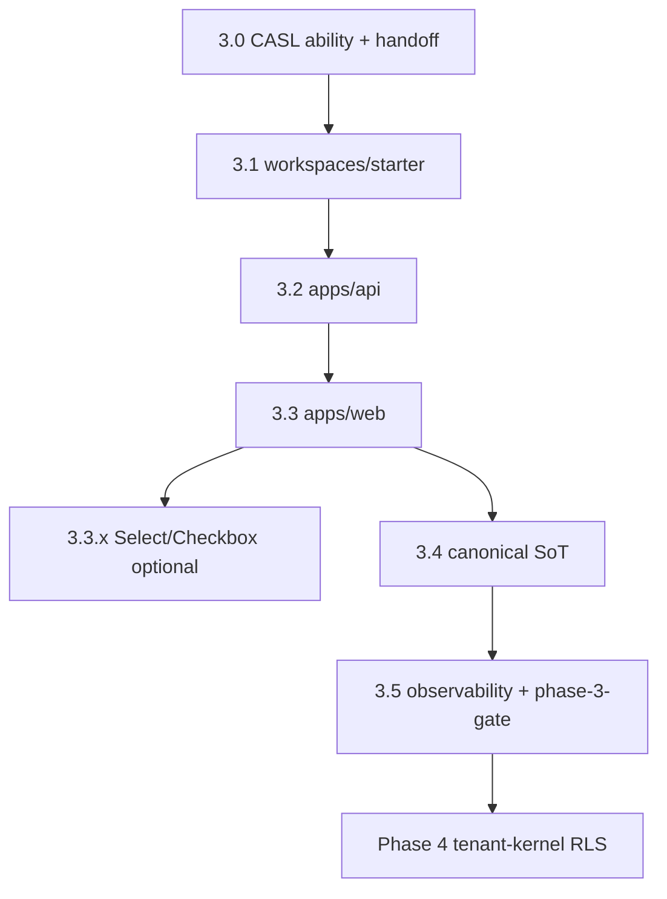

# Phase 3 — State machine & DAG

## STATE MODEL

```yaml
execution_mode:
  type: enum
  allowed: [AI_EXEC, HUMAN_REVIEW]
  default: AI_EXEC
  rule: "REPO_SCRIPTS_OVER_STALE_MD — bind gates to package.json + p3_* ids"

completion_state:
  type: enum
  allowed: [IN_PROGRESS, DONE, BLOCKED, FAILED]
  initial: IN_PROGRESS
  DONE_when: "current_subphase == DONE AND pnpm run phase-3:gate exit 0"

forbidden_states:
  - id: FS-P3-BARREL
    trigger: 'import from "@app-tour/ui-primitives" root'
    enforcement: [p3_import_boundary, p3_audit_boundary, P3-E-BARREL]
  - id: FS-P3-DENALI
    trigger: static workspaces/denali import
    enforcement: p3_no_denali
  - id: FS-P3-INGRESS-BEFORE-CASL
    trigger: validateWorkspaceThemeIngress before ability.can
    enforcement: P3-SEC-01

blocked_states:
  - id: BL-P3-DENALI-PKG
    until: phase 6
    action: packages/workspaces/denali feature work
  - id: BL-P3-PHASE4
    until: "phase_3_complete_when_ALL hard items PASS"
    action: tenant-kernel RLS production without phase-3 gate

failure_states:
  - id: FF-P3-GATE
    trigger: "pnpm run phase-3:gate exit non-zero"
    recovery: "fix failing outer step or p3_* check; re-run full phase-3:gate"
  - id: FF-P3-GUARD-ONLY
    trigger: "merge approved after phase-3:guard alone"
    recovery: "run full phase-3:gate — misses build test phase-2:gate doc-gate"
  - id: FF-P3-DOC-GATE
    trigger: "3.1+ code PR without doc-gate / Markdoc update"
    recovery: "update phase-3-design-system.mdoc first; pnpm run doc-gate"

state_variables:
  current_phase:
    type: enum
    allowed: ["0", "1", "2", "3", "4", "5", "6", "7"]
    initial: "3"
  current_subphase:
    type: enum
    allowed: ["3.0", "3.1", "3.2", "3.3", "3.3.x", "3.4", "3.5", "DONE"]
    initial: "3.0"
    closed_state: "DONE — document claims Closed: Zero-Debt Verified 2026-06-03"
  phase_3_mode:
    type: enum
    allowed: ["app_integration_consumer"]
    value: "app_integration_consumer"
    meaning: "starter plugin + apps/web + apps/api — first consumer of phase 2 visual layer"

transition_rules:
  - from_subphase: "3.0"
    to_subphase: "3.1"
    condition: ALL exit_criteria_3_0 PASS
  - from_subphase: "3.1"
    to_subphase: "3.2"
    condition: ALL exit_criteria_3_1 PASS AND doc-gate PASS for 3.1+ code PRs
  - from_subphase: "3.2"
    to_subphase: "3.3"
    condition: ALL exit_criteria_3_2 PASS
  - from_subphase: "3.3"
    to_subphase: "3.4"
    condition: ALL exit_criteria_3_3 required items PASS
    parallel_optional: "3.3.x Select/Checkbox may ship after 3.3 without blocking 3.4"
  - from_subphase: "3.4"
    to_subphase: "3.5"
    condition: ALL exit_criteria_3_4 PASS
  - from_subphase: "3.5"
    to_subphase: "DONE"
    condition: ALL exit_criteria_3_5 PASS AND phase_3_dod ALL hard items PASS
  - forbidden_transition:
      action: "static import packages/workspaces/denali"
      blocked_until: "phase 6"
      enforcement: p3_no_denali
  - forbidden_transition:
      action: "import @app-tour/ui-primitives barrel root"
      blocked_always: true
      replacement: "subpaths only — button, input, field-shell, alert, badge [, select, checkbox when 3.3.x]"
  - forbidden_transition:
      action: "validateWorkspaceThemeIngress before ability.can(access, WorkspaceTheme)"
      blocked_always: true
      replacement: "§6.3 security handoff order"
  - forbidden_transition:
      action: "change phase 2 export surface without remediation PR + phase-2:gate"
      blocked_always: true
  - forbidden_transition:
      action: "overlap packages/workspaces/denali feature work"
      blocked_always: true
```

---

## SUBPHASE DAG



```yaml
dag_edges:
  - { from: "3.0", to: "3.1" }
  - { from: "3.1", to: "3.2" }
  - { from: "3.0", to: "3.2", note: "CASL required for API" }
  - { from: "3.2", to: "3.3" }
  - { from: "3.3", to: "3.3.x", optional: true, blocking: false }
  - { from: "3.2", to: "3.4" }
  - { from: "3.3", to: "3.4" }
  - { from: "3.4", to: "3.5" }
  - { from: "3.5", to: "Phase 4 tenant-kernel" }
allowed_overlap:
  - "3.5 guard scaffolding parallel with late 3.3 polish (guard-only PRs)"
forbidden_overlap:
  - action: "packages/workspaces/denali"
  - action: "phase 2 export surface change without remediation"
  - action: "barrel imports in apps/**"
pr_rule:
  - rule: "one subphase = one PR (3.3.x separate optional PRs)"
  - rule: "PR title/body MUST include label Phase: 3.x"
  - rule: "FORBIDDEN fast-forward multiple subphases in one merge without architect exception"
  - rule: "Docs-as-Code: code PRs 3.1+ require doc-gate + matching docs/ update per Zero-Debt Covenant"
barrel_import_law:
  forbidden: '@app-tour/ui-primitives'
  allowed_subpaths: [button, input, field-shell, alert, badge]
  optional_subpaths_3_3_x: [select, checkbox]
  enforcement: [guard:import-boundary, audit-boundary, P3-E-BARREL, apps/web ESLint no-restricted-imports]
```

---

