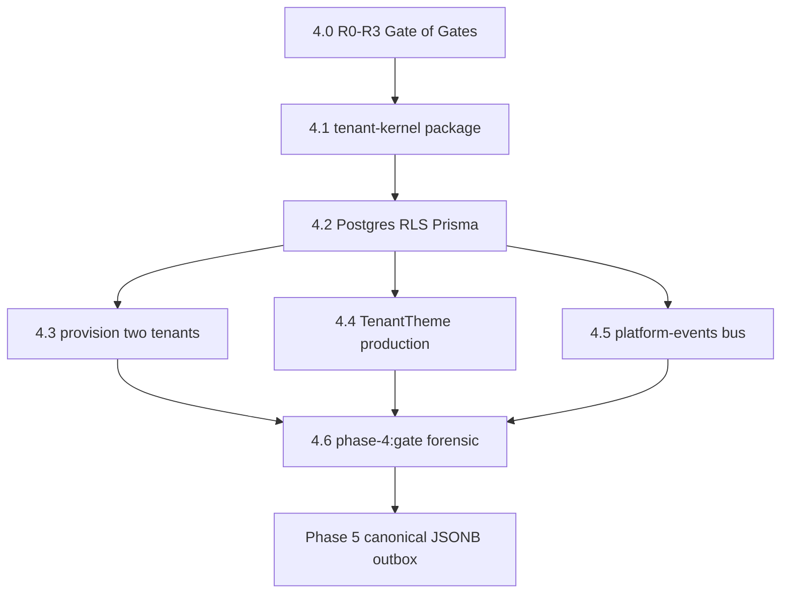

# Phase 4 — State machine

```yaml
agent_load_tier: T1_gate
machine_readable: true
owner: phase-4-state-machine.md
duplicate_of: audits/subphase-enforcement-map.md#forbidden-transitions
```

## STATE MODEL

```yaml
execution_mode:
  type: enum
  allowed: [AI_EXEC, HUMAN_REVIEW]
  default: AI_EXEC
  rule: "REPO_SCRIPTS_OVER_STALE_MD — bind guards to p4_* + P4-E-* tests"

completion_state:
  type: enum
  allowed: [IN_PROGRESS, DONE, BLOCKED, FAILED]
  initial: IN_PROGRESS
  DONE_when: "current_subphase == DONE AND pnpm run phase-4:gate exit 0 AND phase_4_dod hard items PASS"

forbidden_states:
  - id: FS-P4-RF-OPEN
    trigger: merge 4.1+ while R0-R3 open
    enforcement: P4-E-RF-40 + p4_red_flag_prerequisite
  - id: FS-P4-GREP-ONLY
    trigger: closure without P4-E-* tests
    enforcement: verification_table grep_only_rule
  - id: FS-P4-PC-TK
    trigger: platform-core imports tenant-kernel
    enforcement: depcruise platform-core ↛ tenant-kernel

blocked_states:
  - id: BL-P4-DENALI
    until: phase 6
    action: packages/workspaces/denali
  - id: BL-P4-PHASE5-OUTBOX
    until: phase 5
    action: outbox_events table + relay

failure_states:
  - id: FF-P4-GATE
    trigger: pnpm run phase-4:gate exit non-zero
    recovery: fix failing p4_* or phase-3:gate regression; re-run full phase-4:gate
  - id: FF-P4-GUARD-ONLY
    trigger: merge after phase-4:guard without build test phase-3:gate
    recovery: run pnpm run phase-4:gate

state_variables:
  current_phase:
    type: enum
    allowed: ["0", "1", "2", "3", "4", "5", "6", "7"]
    initial: "4"
  current_subphase:
    type: enum
    allowed: ["4.0", "4.1", "4.2", "4.3", "4.4", "4.5", "4.6", "DONE"]
    initial: "4.0"
    closed_state: "DONE — requires phase_4_dod ALL hard items PASS AND forensic archived AND Purity Score >= 8"
  phase_4_mode:
    type: enum
    allowed: ["tenant_security_boundary"]
    value: "tenant_security_boundary"
    meaning: "Every API/web request resolves verified tenant; tenant-scoped data in Postgres with CASL+RLS; tenant theme from kernel not static env"

transition_rules:
  - from_subphase: "4.0"
    to_subphase: "4.1"
    condition: ALL exit_criteria_4_0 PASS AND reports/phase-3.2-red-flag-status-*.md exists AND P4-E-RF-40 PASS
  - from_subphase: "4.1"
    to_subphase: "4.2"
    condition: ALL exit_criteria_4_1 PASS
  - from_subphase: "4.2"
    to_subphase: "4.3"
    condition: ALL exit_criteria_4_2 PASS
  - from_subphase: "4.2"
    to_subphase: "4.4"
    condition: ALL exit_criteria_4_2 PASS
    note: "4.4 MAY start after 4.2 without waiting 4.3"
  - from_subphase: "4.2"
    to_subphase: "4.5"
    condition: ALL exit_criteria_4_2 PASS
  - from_subphase: "4.3"
    to_subphase: "4.6"
    condition: ALL exit_criteria_4_3 PASS AND exit_criteria_4_4 PASS AND exit_criteria_4_5 PASS
  - from_subphase: "4.4"
    to_subphase: "4.6"
    condition: paired with 4.3 and 4.5 complete
  - from_subphase: "4.5"
    to_subphase: "4.6"
    condition: paired with 4.3 and 4.4 complete
  - from_subphase: "4.6"
    to_subphase: "DONE"
    condition: ALL exit_criteria_4_6 PASS AND phase_4_dod ALL hard items PASS
  forbidden_transition:
    action: "start subphase 4.2 before 4.0 exit"
    enforcement: P4-E-RF-40 + architect review
  forbidden_transition:
    action: "start phase 6 Denali before phase 4 DONE"
    enforcement: phase-4-guard p4_no_denali_in_kernel + phase registry
  forbidden_transition:
    action: "merge Phase 4.1+ PR while R0–R3 open"
    enforcement: P4-E-RF-40
```

---

## SUBPHASE DAG



```yaml
dag_edges:
  - { from: "4.0", to: "4.1" }
  - { from: "4.1", to: "4.2" }
  - { from: "4.2", to: "4.3" }
  - { from: "4.2", to: "4.4", parallel: true }
  - { from: "4.2", to: "4.5", parallel: true }
  - { from: "4.3", to: "4.6" }
  - { from: "4.4", to: "4.6" }
  - { from: "4.5", to: "4.6" }
  - { from: "4.6", to: "Phase 5" }
allowed_overlap:
  - "Phase 5 canonical schema DESIGN parallel with 4.2 — FORBIDDEN outbox cutover until phase 5"
forbidden_overlap:
  - action: "4.2 before 4.0 complete"
  - action: "phase 6 Denali before phase 4 DONE"
pr_rule:
  - rule: "PR title/body MUST include label Phase: 4.x"
  - rule: "PR checklist MUST list Enforcement IDs P4-E-* from audits/verification-matrix.md"
  - rule: "Doc-First: update docs/phase-4-tenant-kernel.mdoc BEFORE protected package code per Zero-Debt Covenant"
  - rule: "grep-only closure FORBIDDEN as sole proof — MAP §12.1"
```

---

## SECTION 0 — ALIGNMENT WITH PHASES 0–3 (§0) — HARD CONSTRAINTS

```yaml
alignment_matrix:
  contract:
    phase_0: "workspace-sdk · CanonicalDocument"
    phase_1: "PlatformWizardEngine headless"
    phase_2: "WorkspaceThemeContract · design-tokens"
    phase_3: "starter plugin · apps/* · CASL"
    phase_4: "Tenant boundary · RLS · Postgres SoT"
  core:
    rule: "FORBIDDEN modify platform-core for tenant features in phase 4"
    enforcement: depcruise platform-core ↛ tenant-kernel
  visual:
    phase_3: "ThemeProviderChain · subpath-only primitives"
    phase_4: "TenantThemeProvider production — NOT mock {}"
  authz:
    phase_3: "createApiAbility · accessibleByTourWhere · WorkspaceTheme before ingress"
    phase_4: "SAME CASL + ADD RLS DB layer"
  tours_data:
    phase_3: "in-memory SoT + optional Docker dev"
    phase_4: "Postgres + RLS default runtime when DATABASE_URL set"
  events:
    phase_3: "hook points only"
    phase_4: "in-process bus — outbox deferred phase 5"

resolved_contradictions:
  - id: P4-ALIGN-01
    topic: "Phase 3 Postgres vs Phase 4 RLS"
    rule: "Phase 3 tour SoT remains in-memory until 4.2; Docker Postgres is dev stack only in phase 3"
    refs: [docs/phase-0-foundation.md §9, docs/phase-3-design-system.md §17]
  - id: P4-ALIGN-02
    topic: "Phase 3 Closed vs tenant production"
    rule: "phase-3:gate = visual/app/CASL scaffold; tenant production honesty = 4.0 R0–R3 + 4.2+"
    refs: [docs/archive/root-forensics/audit-red-flags-phase-3.md, docs/backlog/phase-3.2-red-flag-backlog.md]
  - id: P4-ALIGN-03
    topic: "TenantTheme stub phase 2 vs production phase 4"
    rule: "TenantThemeConfig types in workspace-sdk phase 2; provider+DB phase 4"
    path: packages/workspace-sdk/src/theme/tenant-theme.contract.ts
  - id: P4-ALIGN-04
    topic: "MAP three apps vs one apps/web"
    rule: "Phase 3–4 single shell apps/web; Marketing/Admin deploy split later; User-Portal = /tours/new wizard POST /tours"
  - id: P4-ALIGN-05
    topic: "Legacy app.tenant_id vs MAP"
    rule: "Session variable MUST be app.current_tenant_id — NOT legacy app.tenant_id name on port"
    legacy_ref: legacy/apps/api/src/database/rls-tenant-session.ts

phase_3_section_16_bridge:
  - phase_3_item: "Tenant subdomain design reviewed"
    phase_4_delivery: "4.1 parseWorkspaceTenantLabelFromHost + reserved labels + host policy in doc §8"
    exit_verify: P4-E-HOST-01
  - phase_3_item: "RLS migration plan drafted"
    phase_4_delivery: "4.2 infra/sql/001_tenant_rls.sql + Prisma schema"
    exit_verify: P4-E-RLS-01
  - phase_3_item: "phase-3:gate · forensic phase 3"
    phase_4_delivery: "P4-E-REG-03 inside phase-4:gate"

import_law_phase_4:
  unchanged_from_map_2:
    - "platform-core → workspace-sdk only"
    - "workspace-sdk ↛ workspaces/* · ↛ design-tokens"
    - "apps/web ↛ workspaces/* static import"
  phase_4_additions:
    - "tenant-kernel → workspace-sdk types/helpers only"
    - "platform-events → pure TS no workspace import"
    - "apps/api → tenant-kernel, platform-events, workspace-sdk, platform-core, workspace-starter"
    - "apps/web → theme-react, ui-primitives/*, workspace-sdk, platform-core, design-tokens (+ tenant-kernel host helpers server-side if needed)"
    - "platform-core ↛ tenant-kernel"
  phase_3_preserved:
    rule: "apps/web MUST use starterWorkspacePlugin from registry ONLY until phase 6"
    rule: "tenant resolve MUST be separate from workspace plugin selection"
```
