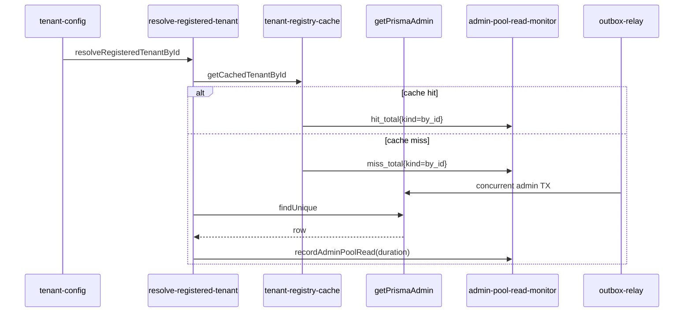

# Admin pool read monitor (NN-03 / B1)

```yaml
status: implemented
phase: 3 scalability audit — noisy-neighbor NN-03 residual closure
closes: B1 checklist — alert on slow admin `findUnique` under outbox/registry contention
mitigated_by: DEC-053, DEC-066, DEC-074
related: outbox-relay-fairness.md, tenant-registry-cache-invalidation.md, pool-leak-post-storm-monitor.md
```

## Problem

`getPrismaAdmin()` serves **outbox relay**, **tenant registry** cache misses, and **rate-limit theme** reads on a **shared admin pool**. Tenant A bulk import → outbox flood → relay `claim`/`update` transactions can delay Tenant B **`GET /api/v2/tenant-config`** on registry cache miss (**NN-03**, **NN-06**).

DEC-066 caps per-tenant relay in-flight; DEC-053/074 add registry/theme cache + invalidation. **Residual:** sustained admin pool contention still slows neighbor login/config without metrics.

## Decision

| Knob                        | Default             | Behavior                                                             |
| --------------------------- | ------------------- | -------------------------------------------------------------------- |
| `ADMIN_POOL_READ_BUDGET_MS` | **500**             | Cache-miss `findUnique` over budget → `admin_pool_read_slow_total++` |
| Ring buffer                 | **128** samples     | Rolling `admin_pool_read_p99_ms` gauge                               |
| Cache counters              | hit/miss per `kind` | `by_id`, `by_subdomain`, `theme` — bounded label cardinality         |

### Metrics (Prometheus text via DEC-108)

| Metric                             | Type    | Labels | Meaning                                |
| ---------------------------------- | ------- | ------ | -------------------------------------- |
| `admin_pool_read_duration_ms_last` | gauge   | —      | Most recent admin read (cache miss)    |
| `admin_pool_read_p99_ms`           | gauge   | —      | p99 over last ≤128 admin reads         |
| `admin_pool_read_slow_total`       | counter | —      | Reads exceeding budget                 |
| `tenant_registry_cache_hit_total`  | counter | `kind` | Registry/theme cache hit               |
| `tenant_registry_cache_miss_total` | counter | `kind` | Registry/theme cache miss → admin read |

### Alert rules (DEC-123 extension)

| Alert                             | Expr                                            | `for` | Severity |
| --------------------------------- | ----------------------------------------------- | ----- | -------- |
| `AppTourAdminPoolReadLatencyHigh` | `admin_pool_read_p99_ms > 500`                  | 5m    | warning  |
| `AppTourAdminPoolReadSlowBursts`  | `increase(admin_pool_read_slow_total[5m]) > 10` | 2m    | warning  |

Label `slo: admin_pool_nn03` — pair with `outbox_relay_tenant_deferred_total` and `db_pool_saturated_total` in incident triage.



## Residual (explicit)

| Scenario                                  | Outcome                                     |
| ----------------------------------------- | ------------------------------------------- |
| Separate `DATABASE_URL_ADMIN` pool sizing | Ops — monitor alerts; no in-app pool resize |
| tenant-config response cache hit          | Admin read skipped — not counted in p99     |
| Memory driver / static registry           | No admin reads — metrics stay zero          |

## Verification

```bash
cd apps/api
node --import tsx --test src/tenant/admin-pool-read-monitor.spec.ts
pnpm run guard:admin-pool-read-monitor
pnpm run guard:deploy-phase5-slo-alerts
```
