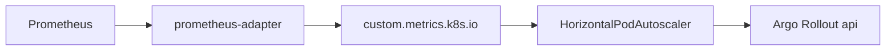

# API HPA on custom Prometheus metrics (DEC-122)

```yaml
status: implemented
phase: 5 evolution — Platform 5.4
closes: SCAL-LIM-01
extends: DEC-121
related: deploy/argo-rollouts/api-rollout.yaml DEC-118
```

## Problem

CPU-only HPA cannot scale on HTTP admission pressure or outbox backlog ([SCAL-LIM-01](phase5-evolution-audit.md)). DEC-121 exposed metrics and `prometheus-adapter` rules but no in-repo **HorizontalPodAutoscaler** manifest.

## Decision

| Item             | Choice                                                                                                                        |
| ---------------- | ----------------------------------------------------------------------------------------------------------------------------- |
| API scale target | Argo `Rollout` `api` (not bare Deployment)                                                                                    |
| Metrics          | **CPU 70%** + **`http_requests_in_flight`** + **`outbox_pending_total`** + **`outbox_relay_oldest_pending_age_seconds`** (F2) |
| API path         | `custom.metrics.k8s.io` pod metrics from DEC-121 adapter rules                                                                |
| Relay path       | Separate `outbox-relay-hpa` when relay split (DEC-118) — scales on backlog only                                               |

### Thresholds (tunable via ops)

| Metric                                    | Target          | Rationale                                                                                                     |
| ----------------------------------------- | --------------- | ------------------------------------------------------------------------------------------------------------- |
| `http_requests_in_flight`                 | **32** avg/pod  | ~50% of default `GLOBAL_HTTP_INFLIGHT_MAX=64` per pod                                                         |
| `outbox_pending_total`                    | **100** avg/pod | Catch-up scale before relay tenant budget defers                                                              |
| `outbox_relay_oldest_pending_age_seconds` | **120** avg/pod | Stale backlog — scale before 5m lag alert (F2 / [`outbox-relay-lag-monitor.md`](outbox-relay-lag-monitor.md)) |
| CPU                                       | **70%**         | Baseline resource signal                                                                                      |

### Scale behavior

| Direction  | Policy                                                              |
| ---------- | ------------------------------------------------------------------- |
| Scale up   | Max **+2 pods** per 60s                                             |
| Scale down | **300s** stabilization window — avoids flapping after traffic spike |

### Split relay topology (DEC-118)

When `outbox-relay` runs as a separate Deployment:

- **`api-hpa`** — keep CPU + `http_requests_in_flight`; **remove** `outbox_pending_total` from API HPA (API pods do not publish events).
- **`outbox-relay-hpa`** — scale relay replicas on `outbox_pending_total` + `outbox_relay_oldest_pending_age_seconds` (F2).

Both manifests ship in `deploy/hpa/`; default `api-hpa.yaml` includes all three metrics for single-image colocated deploys.



## Manifest layout

| Path                               | Target                    |
| ---------------------------------- | ------------------------- |
| `deploy/hpa/api-hpa.yaml`          | `Rollout/api`             |
| `deploy/hpa/outbox-relay-hpa.yaml` | `Deployment/outbox-relay` |

## Prerequisites

1. DEC-121 applied (`ServiceMonitor`, `adapter-rules`, metrics JWT secret).
2. `kubectl get --raw` shows custom metrics API.
3. Argo Rollouts controller installed (HPA → Rollout requires Argo ≥ 1.1).

## Verification

```bash
cd apps/api
pnpm run guard:deploy-hpa
pnpm run phase-5:evolution-gate

kubectl apply -f deploy/hpa/api-hpa.yaml
kubectl describe hpa api -n app-tour
```
