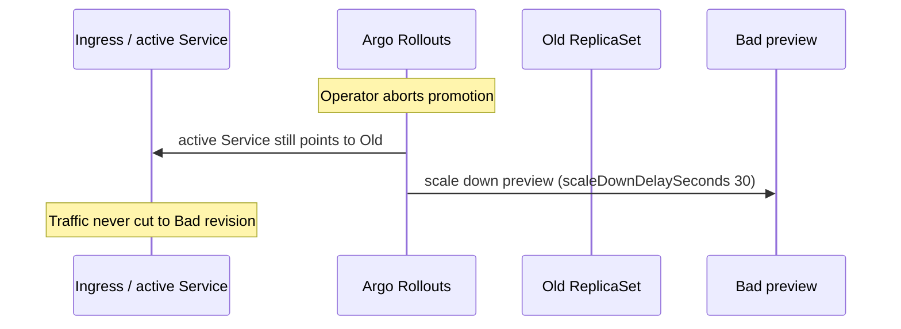

# Argo Rollouts blue-green + split outbox relay worker (DEC-118)

```yaml
status: implemented
phase: 5 evolution — Platform 5.1
closes: RB-GAP-05, RB-GAP-08, RB-GAP-14
related: graceful-shutdown-ingress-reject.md DEC-101, production-deploy-checklist.md
```

## Problem

| Gap           | Issue                                                                                   |
| ------------- | --------------------------------------------------------------------------------------- |
| **RB-GAP-05** | Rolling deploy only — no blue/green; bad revision stays in rotation until manual revert |
| **RB-GAP-08** | Shutdown drain budget vs platform `scaleDownDelaySeconds` not codified in repo          |
| **RB-GAP-14** | Outbox relay colocated in API `main.ts` — API rollback **stops** event publish          |

## Decision

| Item         | Choice                                                                           |
| ------------ | -------------------------------------------------------------------------------- |
| API deploy   | **Argo Rollouts** `blueGreen` strategy with `scaleDownDelaySeconds: 30`          |
| Relay deploy | Separate **Deployment** `outbox-relay` — same image, different boot path         |
| API env      | `WORKER_ROLE=api` (default), `OUTBOX_RELAY_ENABLED=false`                        |
| Relay env    | `WORKER_ROLE=outbox-relay`, `OUTBOX_RELAY_ENABLED=true`                          |
| Boot split   | `bootstrapOutboxRelayWorker()` — health HTTP only + relay + projection reconcile |
| Grace        | `terminationGracePeriodSeconds: 35` (≥ 30s scale-down + relay flush)             |

### Rollback target (<30s active switch)



Blue/green **does not** guarantee <30s image pull on cold nodes — pre-pull / cached layers remain an ops requirement. The **traffic cut** is instant (Service selector flip); old pods drain over `scaleDownDelaySeconds`.

### Manifest layout

| Path                                                | Kind                                   | Role                                      |
| --------------------------------------------------- | -------------------------------------- | ----------------------------------------- |
| `deploy/argo-rollouts/api-rollout.yaml`             | `Rollout` + `Service` (active/preview) | HTTP API — relay off                      |
| `deploy/argo-rollouts/outbox-relay-deployment.yaml` | `Deployment`                           | Background publish + projection reconcile |

### Worker HTTP surface (relay)

| Route         | Purpose                                                  |
| ------------- | -------------------------------------------------------- |
| `GET /health` | K8s liveness/readiness; 503 when shutting down (DEC-101) |

Full tour API routes are **not** mounted on relay pods.

## Environment

| Variable                              | API pod         | Relay pod                     |
| ------------------------------------- | --------------- | ----------------------------- |
| `WORKER_ROLE`                         | `api` (default) | `outbox-relay`                |
| `OUTBOX_RELAY_ENABLED`                | `false`         | `true` (required)             |
| `DATABASE_URL` / `DATABASE_URL_ADMIN` | required (prod) | required (prod)               |
| `GRACEFUL_SHUTDOWN_*`                 | per DEC-085     | same — relay drain on SIGTERM |

## Verification

```bash
cd apps/api
pnpm run guard:deploy-argo-rollouts
pnpm run phase-5:evolution-gate

# cluster (ops)
kubectl argo rollouts get rollout api -n app-tour
kubectl get deploy outbox-relay -n app-tour
```

## Ops notes

- Promote preview only after smoke against `api-preview` Service.
- Relay Deployment uses **RollingUpdate** (acceptable — API rollback no longer stops relay).
- ServiceMonitor / HPA on relay metrics: Phase 5.3–5.4 (`deploy/prometheus/`, `deploy/hpa/`).
