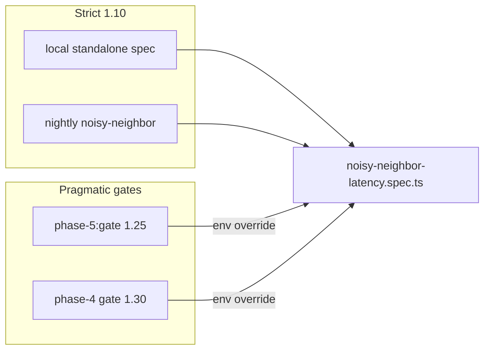

# BASELINE_RATIO_MAX tiering (CON-06 / D6)

```yaml
status: implemented
phase: 3 scalability audit — document alignment CON-06
closes: D6 checklist — noisy-neighbor fairness SLO context per gate tier
related: validation-fairness.md, phase5-evolution-audit.md CI-BYP-20
```

## Problem

`noisy-neighbor-latency.spec.ts` defaults `BASELINE_RATIO_MAX=1.10` (victim write ≤ **10%** over solo baseline). `phase-5:gate` in root `package.json` sets `BASELINE_RATIO_MAX=1.25` for pragmatic CI under combined build+test load. Without an explicit tier table, readers treat **1.10** as the only SLO and flag **1.25** as drift.

## Decision — tiered ceilings (intentional, not a bug)

| Context                                | `BASELINE_RATIO_MAX` | Where set                                                   | Meaning                                                                                                                             |
| -------------------------------------- | -------------------: | ----------------------------------------------------------- | ----------------------------------------------------------------------------------------------------------------------------------- |
| **Standalone spec / nightly**          |             **1.10** | `noisy-neighbor-latency.spec.ts` default; `api-nightly.yml` | Strict CPU fairness — victim `createTour` ≤ 10% over baseline @ 1000 validation burst                                               |
| **Phase 5 full gate**                  |             **1.25** | root `package.json` `phase-5:gate`                          | Pragmatic waiver ([CI-BYP-20](../../../apps/api/docs/phase5-evolution-audit.md)) — same spec, looser ratio under parallel gate load |
| **Phase 4 resilience gate (Postgres)** |             **1.30** | `phase-4-resilience-regression-gate.mjs`                    | Orchestration tier with DB reset + outbox ordering — documented in [`postgres-required-gates.md`](postgres-required-gates.md)       |

**Authoritative default for product SLO:** **1.10** when running the spec in isolation or nightly. Gate overrides are **environment injection only** — spec source keeps `?? "1.10"`.



## Verification

```bash
# Strict tier (default)
cd apps/api && NODE_ENV=test STORAGE_DRIVER=memory \
  node --import tsx --test test/3-performance/noisy-neighbor-latency.spec.ts

# Gate tier (same spec, pragmatic ratio)
cd apps/api && BASELINE_RATIO_MAX=1.25 NODE_ENV=test STORAGE_DRIVER=memory \
  node --import tsx --test test/3-performance/noisy-neighbor-latency.spec.ts

pnpm run guard:phase3-doc-alignment
```

## Residual

| Item                    | Outcome                                                                                               |
| ----------------------- | ----------------------------------------------------------------------------------------------------- |
| Align gate back to 1.10 | Deferred — track in Phase 5 CI-BYP-20 removal when pool/worker sizing proven                          |
| HTTP victim probes      | Use ratio **plus floor** (`TENANT_B_LATENCY_RATIO_MAX`) — separate from CPU-only `BASELINE_RATIO_MAX` |

## Related

- [`validation-fairness.md`](validation-fairness.md) — NN-01 CPU fairness probes
- [`rate-limiting.md`](rate-limiting.md) — HTTP-layer victim SLO
- [`IMPLEMENTATION-DECISIONS.md`](IMPLEMENTATION-DECISIONS.md) — DEC-016 validation fairness
