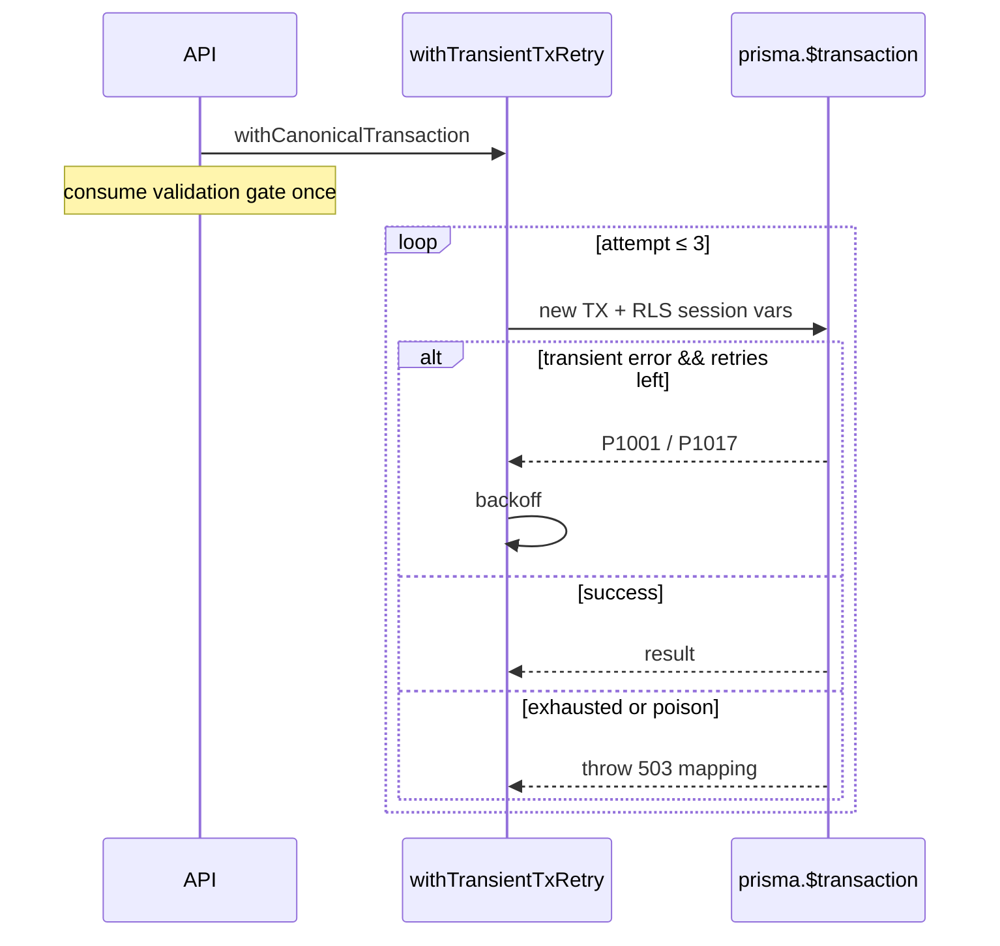

# Canonical transaction transient retry (DEC-112 / evolution Phase 4.3)

```yaml
status: implemented
phase: 5 evolution — Phase 4.3
closes: SH-GAP-01, SH-GAP-02, SH-GAP-03 (partial)
related: transient-db-error.md, phase-5-canonical-schema.md §7
```

## Problem

`withCanonicalTransaction` opened a single Prisma `$transaction` with no whole-TX replay on disconnect (`P1001`/`P1017`) or pool timeout. A mid-TX blip rolled back and surfaced as **500** — clients retried blindly while the server did not ([SH-GAP-02](phase5-evolution-audit.md)).

DEC-094 classified transient errors at `withTenantRls` but **explicitly avoided** in-TX retry. Canonical persist path needed the same classification with **bounded whole-TX replay**.

## Decision

| Item            | Choice                                                                                 |
| --------------- | -------------------------------------------------------------------------------------- |
| Wrapper         | `withTransientTxRetry(run)` — replays entire `run()` closure                           |
| Scope           | `withCanonicalTransaction` only (not arbitrary nested TX bodies)                       |
| Max retries     | `CANONICAL_TX_TRANSIENT_RETRY_ATTEMPTS` default **2** (3 total attempts)               |
| Transient set   | `isTransientDbError` (P1001, P1017, pool saturation, ECONNRESET…)                      |
| Non-transient   | Fail immediately — no retry (`P2002`, validation, business errors)                     |
| RLS             | Each attempt = new `$transaction` + `applyTenantRlsSessionVars`                        |
| Validation gate | `consumePreTransactionValidationGate` once **before** retry loop                       |
| Circuit         | Intermediate retry failures **do not** increment circuit; final exhausted attempt does |
| Backoff         | `computeRelayBackoff` between attempts (50ms base, 500ms cap)                          |
| Metric          | `canonical_tx_transient_retry_total` on success after retry                            |

## Flow



## Non-goals

- Retry inside an open `$transaction` callback (unsafe for partial writes)
- Retry without prior validation gate (RULE-003 unchanged)
- Auto-retry on non-idempotent HTTP without Idempotency-Key (HTTP boundary unchanged)

## Verification

```bash
cd apps/api
pnpm run guard:canonical-tx-transient-retry
node --import tsx --test src/db/with-transient-tx-retry.spec.ts
pnpm run phase-5:evolution-gate
```
