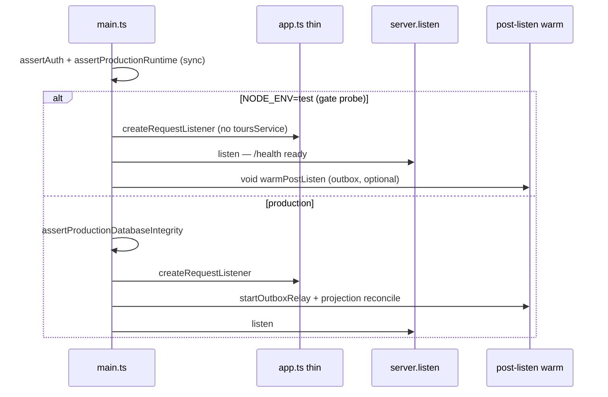

# Cold-start lazy boot (DEC-061 follow-on / §12)

```yaml
status: implemented
phase: 3 scalability audit — CS-UNSC-01 compiled path
related: DEC-061, SCAL-DEBT-15
closes: CS-UNSC-01 (partial — dist/main.js spawn-to-/health)
```

## Problem

The compiled `dist/main.js` readiness probe (`cold-start-readiness-gate.mjs`) measures **spawn → first `GET /health` 200**. Before lazy boot, `main.ts` and `app.ts` eagerly imported the full canonical stack (`platform-core`, `workspace-sdk`, tour routes, provisioning) at module evaluation — even though `/health` only needs `health.routes` + `json` + shutdown state.

Measured p95 on `dist/main.js` was **546–770 ms** against the **500 ms** audit SLO (DEC-061). After lazy boot, repeated gate samples show p95 **240–290 ms** with `unscalable: false` in the last-run artifact.

**Enforce policy (tiered):**

| Tier                                           | `COLD_START_READINESS_ENFORCE` | Behavior                                                                                     |
| ---------------------------------------------- | ------------------------------ | -------------------------------------------------------------------------------------------- |
| Trunk / pre-commit / `phase-3:regression-gate` | `false`                        | Records `unscalable` in artifact; gate **PASS** even when p95 > budget (DEC-061 record-only) |
| Nightly CI / pre-release                       | `true`                         | Gate **FAIL** when p95 > `COLD_START_READINESS_BUDGET_MS` (default 500 ms)                   |
| Release promotion                              | `true`                         | Same as nightly — hard-fail before scale-to-zero deploy                                      |

Trunk stays record-only so shared CI runners with variable p95 do not block PR merge. Nightly workflow (`.github/workflows/api-nightly.yml`) runs `test:nightly:cold-start` after `pnpm run build`.

## Decision

Split boot into a **thin listen path** and **deferred warm imports**:

| Layer     | Eager (before `server.listen`)                              | Lazy (first non-health route or post-listen warm)                 |
| --------- | ----------------------------------------------------------- | ----------------------------------------------------------------- |
| `main.ts` | `node:http`, logger, shutdown hooks, worker-role fork       | Auth/runtime guards; `createRequestListener`; outbox relay (prod) |
| `app.ts`  | `/health`, trace ALS, shutdown ingress reject, 404 envelope | Tour stack, tenant-config, provisioning, internal ops routes      |
| Tours DI  | Injected `toursService` in tests                            | `resolveLazyToursService()` on first `/tours` when omitted        |

### Test vs production boot order



**Production safety:** `assertProductionDatabaseIntegrity()` still runs **before** `listen` when `isProductionAuthMode()` and `STORAGE_DRIVER=prisma`. Test/dev gate probes may listen first — integrity probe is a no-op there.

## Modules

| File                                                                                            | Role                                                  |
| ----------------------------------------------------------------------------------------------- | ----------------------------------------------------- |
| [`apps/api/src/boot/lazy-tours-service.ts`](../../../apps/api/src/boot/lazy-tours-service.ts)   | Single-flight `import()` of `ToursService` wiring     |
| [`apps/api/src/boot/lazy-route-handlers.ts`](../../../apps/api/src/boot/lazy-route-handlers.ts) | Single-flight `import()` of non-health route handlers |
| [`apps/api/src/app.ts`](../../../apps/api/src/app.ts)                                           | Thin dispatcher — sync `/health` only on cold path    |
| [`apps/api/src/main.ts`](../../../apps/api/src/main.ts)                                         | Dynamic `import()` boot chain; test-fast listen       |

## Environment

| Variable                         | Default                            | Role                                                                |
| -------------------------------- | ---------------------------------- | ------------------------------------------------------------------- |
| `COLD_START_READINESS_BUDGET_MS` | `500`                              | Gate p95 budget (DEC-061) — spawn → `GET /health` on `dist/main.js` |
| `COLD_START_READINESS_ENFORCE`   | `false` (trunk) / `true` (nightly) | When `true`, exit 1 if p95 > budget                                 |
| `OUTBOX_RELAY_ENABLED`           | —                                  | Gate sets `false` — relay not started during probe                  |

### Tiered budgets (CON-03 — no single `COLD_START_BUDGET_MS` ambiguity)

| Probe                    | Spec / script                             | Budget env                       | Default                                                     | What it measures                                                                                       |
| ------------------------ | ----------------------------------------- | -------------------------------- | ----------------------------------------------------------- | ------------------------------------------------------------------------------------------------------ |
| **Readiness**            | `cold-start-readiness-gate.mjs`           | `COLD_START_READINESS_BUDGET_MS` | **500 ms**                                                  | Compiled `dist/main.js` spawn → first `/health` 200 (§12 SLO)                                          |
| **HTTP validation wake** | `cold-start-latency.spec.ts` (subprocess) | `COLD_START_HTTP_BUDGET_MS`      | **500 ms** (falls back to `COLD_START_READINESS_BUDGET_MS`) | tsx worker first `GET /probe` TTFB incl. per-call RuleEngine validation                                |
| **Engine compile**       | `cold-start-latency.spec.ts` (in-process) | `COLD_START_ENGINE_BUDGET_MS`    | **1000 ms** (legacy alias: `COLD_START_BUDGET_MS`)          | `PlatformWizardEngine.tryInit` on 256-cell RuleSet — serverless **compile** debt, not listen readiness |

Readiness @ 500 ms and engine compile @ 1000 ms are **intentionally different**: `/health` must be thin; first tour validation may compile a large RuleSet. Legacy `COLD_START_BUDGET_MS` applies only to the engine probe for backward compatibility.

## Verification

```bash
cd apps/api
pnpm run build
pnpm run cold-start-readiness-gate                    # trunk: record-only (enforce=false)
pnpm run test:nightly:cold-start                        # nightly: build + enforce=true
pnpm run guard:cold-start-readiness-gate                # trunk lock (script + regression gate wiring)
pnpm run guard:cold-start-readiness-enforce             # nightly lock (enforce script + workflow)
```

**Artifact:** `test/reliability/cold-start-readiness.last-run.json` — fields `enforce`, `unscalable`, `verdict`. Nightly runs set `enforce: true` and require `verdict: PASS` (i.e. `unscalable: false`).

**CI lock matrix:**

| Guard                                | Tier    | Validates                                                                                                  |
| ------------------------------------ | ------- | ---------------------------------------------------------------------------------------------------------- |
| `guard:cold-start-readiness-gate`    | Trunk   | Gate script exists; `phase-3-regression-gate` invokes record-only probe after `build-dist`                 |
| `guard:cold-start-readiness-enforce` | Nightly | `test:nightly:cold-start` script; trunk regression keeps `ENFORCE=false`; workflow schedules enforce probe |

**Regression:** Existing integration specs inject `toursService` explicitly — lazy path is bypassed. No change to DEC-061 probe contract.

## CS-UNSC tier matrix (CON-03 / §12)

| ID             | Probe                      | Path                         | SLO            | Tier                              | Status                                                   |
| -------------- | -------------------------- | ---------------------------- | -------------- | --------------------------------- | -------------------------------------------------------- |
| **CS-UNSC-03** | Spawn → `GET /health`      | Compiled `dist/main.js`      | **500 ms** p95 | Trunk gate + nightly enforce      | **Pass** — lazy boot                                     |
| **CS-UNSC-02** | Spawn → `COLD_START_READY` | `cold-start-http-worker.ts`  | **500 ms**     | Trunk spec (`cold-start-latency`) | **Pass** — worker listens before `platform-core` import  |
| **CS-UNSC-01** | Spawn → `GET /health`      | `tsx` + full `main.ts` graph | **500 ms**     | **Dev record-only**               | **Waived** — tsx transpile; production uses `dist/` only |

`cold-start-http-worker` defers `@app-tour/platform-core` / `workspace-sdk` until first `GET /probe` so spawn-to-ready measures **socket bind only**, not RuleEngine compile. First-request validation cost remains in HTTP TTFB (budget `COLD_START_HTTP_BUDGET_MS`).

**CS-UNSC-01** is intentionally **not** in `phase-3:regression-gate` — operators use compiled gate + nightly enforce; local `tsx` dev may exceed 500 ms without blocking merge. Formal waiver + record-only probe: [cold-start-tsx-dev-waiver.md](cold-start-tsx-dev-waiver.md) (`pnpm run probe:cold-start-tsx-dev`, `guard:cold-start-tsx-waiver`).
