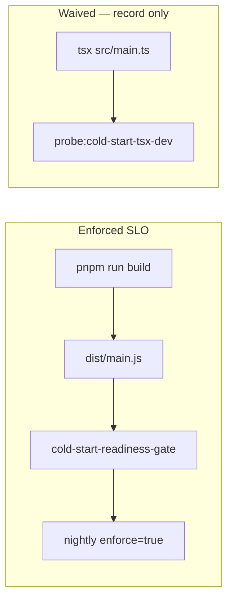

# Cold-start tsx dev waiver (CS-UNSC-01 / A2)

```yaml
status: waived
phase: 3 scalability audit — §12 cold-start
closes: A2 checklist — CS-UNSC-01 tsx `main.ts` excluded from readiness SLO
related: cold-start-lazy-boot.md, DEC-061
production_path: dist/main.js only
```

## Problem

`node --import tsx src/main.ts` pays **on-the-fly transpile** plus the full eager import graph. Measured p95 spawn → `GET /health` is **~2084 ms** — **Unscalable** against the **500 ms** readiness SLO. This path is used by `pnpm run dev` only; **production and nightly enforce** use compiled `dist/main.js` (p95 **~290 ms** after lazy boot).

Blocking PRs on tsx dev boot would be a **false negative** — it does not represent scale-to-zero readiness.

## Decision

| Path                                      | SLO          | Trunk gate                    | Nightly enforce                | Status                      |
| ----------------------------------------- | ------------ | ----------------------------- | ------------------------------ | --------------------------- |
| **`dist/main.js`**                        | 500 ms p95   | Record-only (`enforce=false`) | **Hard-fail** (`enforce=true`) | **Pass** — production SoT   |
| **`tsx src/main.ts`** (CS-UNSC-01)        | —            | **Excluded**                  | **Excluded**                   | **Waived** — dev ergonomics |
| **`cold-start-http-worker`** (CS-UNSC-02) | 500 ms ready | Spec in `cold-start-latency`  | —                              | **Pass**                    |

### Operator rules

1. **Never** promote scale-to-zero or readiness SLO from `tsx` / `pnpm run dev` timings.
2. **Always** use `pnpm run build` + `cold-start-readiness-gate` or `test:nightly:cold-start` before release.
3. Optional **record-only** probe documents local tsx debt: `pnpm run probe:cold-start-tsx-dev` (always exit 0).



## Implementation map

| File                                               | Role                                       |
| -------------------------------------------------- | ------------------------------------------ |
| `apps/api/scripts/cold-start-readiness-gate.mjs`   | Production probe — `dist/main.js` only     |
| `apps/api/scripts/cold-start-tsx-dev-probe.mjs`    | CS-UNSC-01 record-only artifact            |
| `apps/api/scripts/guard-cold-start-tsx-waiver.mjs` | CI lock — tsx never in enforce path        |
| `apps/api/scripts/phase-3-regression-gate.mjs`     | `COLD_START_READINESS_ENFORCE=false`       |
| `.github/workflows/api-nightly.yml`                | `test:nightly:cold-start` on compiled path |

## Artifact

`test/reliability/cold-start-tsx-dev.last-run.json`:

| Field        | Meaning                            |
| ------------ | ---------------------------------- |
| `waived`     | Always `true`                      |
| `unscalable` | `p95Ms > budgetMs` (informational) |
| `verdict`    | Always `PASS` — never blocks CI    |

## Verification

```bash
cd apps/api
pnpm run guard:cold-start-tsx-waiver
pnpm run probe:cold-start-tsx-dev    # optional local record
pnpm run test:nightly:cold-start    # production enforce path
```
