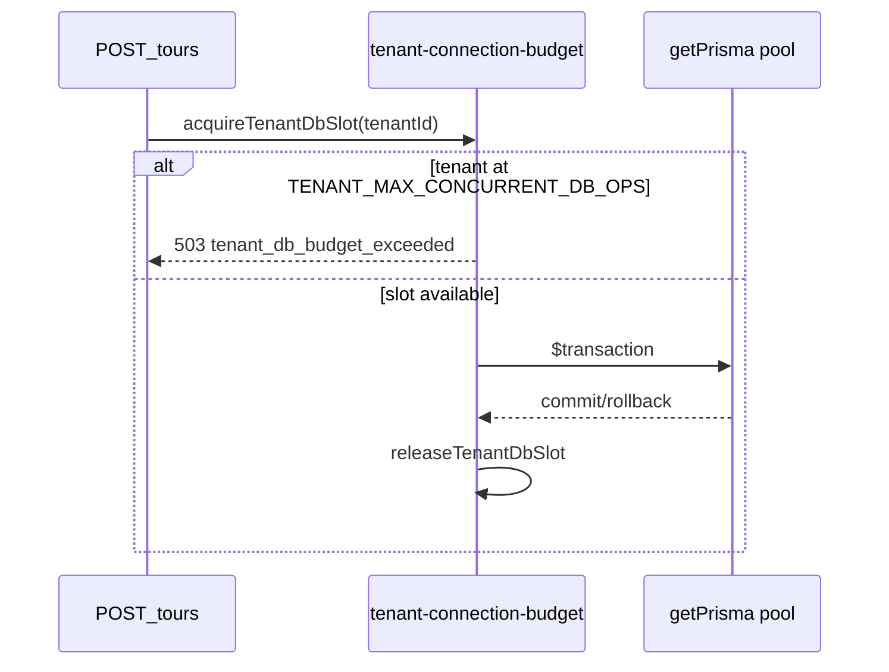

# Per-tenant connection budget (P2-5 — design)

```yaml
status: implemented
phase: 3 scalability audit — closure step 4 (DEC-055)
related: DEC-012 (pool saturation 503), DEC-015 (HTTP rate limit)
closes: SCAL-DEBT-01, NN-02 (partial)
```

## Problem

HTTP rate limits (50 rps default) bound **request rate**, not **concurrent DB sessions** per tenant. A single tenant can still hold multiple Prisma pool connections during long transactions or parallel integration tests.

## Proposed model

| Layer          | Knob                                           | Behavior                                                                                                                   |
| -------------- | ---------------------------------------------- | -------------------------------------------------------------------------------------------------------------------------- |
| Pool           | `DATABASE_URL` `connection_limit`              | Global ceiling — size ≥ `OUTBOX_RELAY_PUBLISH_CONCURRENCY` + HTTP headroom ([C2](outbox-relay-pool-contention-monitor.md)) |
| Per-tenant     | `TENANT_MAX_CONCURRENT_DB_OPS` (default **4**) | In-process semaphore before `prisma.$transaction` in `withTenantRls` / `withCanonicalTransaction`                          |
| Saturation     | DEC-012                                        | When global pool exhausted → HTTP 503 `DB_POOL_SATURATED`                                                                  |
| Per-tenant cap | DEC-055                                        | When tenant at cap → HTTP 503 `tenant_db_budget_exceeded` / `TENANT_DB_BUDGET_EXCEEDED`                                    |

## Semantics (implemented)

1. **Non-blocking acquire** before `prisma.$transaction` — fail fast when tenant at cap (does not wait on pool).
2. **Release** in `finally` on commit/rollback/throw.
3. Counter is **in-process** — multi-replica fairness requires Phase 7 distributed semaphore (out of scope).



## Environment

| Variable                       | Default | Role                                  |
| ------------------------------ | ------- | ------------------------------------- |
| `TENANT_MAX_CONCURRENT_DB_OPS` | `4`     | Max concurrent app-pool TX per tenant |

## Verification

```bash
cd apps/api
pnpm run guard:tenant-db-budget
node --import tsx --test test/3-performance/tenant-connection-budget.spec.ts
pnpm run phase-3:regression-gate
```

**Probe isolation:** `db-pool-saturation.spec.ts` raises `TENANT_MAX_CONCURRENT_DB_OPS` for the suite so **global** pool saturation (DEC-012) is measured — not per-tenant budget rejection (DEC-055).
