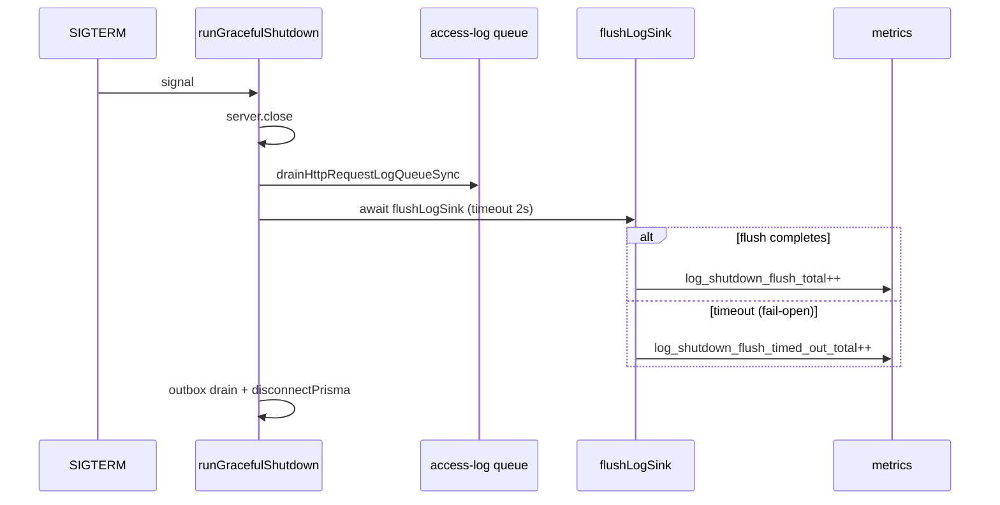

# FOF-LOG-03 shutdown tail acceptance (A3)

```yaml
status: accepted
phase: 3 scalability audit — §11 logging backpressure
closes: A3 checklist — SIGTERM tail loss residual
mitigated_by: DEC-063, DEC-062, DEC-070
related: logging-backpressure.md, graceful-shutdown-outbox-drain.md
```

## Problem

Under SIGTERM during log sink pressure, buffered NDJSON could be **discarded** before reaching the collector — incomplete incident timelines (FOF-LOG-03). Phase 3 audit rated this **Fatal** under adversarial slow-sink assumption; empirical fast-stdout probes stayed green (LOG-BP-01).

## Mitigation (implemented)

| Step                   | DEC     | Behavior                                                                           |
| ---------------------- | ------- | ---------------------------------------------------------------------------------- |
| Async access log       | DEC-062 | `finish` enqueues — does not block on Pino                                         |
| Bounded sink + metrics | DEC-063 | `maxLength`, `drain`/`drop`/`error` counters                                       |
| Shutdown order         | DEC-063 | `server.close` → `drainHttpRequestLogQueueSync` → `flushLogSink` → outbox → Prisma |
| Nightly adversarial    | DEC-070 | `test:nightly:slow-sink` — HTTP stays 200 under slow drain                         |



## Residual (accepted)

| Scenario                                                   | Outcome                                                                            |
| ---------------------------------------------------------- | ---------------------------------------------------------------------------------- |
| Slow remote log driver exceeds `LOG_SINK_FLUSH_TIMEOUT_MS` | **Fail-open exit** — tail may be lost; metric `log_shutdown_flush_timed_out_total` |
| `SIGKILL` / OOM                                            | No flush — accepted vs unbounded buffer OOM                                        |
| `log_sink_drop_total` growth under sustained pressure      | Bounded memory — completeness traded for availability                              |

**Frequency:** Low vs OOM under unbounded buffer (pre-DEC-063). Operators **alert** on flush timeout and drop counters; not a trunk gate blocker.

## Production pre-flight (before remote log driver)

1. Run **`pnpm run test:nightly:slow-sink`** on release candidate (DEC-070).
2. Confirm **`guard:log-backpressure-contract`** green in CI.
3. Set `LOG_SINK_FLUSH_TIMEOUT_MS` ≥ collector drain SLA (default **2000** ms).
4. Wire Prometheus scrape + alert **`AppTourLogShutdownFlushTimeout`** (see [phase5-slo-alerting.md](phase5-slo-alerting.md)).
5. Do **not** switch to `pino.transport` / pretty-print without re-running slow-sink probe.

## Metrics

| Metric                               | Meaning                                   |
| ------------------------------------ | ----------------------------------------- |
| `log_sink_drop_total`                | Sonic-Boom dropped lines (bounded buffer) |
| `log_sink_drain_total`               | Sink backpressure drain events            |
| `log_sink_error_total`               | Pipe errors (HF-09)                       |
| `log_shutdown_flush_total`           | SIGTERM path flush completed              |
| `log_shutdown_flush_timed_out_total` | Flush hit timeout — **tail loss risk**    |

## Verification

```bash
cd apps/api
pnpm run guard:log-backpressure-contract
pnpm run guard:fof-log-03-shutdown-tail
pnpm run test:nightly:slow-sink   # before prod log driver change
node --import tsx --test src/observability/logger-backpressure.spec.ts
```
