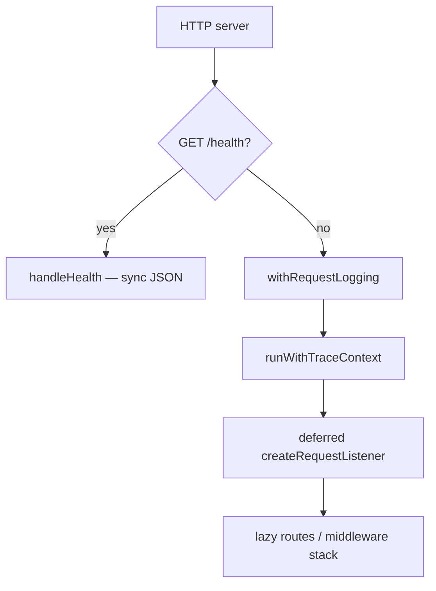

# Health priority ingress lane (NN-08 / Phase 3)

```yaml
status: implemented
phase: 3 scalability audit — noisy-neighbor register NN-08
closes: NN-08 (partial — monolith fast path; sidecar deferred)
related: cold-start-lazy-boot.md, priority-load-shed.md, logging-backpressure.md
residual: sync RuleEngine CPU monopolization (NN-01) can still delay /health on a wedged event loop
```

## Problem

`GET /health` is the K8s / cold-start readiness probe. Before this lane, every request — including `/health` — passed through:

1. `withRequestLogging` (in-flight counter + async access-log enqueue on `finish`)
2. `runWithTraceContext` (ALS trace binding)
3. Full `createRequestListener` dispatch (lazy route imports on first non-health miss)

Under access-log queue pressure (DEC-062) or trace/logging overhead, probe latency could grow even when the handler itself is trivial (`sendJson` 200). The audit register **[NN-08]** flagged missing **priority isolation** vs bulk validation / logging storms.

A separate health worker or sidecar is out of scope for the single-process monolith; this appendix documents the **minimal fast path** at the HTTP server root.

## Decision

| Item             | Choice                                                                                         |
| ---------------- | ---------------------------------------------------------------------------------------------- |
| Gate             | `createHealthAwareServerListener` in `main.ts` — **before** `withRequestLogging` and trace ALS |
| Match            | `GET` + pathname `/health` only (normalized via `URL`; no query sensitivity)                   |
| Handler          | Existing `handleHealth` — shutdown **503** unchanged (DEC-101)                                 |
| Exempt from      | Access-log queue, HTTP in-flight metrics wrapper, trace ALS, lazy app import                   |
| Still subject to | Event-loop CPU when sync validation monopolizes the thread (NN-01 residual)                    |
| Not in scope     | Sidecar, OS priority, worker-thread health                                                     |

### Request flow



`/health` on the **compiled** `main.ts` path also skips deferred `import("./app")` until the first business route (see [cold-start-lazy-boot.md](cold-start-lazy-boot.md)).

Weighted fair admission ([priority-load-shed.md](priority-load-shed.md)) already exempts `/health` from tenant inflight shed because it never enters `runWithHttpRequestContext`; this lane closes the **logging / trace / lazy-import** gap at the process entrypoint.

## Modules

| File                                                                                                    | Role                                                              |
| ------------------------------------------------------------------------------------------------------- | ----------------------------------------------------------------- |
| [`apps/api/src/boot/health-priority-ingress.ts`](../../../apps/api/src/boot/health-priority-ingress.ts) | `isHealthGetRequest`, `createHealthAwareServerListener`           |
| [`apps/api/src/main.ts`](../../../apps/api/src/main.ts)                                                 | `createServer(createHealthAwareServerListener(deferredDispatch))` |
| [`apps/api/src/health/health.routes.ts`](../../../apps/api/src/health/health.routes.ts)                 | Probe body + graceful-shutdown **503**                            |

## Residual risk (explicit)

| Scenario                                      | `/health` behavior                                              |
| --------------------------------------------- | --------------------------------------------------------------- |
| Access-log queue saturated                    | **Mitigated** — health bypasses enqueue                         |
| Lazy app cold import on first API route       | **Mitigated** — health never triggers import                    |
| Extreme sync RuleEngine on event loop (NN-01) | **Degraded latency** until thread frees — not a separate worker |
| Process hang / OOM                            | **Fails** — probe timeout; requires orchestrator restart        |

In-process **`health_probe_p99_ms`** + Prometheus alerts **`AppTourHealthProbeLatencyHigh`** / **`AppTourHealthProbeSlowBursts`** close the NN-01 residual checklist item (A1) — see [health-probe-latency-monitor.md](health-probe-latency-monitor.md).

Future scale-out MAY add a sidecar health port; until then operators alert on sustained p99 / `health_probe_slow_total`, not probe misconfiguration.

## Verification

```bash
cd apps/api
node --import tsx --test --test-force-exit src/boot/health-priority-ingress.spec.ts
pnpm run guard:health-priority-lane
pnpm run phase-3:regression-gate   # includes health-priority spec in closure tier
```

**Regression gate:** `phase-3-regression-gate.mjs` runs `src/boot/health-priority-ingress.spec.ts` in the `phase3-p0-closure-specs` step (NN-01/NN-08 trunk lock).

**Spec contract:**

- Static: `main.ts` wires `createHealthAwareServerListener` before `withRequestLogging`
- Runtime: concurrent `GET /health` stays **200** with bounded p99 while access-log drain is adversarially slow on non-health traffic
- Runtime: `GET /health` responds during interleaved sync validation storm (NN-01 may inflate latency; must not **503** except shutdown)
