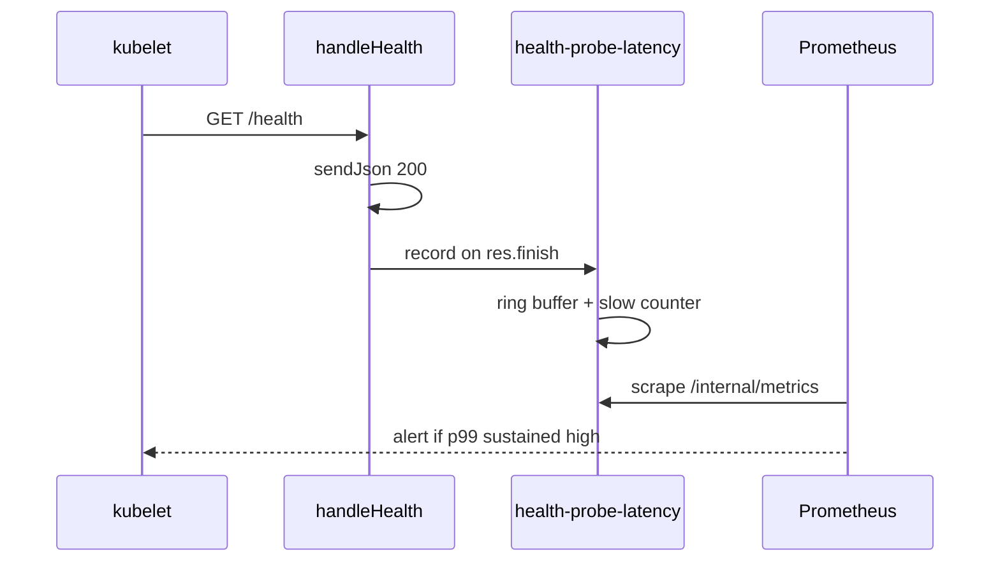

# Health probe latency monitor (NN-01 residual / A1)

```yaml
status: implemented
phase: 3 scalability audit — noisy-neighbor NN-01 residual closure
closes: A1 checklist — alert on sustained GET /health p99 under wedged event loop
related: health-priority-lane.md, validation-fairness.md, phase5-slo-alerting.md
```

## Problem

NN-08 removes logging/trace/lazy-import from `GET /health`, and DEC-056 offloads validation to a worker pool. **Residual (NN-01):** a **fully wedged** event loop — sync validation bypass, extreme CPU monopolization — still delays the health handler on the **same thread**. K8s probes stay **200** but latency grows; without metrics, operators misdiagnose probe timeouts as network or misconfigured `periodSeconds`.

## Decision

| Knob                                | Default         | Behavior                                                                                   |
| ----------------------------------- | --------------- | ------------------------------------------------------------------------------------------ |
| `HEALTH_PROBE_LATENCY_BUDGET_MS`    | **500**         | Wall time from request accept → `finish`; over budget increments `health_probe_slow_total` |
| Ring buffer                         | **128** samples | In-process rolling window for `health_probe_p99_ms` gauge                                  |
| `HEALTH_PROBE_STORM_P99_CEILING_MS` | **3000**        | Trunk spec ceiling under sync validation storm (degraded, not hard fail)                   |

### Metrics (Prometheus text via DEC-108)

| Metric                          | Type    | Meaning                                     |
| ------------------------------- | ------- | ------------------------------------------- |
| `health_probe_duration_ms_last` | gauge   | Most recent completed probe                 |
| `health_probe_p99_ms`           | gauge   | p99 over last ≤128 probes                   |
| `health_probe_slow_total`       | counter | Probes exceeding budget since process start |

### Alert rules (DEC-123 extension)

| Alert                           | Expr                                        | `for` | Severity |
| ------------------------------- | ------------------------------------------- | ----- | -------- |
| `AppTourHealthProbeLatencyHigh` | `health_probe_p99_ms > 500`                 | 5m    | warning  |
| `AppTourHealthProbeSlowBursts`  | `increase(health_probe_slow_total[5m]) > 5` | 2m    | warning  |

Both label `slo: readiness_nn01` — ties to validation-fairness runbook, not probe misconfiguration.



## Implementation map

| File                                                      | Role                              |
| --------------------------------------------------------- | --------------------------------- |
| `apps/api/src/health/health-probe-latency.ts`             | Sample ring + budget + exports    |
| `apps/api/src/health/health.routes.ts`                    | `res.on("finish")` timing wrapper |
| `apps/api/src/observability/prometheus-format.ts`         | Gauge/counter export              |
| `deploy/alerts/phase5-slo.yaml`                           | `AppTourHealthProbe*` rules       |
| `apps/api/scripts/guard-health-probe-latency-monitor.mjs` | CI lock                           |
| `apps/api/src/boot/health-priority-ingress.spec.ts`       | Storm p99 ceiling + metric smoke  |

## Residual (explicit)

| Scenario                       | Outcome                                   |
| ------------------------------ | ----------------------------------------- |
| Sidecar health port            | Deferred — monolith uses in-process p99   |
| Probe **503** during CPU storm | Not expected — only shutdown (DEC-101)    |
| Process hang                   | Probe timeout — restart; metric may stall |

## Verification

```bash
cd apps/api
node --import tsx --test src/health/health-probe-latency.spec.ts
node --import tsx --test --test-force-exit src/boot/health-priority-ingress.spec.ts
pnpm run guard:health-probe-latency-monitor
pnpm run guard:deploy-phase5-slo-alerts
```
