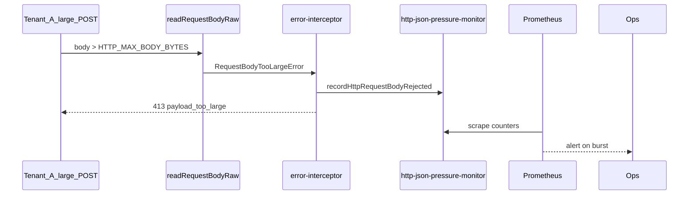

# HTTP JSON pressure monitor (NN-07 / B5)

```yaml
status: implemented
phase: 3 scalability audit — noisy-neighbor NN-07 residual closure
closes: B5 checklist — alert on ingress 413 and egress 507 JSON reject bursts
mitigated_by: DEC-052, DEC-129
related: http-request-body-limit.md, http-response-size-budget.md, validation-fairness.md
```

## Problem

DEC-052 caps ingress at **256 KiB** (`HTTP_MAX_BODY_BYTES`) with **413** before `JSON.parse`. DEC-129 caps egress at **2 MiB** (`HTTP_MAX_RESPONSE_BYTES`) with **507** before `res.end`.

**Residual (NN-07):** Bodies under the cap can still monopolize the event loop during parse/stringify under bulk import. Operators need **reject counters** and **burst alerts** to detect adversarial or misconfigured large payloads without waiting for CPU probes.

## Decision

| Knob                | Default                               | Behavior                                          |
| ------------------- | ------------------------------------- | ------------------------------------------------- |
| Ingress reject      | `http_request_body_rejected_total++`  | Each **413** `REQUEST_BODY_TOO_LARGE` response    |
| Egress reject       | `http_response_body_rejected_total++` | Each **507** `RESPONSE_TOO_LARGE` response        |
| Ingress burst alert | `> 10` / 5m                           | `increase(http_request_body_rejected_total[5m])`  |
| Egress burst alert  | `> 5` / 5m                            | `increase(http_response_body_rejected_total[5m])` |

### Metrics (Prometheus text via DEC-108)

| Metric                              | Type    | Meaning                                             |
| ----------------------------------- | ------- | --------------------------------------------------- |
| `http_request_body_rejected_total`  | counter | Ingress body over `HTTP_MAX_BODY_BYTES` (413)       |
| `http_response_body_rejected_total` | counter | Egress payload over `HTTP_MAX_RESPONSE_BYTES` (507) |

### Alert rules (DEC-123 extension)

| Alert                                   | Expr                                                                        | `for` | Severity |
| --------------------------------------- | --------------------------------------------------------------------------- | ----- | -------- |
| `AppTourHttpRequestBodyRejectedBursts`  | `increase(http_request_body_rejected_total{namespace="app-tour"}[5m]) > 10` | 2m    | warning  |
| `AppTourHttpResponseBodyRejectedBursts` | `increase(http_response_body_rejected_total{namespace="app-tour"}[5m]) > 5` | 2m    | warning  |

Label `slo: json_pressure_nn07` — pair with `validation_queue_depth_total` and noisy-neighbor nightly probe.



## Residual (explicit)

| Scenario                       | Outcome                                             |
| ------------------------------ | --------------------------------------------------- |
| Body under cap, slow parse     | Not counted — use NN-01/validation monitors         |
| Malformed JSON                 | **400** `INVALID_JSON` — separate from this monitor |
| Bulk import via direct persist | Bypasses HTTP ingress cap — job API deferred        |

## Verification

```bash
cd apps/api
node --import tsx --test src/http/http-json-pressure-monitor.spec.ts
node --import tsx --test test/3-performance/request-body-limit.spec.ts
pnpm run guard:http-json-pressure-monitor
pnpm run guard:deploy-phase5-slo-alerts
```
