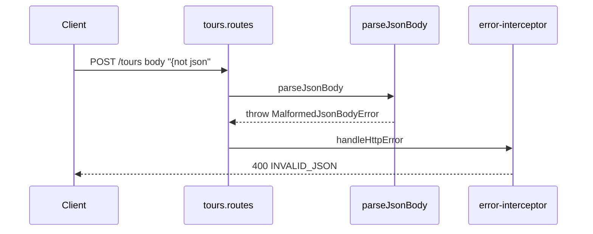

# Malformed JSON request bodies → 400 (DEC-092 / Wave D)

```yaml
status: implemented
phase: 4 resilience — Wave D
closes: SV-11
related: http-request-body-limit.md, request-body-limit.ts
```

## Problem

Tour routes called `JSON.parse(rawBody)` directly. Syntax errors (truncated JSON, trailing commas, non-JSON bodies) fell through to the generic error mapper and returned **500 internal_error** — client fault misclassified as server fault (SV-11). That pollutes SLO dashboards and triggers unnecessary on-call pages.

Enterprise pattern: **400 + stable machine code** for malformed payloads; never log stack for client parse failures.

## Decision

| Item         | Choice                                                                               |
| ------------ | ------------------------------------------------------------------------------------ |
| Parser       | `parseJsonBody(raw)` in `apps/api/src/http/json.ts`                                  |
| Error type   | `MalformedJsonBodyError` with `code = INVALID_JSON`                                  |
| HTTP mapping | **400** `{ error: "invalid_json", code: "INVALID_JSON", correlationId }`             |
| Routes       | `handleCreateTour`, `handlePatchTour` use `parseJsonBody` after `readRequestBodyRaw` |
| Empty body   | `{}` (unchanged)                                                                     |
| Logging      | **No** error log — same policy as validation failures (DEC-038)                      |
| Guard        | `guard:http-malformed-json`                                                          |
| Spec         | `test/4-integration/malformed-json-body.spec.ts`                                     |

## Flow



## Verification

```bash
cd apps/api
NODE_ENV=test STORAGE_DRIVER=memory \
  node --import tsx --test test/4-integration/malformed-json-body.spec.ts
pnpm run guard:http-malformed-json
```

| Assertion                            | Proves                                |
| ------------------------------------ | ------------------------------------- |
| `{broken` → 400, code `INVALID_JSON` | Client-safe mapping                   |
| Valid JSON tour body → 201           | No regression on happy path           |
| Oversized body still → 413           | Body limit takes precedence (DEC-052) |
