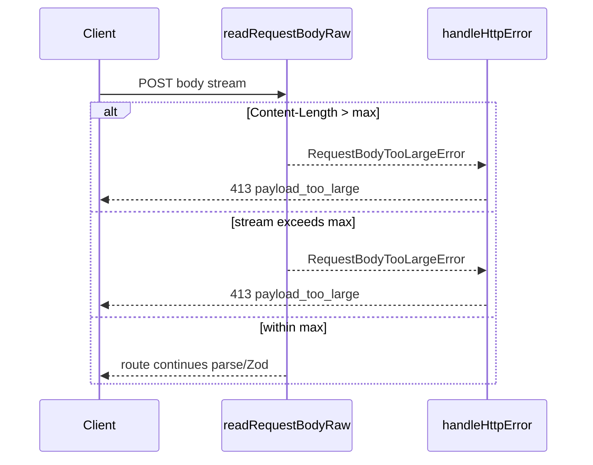

# HTTP request body size limit (DEC-052 / SCAL-DEBT-03)

```yaml
status: implemented
phase: 3 scalability audit — closure step 1
closes: SCAL-DEBT-03, SCAL-HF-06, NN-07 (partial)
related: phase3-scalability-stress-audit.md § Event loop blockers
```

## Problem

`readRequestBodyRaw` buffered the entire request stream into memory before any validation. Under adversarial load, **512 KiB–2 MiB** JSON bodies block the event loop on `Buffer.concat` and `JSON.parse` with no early reject — OOM and noisy-neighbor risk for other tenants ([SCAL-HF-06](../../../apps/api/docs/phase3-scalability-stress-audit.md), [NN-07](../../../apps/api/docs/phase3-scalability-stress-audit.md)).

Starter wizard payloads are **~2–8 KiB**; the cap is sized for normal create/update with headroom, not bulk import blobs.

## Decision

| Knob                    | Default              | Behavior                                                |
| ----------------------- | -------------------- | ------------------------------------------------------- |
| `HTTP_MAX_BODY_BYTES`   | **262144** (256 KiB) | Reject before `Buffer.concat` / `JSON.parse`            |
| Invalid env (≤0, NaN)   | fallback 256 KiB     | Fail-safe default                                       |
| `Content-Length` header | pre-check            | If present and **>** max → **413** without reading body |
| Chunked / no header     | streaming tally      | Abort on first chunk that exceeds max                   |

## HTTP contract

| Status  | Body `error`        | Body `code`              | Logged?                                       |
| ------- | ------------------- | ------------------------ | --------------------------------------------- |
| **413** | `payload_too_large` | `REQUEST_BODY_TOO_LARGE` | **No** — client error (same class as Zod 400) |

Response includes `correlationId` via standard error envelope ([DEC-044](trace-request-context.md)).

## Implementation map

| File                                           | Role                                                     |
| ---------------------------------------------- | -------------------------------------------------------- |
| `apps/api/src/http/request-body-limit.ts`      | `resolveHttpMaxBodyBytes()`, `RequestBodyTooLargeError`  |
| `apps/api/src/http/json.ts`                    | Enforce limit in `readRequestBodyRaw` (all JSON ingress) |
| `apps/api/src/middleware/error-interceptor.ts` | Map to 413 opaque envelope                               |
| `apps/api/scripts/guard-http-body-limit.mjs`   | CI — limit check must stay in `readRequestBodyRaw`       |

## Flow



## Monitoring (B5 / NN-07)

Ingress **413** reject counter and burst alerts: [`http-json-pressure-monitor.md`](http-json-pressure-monitor.md). Pair with DEC-129 egress monitor (`http_response_body_rejected_total`).

## Verification

```bash
cd apps/api
pnpm run guard:http-body-limit
pnpm run guard:http-json-pressure-monitor
node --import tsx --test test/3-performance/request-body-limit.spec.ts
node --import tsx --test src/http/json.spec.ts
node --import tsx --test src/http/http-json-pressure-monitor.spec.ts
```

**Probe scenarios:**

1. Valid starter body → **201** on `POST /tours` (unchanged).
2. Body **max + 1** bytes with `Content-Length` → **413** before tour service.
3. Chunked stream exceeding max mid-read → **413**.
4. `HTTP_MAX_BODY_BYTES` override in test → limit follows env.

## Out of scope (later steps)

- ~~Response `JSON.stringify` cap / pagination (event-loop row — P2).~~ **Done** DEC-129 — [`http-response-size-budget.md`](http-response-size-budget.md).
- Single parse pipeline for POST/PATCH (Phase 3 step 4 in event-loop list).
- Bulk import job API ([SCAL-DEBT-09](../../../apps/api/docs/phase3-scalability-stress-audit.md)).
