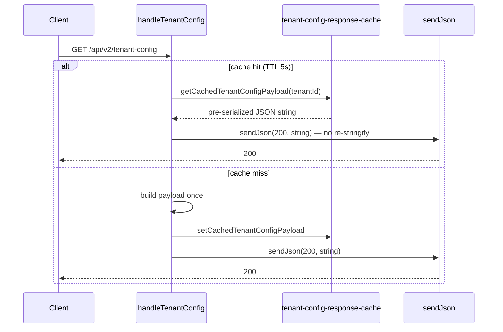
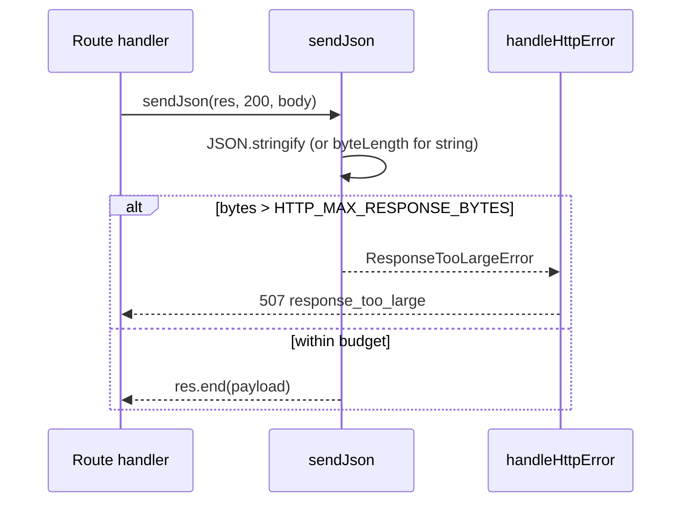

# HTTP response size budget (DEC-129 / Event-loop P2 #5)

```yaml
status: implemented
phase: 3 scalability audit — event-loop P2 response shaping
closes: Event-loop row `http/json.ts` stringify (partial), `tenant-config.routes.ts` repeat stringify
related: DEC-052, DEC-053, phase3-scalability-stress-audit.md § Performance Blockers (Event Loop)
```

## Problem

Ingress JSON is capped at **256 KiB** ([DEC-052](http-request-body-limit.md)), but egress had no budget:

| Hot path                                          | Symptom                                                                                                        |
| ------------------------------------------------- | -------------------------------------------------------------------------------------------------------------- |
| `sendJson` → `JSON.stringify` + `res.end`         | Large `GET /tours/:id` canonical blocks the loop on stringify + socket write                                   |
| `tenant-config.routes.ts` inline `JSON.stringify` | Every `GET /api/v2/tenant-config` re-stringifies large `theme` JSON even when registry row is cached (DEC-053) |

Executive summary row **「response stringify still uncapped」** — this step adds an egress cap and a short-lived serialized cache for tenant-config.

## Decision

| Knob                                  | Default             | Behavior                                                                                                              |
| ------------------------------------- | ------------------- | --------------------------------------------------------------------------------------------------------------------- |
| `HTTP_MAX_RESPONSE_BYTES`             | **2097152** (2 MiB) | After `JSON.stringify`, reject payloads over max before `res.end`                                                     |
| Invalid env (≤0, NaN)                 | fallback 2 MiB      | Fail-safe default                                                                                                     |
| Pre-serialized string body            | fast path           | `sendJson(res, status, string)` checks `Buffer.byteLength` **before** re-stringify — used by tenant-config cache hits |
| `TENANT_CONFIG_RESPONSE_CACHE_TTL_MS` | **5000**            | Per-tenant serialized JSON cache; aligned with registry/theme TTL (DEC-053)                                           |

### Status mapping (413 vs 507)

| Direction             | Over budget     | Status  | Body `error`         | Body `code`              | Logged?                                                       |
| --------------------- | --------------- | ------- | -------------------- | ------------------------ | ------------------------------------------------------------- |
| **Request** (ingress) | Before parse    | **413** | `payload_too_large`  | `REQUEST_BODY_TOO_LARGE` | **No** — client error ([DEC-052](http-request-body-limit.md)) |
| **Response** (egress) | After stringify | **507** | `response_too_large` | `RESPONSE_TOO_LARGE`     | **No** — client error (oversized representation)              |

**507** distinguishes server-generated oversize payloads from ingress **413**. Both use the standard opaque error envelope with `correlationId` ([DEC-044](trace-request-context.md)).

## Tenant-config serialized cache

`GET /api/v2/tenant-config` is read-tier and polled frequently (theme, workspace type). Registry metadata is already cached 5s (DEC-053), but the route still paid `JSON.stringify` on every hit.



**Invalidation:** `invalidateTenantRegistryCache` evicts the matching tenant-config payload so admin writes cannot serve stale theme JSON (DEC-074 write-path parity).

## Implementation map

| File                                                   | Role                                                     |
| ------------------------------------------------------ | -------------------------------------------------------- |
| `apps/api/src/http/http-response-size-budget.ts`       | `resolveHttpMaxResponseBytes()`, `ResponseTooLargeError` |
| `apps/api/src/http/json.ts`                            | Egress cap in `sendJson`; string fast path               |
| `apps/api/src/tenant/tenant-config-response-cache.ts`  | Per-tenant serialized cache + TTL                        |
| `apps/api/src/tenant/tenant-config.routes.ts`          | Cache + `sendJson` (no inline stringify)                 |
| `apps/api/src/tenant/tenant-registry-cache.ts`         | Evict config cache on registry invalidation              |
| `apps/api/src/middleware/error-interceptor.ts`         | Map `ResponseTooLargeError` → **507**                    |
| `apps/api/scripts/guard-http-response-size-budget.mjs` | CI lock                                                  |

## Flow — egress reject



## Monitoring (B5 / NN-07)

Egress **507** reject counter: [`http-json-pressure-monitor.md`](http-json-pressure-monitor.md) (`http_response_body_rejected_total`).

## Verification

```bash
cd apps/api
pnpm run guard:http-response-size-budget
node --import tsx --test src/http/json.spec.ts
node --import tsx --test src/tenant/tenant-config-response-cache.spec.ts
```

**Probe scenarios:**

1. Normal `GET /tours/:id` → **200** (unchanged under 2 MiB).
2. `sendJson` with object whose serialized size exceeds `HTTP_MAX_RESPONSE_BYTES` → **507** `RESPONSE_TOO_LARGE`.
3. Pre-serialized string over max → **507** without second stringify.
4. Repeated `GET /api/v2/tenant-config` within 5s → cache hit (no second `JSON.stringify` in route).

## Out of scope (later)

- Pagination / summary DTOs for list endpoints (event-loop P2 list shaping).
- Single parse pipeline for POST/PATCH `/tours` (event-loop P1 #4).
- Async streaming JSON or worker-side compression.
