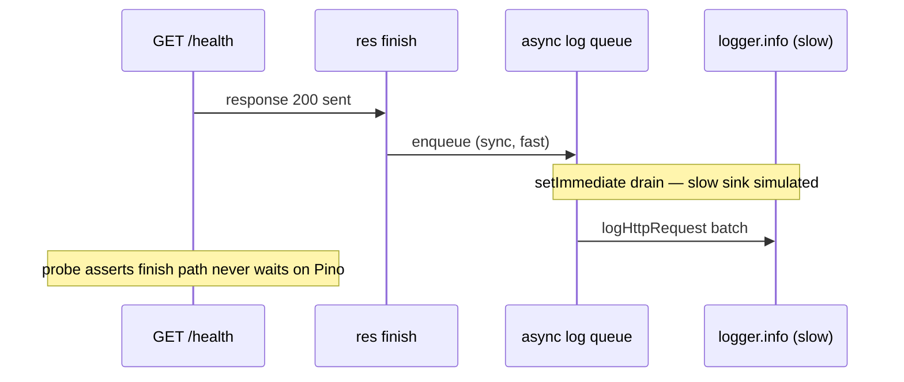

# Logging backpressure contract (DEC-063 / SCAL-DEBT-08)

```yaml
status: implemented
phase: 3 scalability audit — closure step 12
closes: SCAL-DEBT-08, FOF-LOG-01 (partial)
accepts: FOF-LOG-03 residual — see [fof-log-03-shutdown-tail-acceptance.md](fof-log-03-shutdown-tail-acceptance.md) (A3)
related: phase3-scalability-stress-audit.md §11, DEC-062 (request-log defer)
```

## Problem

Default Pino → Sonic-Boom stdout had **no bounded buffer**, **no drain/drop observability**, and **no shutdown flush**. Under a slow log sink, internal buffers grow without bound (FOF-LOG-01) and SIGTERM can discard tail NDJSON (FOF-LOG-03). DEC-062 removed synchronous `finish` → `logger.info`, but the sink contract itself remained implicit.

## Decision

| Knob                        | Default             | Behavior                                                                          |
| --------------------------- | ------------------- | --------------------------------------------------------------------------------- |
| `LOG_SINK_MIN_LENGTH`       | **4096**            | Sonic-Boom batch flush size                                                       |
| `LOG_SINK_MAX_LENGTH`       | **4194304** (4 MiB) | Bounded buffer; overflow emits Sonic-Boom `drop`                                  |
| `LOG_SINK_FLUSH_TIMEOUT_MS` | **2000**            | Shutdown flush deadline (fail-open)                                               |
| `log_sink_drain_total`      | counter             | Increment on destination `drain`                                                  |
| `log_sink_drop_total`       | counter             | Increment on destination `drop`                                                   |
| `log_sink_error_total`      | counter             | Increment on destination `error` (EPIPE/EAGAIN) — **must not crash** (SCAL-HF-09) |
| `retryEAGAIN`               | **`() => false`**   | Stop infinite Sonic-Boom retry on full pipe; emit `error` once instead            |

## Shutdown order (after `server.close`)

1. `drainHttpRequestLogQueueSync()` — flush DEC-062 async access-log queue
2. `flushLogSink()` — `logger.flush()` with timeout
3. Outbox relay drain (existing)
4. Prisma disconnect (existing)

## Implementation map

| File                                                   | Role                                           |
| ------------------------------------------------------ | ---------------------------------------------- |
| `apps/api/src/observability/log-sink.ts`               | Bounded `pino.destination`, drain/drop metrics |
| `apps/api/src/observability/logger.ts`                 | Explicit destination + `flushLogSink()` export |
| `apps/api/src/http/request-logging.ts`                 | `drainHttpRequestLogQueueSync()` for shutdown  |
| `apps/api/src/server/graceful-shutdown.ts`             | Calls queue drain + log flush before outbox    |
| `apps/api/scripts/guard-log-backpressure-contract.mjs` | CI lock                                        |

## Contract (availability-first)

| Signal                      | App response                                                                          |
| --------------------------- | ------------------------------------------------------------------------------------- |
| Sink backpressure (`drain`) | Metric only — no request-path block                                                   |
| Buffer overflow (`drop`)    | Metric only — bounded memory at cost of log completeness                              |
| Destination `error` (pipe)  | Metric only — swallowed handler; process stays alive (HF-09)                          |
| SIGTERM / SIGINT            | Best-effort flush within timeout; `log_shutdown_flush_*` metrics; process still exits |
| Flush timeout (FOF-LOG-03)  | `log_shutdown_flush_timed_out_total` — alert `AppTourLogShutdownFlushTimeout`         |

## Nightly slow-sink adversarial probe (DEC-070)

Phase 2 [`log-backpressure-burst.ts`](../../../apps/api/scripts/log-backpressure-burst.ts) measures **fast stdout** only (LOG-BP-01). After DEC-062/063, trunk proves bounded sink + async enqueue; **nightly** re-runs under artificial slow drain.

| Item    | Choice                                                                                           |
| ------- | ------------------------------------------------------------------------------------------------ |
| Spec    | `test/3-performance/log-slow-sink-adversarial.spec.ts`                                           |
| Tier    | `APPS_API_TEST_TIER=nightly` only (`skipUnlessNightlyTier`)                                      |
| Attack  | `SLOW_SINK_BURST` × `GET /health` @ `SLOW_SINK_CONCURRENCY` while `logger.info` drain is delayed |
| SLO     | All **200**; p99 ≤ `SLOW_SINK_HTTP_P99_CEILING_MS` (default **3000**)                            |
| Queue   | `__getHttpRequestLogQueueSizeForTests()` → **0** after drain window                              |
| CI lock | `guard:log-slow-sink-nightly` (nightly scripts only — not trunk regression gate)                 |



## Verification

```bash
cd apps/api && pnpm run guard:log-backpressure-contract
node --import tsx --test src/observability/logger-backpressure.spec.ts

# Nightly adversarial (skipped on trunk tier):
pnpm run test:nightly:slow-sink
```
