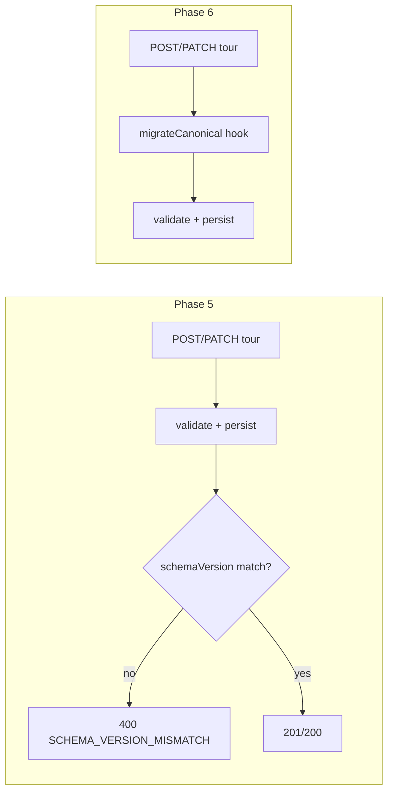

# migrateCanonical Phase 6 placeholder (DEC-091 / Wave D)

```yaml
status: implemented
phase: 4 resilience — Wave D
closes: SV-F-04 (documented deferral)
related: phase-5-canonical-schema.md, MIGRATION-MAP.md §8.3
```

## Problem

MAP §8.3 defines **`migrateCanonical`** — in-flight upgrade of stored canonical documents when `schemaVersion < current`. Phase 5 ships validation and explicit version mismatch rejection but **must not** execute legacy Denali trip_details migration on write paths. Without a guard, a future PR could wire the placeholder hook and silently throw **500** on production writes (SV-LAT-02).

## Decision

| Item              | Choice                                                                                                                                    |
| ----------------- | ----------------------------------------------------------------------------------------------------------------------------------------- |
| Hook module       | `apps/api/src/canonical/migrate-canonical-hook.ts`                                                                                        |
| Runtime behavior  | `migrateCanonicalNotImplemented` throws `MIGRATE_CANONICAL_NOT_IMPLEMENTED_PHASE_5`                                                       |
| Write-path import | **Forbidden** — no import of `migrate-canonical-hook` from `tours/`, `canonical/canonical-tour.service.ts`, `storage/`, or route handlers |
| Phase 5 mismatch  | Explicit `schemaVersion` reject → **400** via `SchemaVersionMismatchError`                                                                |
| Phase 6 cutover   | Wire hook in `CanonicalTourService` with workspace plugin semver table                                                                    |
| Guard             | `guard:migrate-canonical-placeholder`                                                                                                     |
| Spec              | Guard-only (no runtime invocation in Phase 5)                                                                                             |

## Phase 5 vs Phase 6



## Verification

```bash
cd apps/api && pnpm run guard:migrate-canonical-placeholder
```

| Check                                 | Proves                                       |
| ------------------------------------- | -------------------------------------------- |
| Hook file exports throw placeholder   | Design seam exists                           |
| Zero imports from write-path modules  | Phase 5 cannot accidentally invoke migration |
| `IMPLEMENTATION-DECISIONS.md` DEC-091 | Doc-gate traceability                        |

## Residual

Until Phase 6: clients with **older explicit schemaVersion** receive **400**, not silent upgrade. PATCH drift without migration remains Phase 6 scope (see `patch-schema-drift` guard for POST/PATCH parity today).
