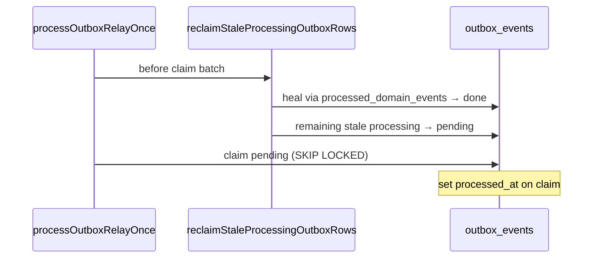

# Outbox processing reclaim (DEC-071 / Phase 4 step 1)

```yaml
status: implemented
phase: 4 resilience audit — closure step 1
closes: F-01, F-05, SD-G1, OZ-01/02/06 (partial)
related: phase4-resilience-audit.md CASCADE-02, 5.4-transactional-outbox.md
```

## Problem

Relay claims rows `pending` → `processing` with `FOR UPDATE SKIP LOCKED`. If the process crashes, receives SIGTERM mid-tick, or deploys during publish, rows can remain **`processing`** forever. The claim predicate only selects `pending`, so zombies are never redelivered. Graceful shutdown previously counted **`pending` only** and could exit 0 while `processing` rows remained ([SD-G1](phase4-resilience-audit.md)).

## Decision

| Item                 | Choice                                                                             |
| -------------------- | ---------------------------------------------------------------------------------- |
| Claim timestamp      | Set `processed_at = now()` when marking `processing` (claim time)                  |
| Reclaim TTL          | `OUTBOX_PROCESSING_RECLAIM_MS` (default **120_000** ms) — read in `outbox-processing-reclaim.ts` via `resolveOutboxProcessingReclaimMs()` |
| Shutdown drain backoff | `computeRelayBackoff` in `sleepOutboxShutdownDrainBackoff()` (DEC-111) — consumed by `outbox-shutdown-drain.ts` |
| OZ-02 heal (DEC-072) | Stale `processing` + `processed_domain_events` match → `done`                      |
| Reclaim action       | Remaining stale `processing` → `pending`, `processed_at = null`                    |
| Legacy rows          | `processing` + `processed_at IS NULL` + `created_at` older than TTL also reclaimed |
| When to run          | Start of each relay tick + shutdown drain loop                                     |
| Shutdown drain       | Exit when **both** `pending` and reclaimable `processing` are **0**                |
| Metric               | `outbox_processing_reclaimed_total`                                                |

## Flow



## Shutdown (F-05 / SD-G1)

`drainOutboxRelayOnShutdown()` (returns `OutboxShutdownDrainResult`):

1. Reclaim stale `processing`
2. Run `processOutboxRelayOnce`
3. Repeat until `pending = 0` and no reclaimable `processing`, or deadline
4. On deadline → `drained: false` → `GracefulShutdownOutboxFlushTimeoutError` (**DEC-076** / SD-G3)

Relay poll shutdown: `await outboxRelay.stop()` awaits in-flight tick before HTTP drain (**DEC-076** / SD-G2). See [`graceful-shutdown-outbox-drain.md`](graceful-shutdown-outbox-drain.md).

## Verification

```bash
cd apps/api && pnpm run guard:outbox-processing-reclaim
node --import tsx --test src/outbox/outbox-processing-reclaim.spec.ts
```
