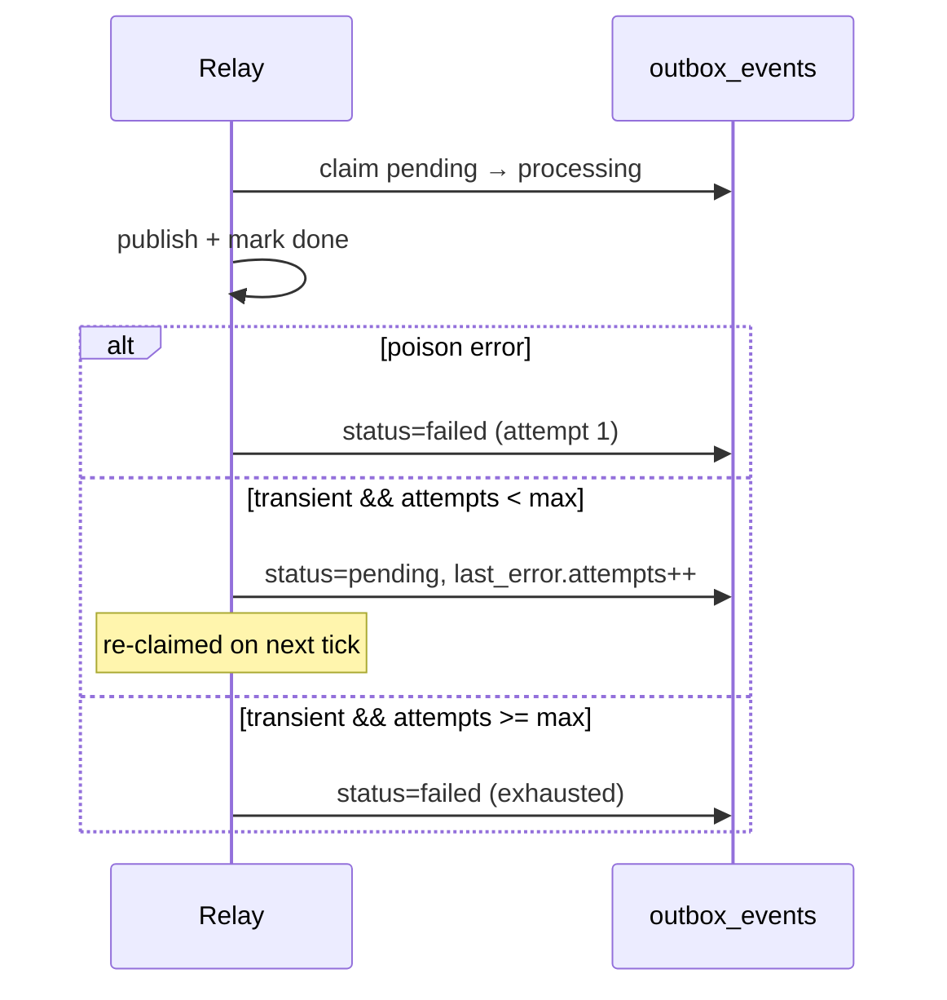

# Outbox publish transient auto-retry (DEC-110 / evolution Phase 4.1)

```yaml
status: implemented
phase: 5 evolution — Phase 4.1
closes: SH-GAP-07, phase4 F-03 (partial)
related: outbox-failed-replay.md, transient-db-error.md
```

## Problem

Relay publish failures were **immediately terminal** (`status = failed`) for every error class. Transient infra blips (Postgres `P1001`, connection reset during `markOutboxDone`, pool timeout) forced human replay via DEC-086 even when the payload was valid — blocking **30-day autonomous** posture ([`phase5-evolution-audit.md`](../../../apps/api/docs/phase5-evolution-audit.md) SH-GAP-07).

Enterprise pattern (2025–2026): **classify → bounded retry with backoff metadata → terminal DLQ only for poison**.

## Decision

| Item                        | Choice                                                                        |
| --------------------------- | ----------------------------------------------------------------------------- |
| Classifier                  | `classifyOutboxPublishError()` → `transient` \| `poison`                      |
| Poison (immediate `failed`) | `OUTBOX_*` validation codes, payload/tenant mismatch, missing `domainEventId` |
| Transient (retry)           | `isTransientDbError`, `DbCircuitOpenError`, `ECONNRESET` / `ETIMEDOUT` chain  |
| Max attempts                | `OUTBOX_PUBLISH_MAX_ATTEMPTS` (default **5**) per row lifecycle               |
| Retry action                | `pending` + `processed_at = null` + `last_error.attempts` increment           |
| Terminal `failed`           | Unchanged DEC-086 — admin replay API; relay **never** auto-claims `failed`    |
| Metrics                     | `outbox_publish_transient_retry_total`, `outbox_publish_poison_total`         |

### `last_error` shape (extended)

```json
{
  "code": "DB_TRANSIENT_UNAVAILABLE: …",
  "at": "2026-06-05T12:00:00.000Z",
  "attempts": 2,
  "classification": "transient"
}
```

Poison terminal rows set `classification: "poison"`.

## Flow



## Modules

| Module                               | Role                                                             |
| ------------------------------------ | ---------------------------------------------------------------- |
| `outbox-publish-error-classifier.ts` | `classifyOutboxPublishError`, poison code set                    |
| `outbox-failed.ts`                   | `markOutboxPendingForRetry`, extended `serializeOutboxLastError` |
| `outbox-relay-config.ts`             | `readOutboxPublishMaxAttempts()`                                 |
| `outbox-relay.ts`                    | Classifier wired in `publishClaimedRowWithBudget`                |

## Non-goals

- In-tick synchronous retry loops (relay returns row to `pending`; next tick re-claims)
- Poll backoff — see [relay-backoff-jitter.md](relay-backoff-jitter.md) (DEC-111)

## Verification

```bash
cd apps/api
pnpm run guard:outbox-auto-retry
node --import tsx --test src/outbox/outbox-publish-error-classifier.spec.ts
pnpm run phase-5:evolution-gate
```

Acceptance:

1. Poison (`OUTBOX_TENANT_PAYLOAD_MISMATCH`) → `failed` on first attempt (INT-SAGA-03 unchanged).
2. Transient classifier returns `pending` with `last_error.attempts` until max, then `failed`.
3. Terminal `failed` rows are not auto-claimed (DEC-086 guard still passes).
