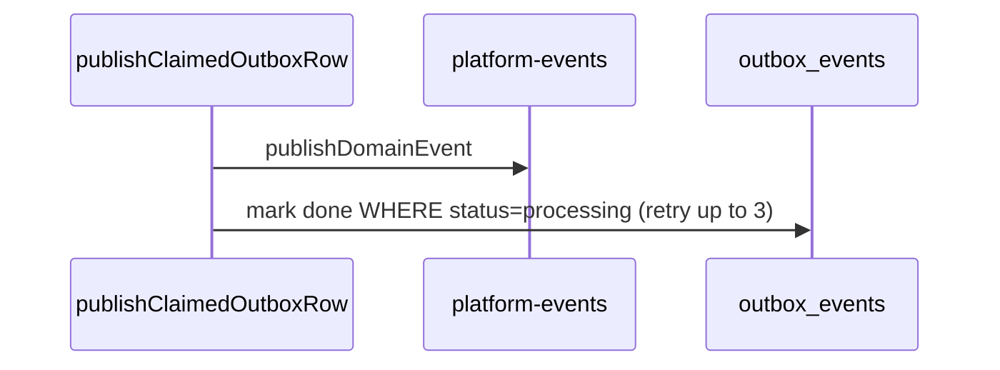

# Outbox publish / mark-done pairing (DEC-072 / Phase 4 step 2)

```yaml
status: implemented
phase: 4 resilience audit — closure step 2
closes: F-02, OZ-02 (partial)
related: outbox-processing-reclaim.md (DEC-071), phase4-resilience-audit.md
```

## Problem

`publishClaimedOutboxRow` publishes to the in-process bus **then** updates the outbox row to `done` in a separate admin `update`. A crash or connection drop between those steps leaves the row in **`processing`** while consumers may already have handled the event (OZ-02). Without pairing, ops dashboards show stuck rows even though delivery succeeded.

## Decision

| Item               | Choice                                                                                                                                          |
| ------------------ | ----------------------------------------------------------------------------------------------------------------------------------------------- |
| Mark-done guard    | `updateMany` with `status = 'processing'` predicate — no silent no-op                                                                           |
| Post-publish retry | `OUTBOX_MARK_DONE_RETRY_ATTEMPTS` (default **3**), delay **50 ms** between tries                                                                |
| Pairing gap        | If publish succeeded but mark-done exhausts retries → row stays **`processing`** (not `failed`); metric `outbox_publish_done_pairing_gap_total` |
| OZ-02 heal         | On reclaim tick, stale `processing` rows with matching `processed_domain_events` → **`done`** (not `pending`)                                   |
| Metric (heal)      | `outbox_publish_done_healed_total`                                                                                                              |

## Happy path



## OZ-02 compensation

When `reclaimStaleProcessingOutboxRows` runs (DEC-071):

1. **Heal** — `processing` older than TTL + `processed_domain_events` exists → `done`
2. **Reclaim** — remaining stale `processing` → `pending` for safe redelivery

Idempotent consumers make redelivery safe when heal cannot run (handler not yet claimed).

## Verification

```bash
cd apps/api && pnpm run guard:outbox-publish-done-pairing
node --import tsx --test src/outbox/outbox-publish-done-pairing.spec.ts
```
