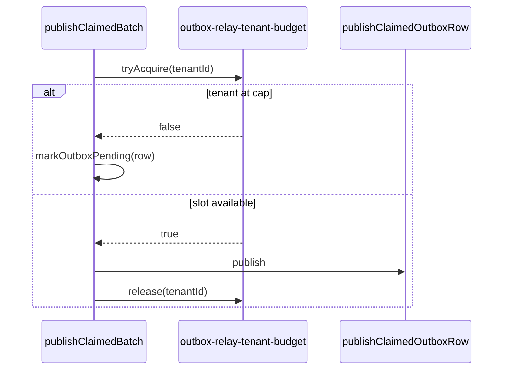

# Outbox relay per-tenant budget (DEC-066 / SCAL-DEBT-10)

```yaml
status: implemented
phase: 3 scalability audit — closure step 15
closes: SCAL-DEBT-10, NN-03, NN-06 (partial)
related: DEC-017 (publish concurrency), connection-budget.md
```

## Problem

`processOutboxRelayOnce` claims a global FIFO batch then publishes up to **16** rows in parallel (`OUTBOX_RELAY_PUBLISH_CONCURRENCY`). A single tenant with a large backlog can monopolize admin/app pool sessions during publish, slowing registry reads and tenant-config for neighbors ([NN-03](NN-06)).

## Decision

| Knob                                    | Default                                         | Behavior                                            |
| --------------------------------------- | ----------------------------------------------- | --------------------------------------------------- |
| `OUTBOX_RELAY_MAX_IN_FLIGHT_PER_TENANT` | **4**                                           | Max concurrent `publishClaimedOutboxRow` per tenant |
| Over cap                                | **Defer**                                       | Row reverted to `pending` for next relay tick       |
| Metric                                  | `outbox_relay_tenant_deferred_total{tenant_id}` | Count deferrals                                     |

## Semantics

1. Worker acquires per-tenant slot before publish.
2. If tenant at cap → `markOutboxPending` (status back to `pending`) — no `failed` row.
3. Slot released in `finally` after publish attempt completes.
4. Global publish concurrency unchanged — fairness is per-tenant, not global.



## Implementation map

| File                                                    | Role                                         |
| ------------------------------------------------------- | -------------------------------------------- |
| `apps/api/src/outbox/outbox-relay-tenant-budget.ts`     | Per-tenant in-flight semaphore               |
| `apps/api/src/outbox/outbox-relay.ts`                   | Budget gate + `markOutboxPending` defer path |
| `apps/api/scripts/guard-outbox-relay-tenant-budget.mjs` | CI lock                                      |

## Monitoring (B1 / NN-03, B4 / NN-06, C2 / OB-COND-02)

Per-tenant deferral reduces but does not eliminate admin pool contention. Pair `outbox_relay_tenant_deferred_total` with [`admin-pool-read-monitor.md`](admin-pool-read-monitor.md) (`admin_pool_read_p99_ms`), [`outbox-relay-monitor.md`](outbox-relay-monitor.md) (`outbox_relay_in_flight_*`), and [`outbox-relay-pool-contention-monitor.md`](outbox-relay-pool-contention-monitor.md) (`outbox_relay_pool_headroom`) when HTTP 503 rises during relay catch-up.

## Verification

```bash
cd apps/api && pnpm run guard:outbox-relay-tenant-budget
node --import tsx --test test/3-performance/outbox-relay-tenant-budget.spec.ts
pnpm run guard:admin-pool-read-monitor
pnpm run guard:outbox-relay-monitor
pnpm run guard:outbox-relay-pool-contention
```
