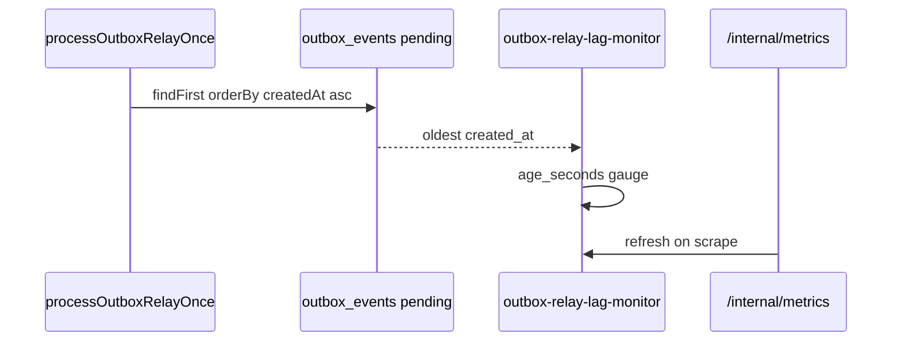

# Outbox relay lag monitor (F1 / Phase 3 §10.9)

```yaml
status: implemented
phase: 3 scalability audit — relay backlog age observability
closes: F1 checklist — oldest pending `created_at` age on `/internal/metrics`
mitigated_by: DEC-123
related: outbox-relay-monitor.md, outbox-relay-tick-monitor.md, phase5-slo-alerting.md
```

## Problem

Phase 3 §10.9 recommended exporting relay lag: `outbox_pending_total` existed (DEC-123) but operators could not distinguish **deep backlog** (many rows) from **stale backlog** (rows sitting pending for minutes). HPA scales on `outbox_pending_total` only — age exposes catch-up debt after incidents.

## Decision

| Metric                                    | Type  | Meaning                                                             |
| ----------------------------------------- | ----- | ------------------------------------------------------------------- |
| `outbox_pending_total`                    | gauge | Pending row count (existing)                                        |
| `outbox_relay_oldest_pending_age_seconds` | gauge | Wall seconds since oldest `pending` row `created_at` (0 when empty) |

Refresh on relay tick (`processOutboxRelayOnce`) and `/internal/metrics` scrape (same path as pending gauge).

| Knob                             | Default | Behavior                                        |
| -------------------------------- | ------- | ----------------------------------------------- |
| `OUTBOX_RELAY_LAG_ALERT_SECONDS` | **300** | Alert when oldest pending age exceeds 5 minutes |

### Alert rules (DEC-123 extension)

| Alert                       | Expr                                                                  | `for` | Severity |
| --------------------------- | --------------------------------------------------------------------- | ----- | -------- |
| `AppTourOutboxRelayLagHigh` | `outbox_relay_oldest_pending_age_seconds{namespace="app-tour"} > 300` | 10m   | warning  |

Label `slo: outbox_relay_lag` — triage with `outbox_pending_total`, `outbox_relay_published_total`, and `AppTourOutboxRelayPublishStalled`.

### HPA scale signal (F2 / DEC-122 extension)

| Manifest                              | Metric                                    | `averageValue` | Rationale                                                                                |
| ------------------------------------- | ----------------------------------------- | -------------- | ---------------------------------------------------------------------------------------- |
| `deploy/hpa/outbox-relay-hpa.yaml`    | `outbox_relay_oldest_pending_age_seconds` | **120**        | Scale relay before 5m alert (300s) when catch-up debt grows                              |
| `deploy/hpa/api-hpa.yaml` (colocated) | same                                      | **120**        | Colocated relay on API pods — HPA takes max(desired) across CPU, in-flight, pending, lag |

`prometheus-adapter` maps the gauge via `deploy/prometheus/adapter-rules.yaml` (DEC-121). Split topology: relay HPA uses **pending + lag**; API HPA drops `outbox_pending_total` per [`api-hpa-custom-metrics.md`](api-hpa-custom-metrics.md) but keeps lag when relay is colocated.



## Residual (explicit)

| Scenario                | Outcome                                                                          |
| ----------------------- | -------------------------------------------------------------------------------- |
| No `DATABASE_URL_ADMIN` | Gauge keeps last value / 0 — same as `outbox_pending_total`                      |
| Per-tenant lag          | Deferred — global oldest only; tenant skew needs Phase 7 label cardinality guard |
| `processing` rows stuck | Age measures **pending** only; use reclaim metrics + `outbox_failed_total`       |

## Verification

```bash
cd apps/api
node --import tsx --test src/outbox/outbox-relay-lag-monitor.spec.ts
pnpm run guard:outbox-relay-lag-monitor
pnpm run guard:deploy-phase5-slo-alerts
```
