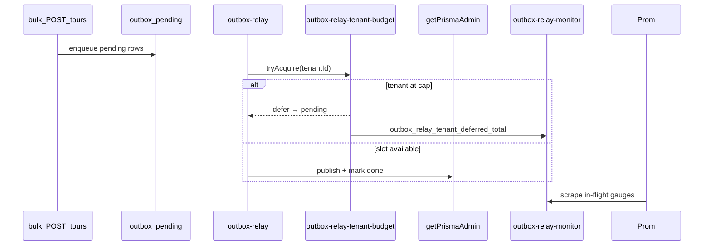

# Outbox relay monitor (NN-06 / B4)

```yaml
status: implemented
phase: 3 scalability audit — noisy-neighbor NN-06 residual closure
closes: B4 checklist — alert on relay in-flight skew and tenant defer bursts
mitigated_by: DEC-066, DEC-123
related: outbox-relay-fairness.md, admin-pool-read-monitor.md, phase5-slo-alerting.md
```

## Problem

DEC-066 caps per-tenant in-flight relay publishes (`OUTBOX_RELAY_MAX_IN_FLIGHT_PER_TENANT`, default **4**) and defers overflow rows to `pending`. Global publish concurrency remains **16** (`OUTBOX_RELAY_PUBLISH_CONCURRENCY`). Bulk import → outbox flood → relay `claim`/`update` on **admin pool** can still raise p99 on neighbor registry reads (**NN-06**, pairs with **NN-03** B1).

**Residual:** Without in-flight gauges and defer burst alerts, operators cannot correlate tenant-config lag with relay monopolization vs admin pool sizing.

## Decision

| Knob                                          | Default     | Behavior                                                             |
| --------------------------------------------- | ----------- | -------------------------------------------------------------------- |
| `OUTBOX_RELAY_IN_FLIGHT_ALERT_TOTAL`          | **12**      | Alert when sum in-flight relay publishes exceeds (~75% of global 16) |
| `OUTBOX_RELAY_IN_FLIGHT_ALERT_MAX_PER_TENANT` | **3**       | Alert when any tenant holds ≥75% of per-tenant cap (4)               |
| Defer burst alert                             | `> 20` / 5m | `sum(increase(outbox_relay_tenant_deferred_total[5m]))`              |

### Metrics (Prometheus text via DEC-108)

| Metric                                    | Type    | Labels      | Meaning                                                                                         |
| ----------------------------------------- | ------- | ----------- | ----------------------------------------------------------------------------------------------- |
| `outbox_relay_in_flight_total`            | gauge   | —           | Sum concurrent relay publish attempts                                                           |
| `outbox_relay_in_flight_max_per_tenant`   | gauge   | —           | Deepest single-tenant in-flight relay count                                                     |
| `outbox_relay_tenants_active`             | gauge   | —           | Tenants with ≥1 in-flight relay publish                                                         |
| `outbox_relay_tenant_deferred_total`      | counter | `tenant_id` | Defer at cap (DEC-066, existing)                                                                |
| `outbox_pending_total`                    | gauge   | —           | Admin DB pending rows (DEC-123, existing)                                                       |
| `outbox_relay_oldest_pending_age_seconds` | gauge   | —           | Age of oldest `pending` row — [`outbox-relay-lag-monitor.md`](outbox-relay-lag-monitor.md) (F1) |

### Alert rules (DEC-123 extension)

| Alert                              | Expr                                                         | `for` | Severity |
| ---------------------------------- | ------------------------------------------------------------ | ----- | -------- |
| `AppTourOutboxRelayInFlightHigh`   | `outbox_relay_in_flight_total > 12`                          | 5m    | warning  |
| `AppTourOutboxRelayInFlightSkew`   | `outbox_relay_in_flight_max_per_tenant > 3`                  | 5m    | warning  |
| `AppTourOutboxRelayDeferredBursts` | `sum(increase(outbox_relay_tenant_deferred_total[5m])) > 20` | 2m    | warning  |

Label `slo: outbox_relay_nn06` — triage with `admin_pool_read_p99_ms` (B1), `outbox_pending_total`, and [`outbox-relay-tick-monitor.md`](outbox-relay-tick-monitor.md) (C3/C4 tick skip + throughput).



## Residual (explicit)

| Scenario                     | Outcome                                                  |
| ---------------------------- | -------------------------------------------------------- |
| Registry read priority class | Deferred Phase 7 — monitor + admin pool sizing today     |
| Multi-replica relay          | Per-process in-flight counters — sum across pods in Prom |
| Defer → row stays `pending`  | Expected — not `failed`                                  |

## Verification

```bash
cd apps/api
node --import tsx --test src/outbox/outbox-relay-monitor.spec.ts
node --import tsx --test test/3-performance/outbox-relay-tenant-budget.spec.ts
pnpm run guard:outbox-relay-monitor
pnpm run guard:deploy-phase5-slo-alerts
```
