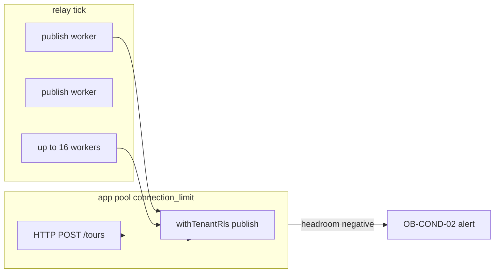

# Outbox relay pool contention monitor (OB-COND-02 / C2)

```yaml
status: implemented
phase: 3 scalability audit — outbox §10.7 conditional risks
closes: C2 checklist — relay publish concurrency vs app pool connection_limit
mitigated_by: DEC-066, DEC-012, B4 outbox-relay-monitor
related: outbox-relay-fairness.md, connection-budget.md, pool-leak-post-storm-monitor.md
```

## Problem

`OUTBOX_RELAY_PUBLISH_CONCURRENCY` defaults to **16** while Prisma `connection_limit` on `DATABASE_URL` defaults to **~10**. Each relay publish uses **`withTenantRls`** on the **app pool** — up to 16 concurrent app-pool TX per tick stack with HTTP writes → queueing or **503** `DB_POOL_SATURATED` (OB-COND-02).

Throughput @ 10k proved **PASS** (3.19× SLO) with test pool `connection_limit=64`. **Residual:** default prod URL without sizing remains a misconfiguration risk.

## Decision

| Knob                                 | Default                                    | Behavior                                     |
| ------------------------------------ | ------------------------------------------ | -------------------------------------------- |
| `readDbPoolConnectionLimitFromEnv()` | **10** if URL omits param                  | Parse `connection_limit` from `DATABASE_URL` |
| `outbox_relay_pool_headroom` gauge   | `connection_limit − publish_concurrency`   | **Negative** = misconfig alert               |
| Contention alert                     | relay in-flight **> 8** AND pool 503 storm | Pair B4 + A4 metrics                         |

### Metrics (Prometheus text via DEC-108)

| Metric                                    | Type    | Meaning                                         |
| ----------------------------------------- | ------- | ----------------------------------------------- |
| `db_pool_connection_limit_config`         | gauge   | Parsed `connection_limit` from `DATABASE_URL`   |
| `outbox_relay_publish_concurrency_config` | gauge   | `OUTBOX_RELAY_PUBLISH_CONCURRENCY` (default 16) |
| `outbox_relay_pool_headroom`              | gauge   | `connection_limit − publish_concurrency`        |
| `outbox_relay_in_flight_total`            | gauge   | From B4 — live relay publish slots              |
| `db_pool_saturated_total`                 | counter | From A4 — HTTP 503 pool storm                   |

### Alert rules (DEC-123 extension)

| Alert                                    | Expr                                                                              | `for` | Severity |
| ---------------------------------------- | --------------------------------------------------------------------------------- | ----- | -------- |
| `AppTourOutboxRelayPoolHeadroomNegative` | `outbox_relay_pool_headroom{namespace="app-tour"} < 0`                            | 10m   | warning  |
| `AppTourOutboxRelayPoolContentionStorm`  | `outbox_relay_in_flight_total > 8 and increase(db_pool_saturated_total[5m]) > 30` | 2m    | warning  |

Label `slo: outbox_relay_obcond02` — runbook: raise `connection_limit` or lower `OUTBOX_RELAY_PUBLISH_CONCURRENCY`.

### Production sizing (required)

```
connection_limit ≥ OUTBOX_RELAY_PUBLISH_CONCURRENCY + HTTP headroom
```

Example: publish **16** → set `connection_limit=32` minimum on `DATABASE_URL` ([`postgres-required-gates.md`](postgres-required-gates.md) uses 32 for integration gates).



## Residual (explicit)

| Scenario                      | Outcome                                                |
| ----------------------------- | ------------------------------------------------------ |
| Admin pool separate           | `DATABASE_URL_ADMIN` — OB-COND-02 is **app pool** only |
| `connection_limit=64` in prod | Headroom positive — alert silent                       |
| Relay disabled                | Gauges reflect config; in-flight stays 0               |

## Verification

```bash
cd apps/api
node --import tsx --test src/outbox/outbox-relay-pool-contention.spec.ts
pnpm run guard:outbox-relay-pool-contention
pnpm run guard:deploy-phase5-slo-alerts
```
