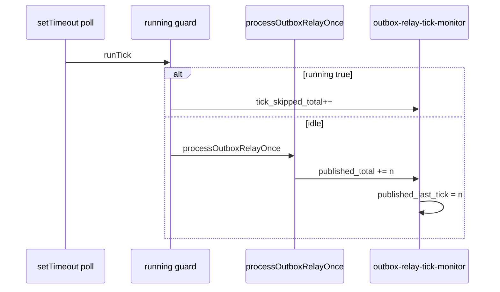

# Outbox relay tick monitor (OB-COND-03 / C3, OB-COND-04 / C4)

```yaml
status: implemented
phase: 3 scalability audit — outbox §10.7 conditional risks
closes: C3 checklist — tick skip when prior batch still running; C4 — relay throughput export
mitigated_by: DEC-004, DEC-123
related: outbox-relay-monitor.md, outbox-relay-pool-contention-monitor.md
```

## Problem

**OB-COND-03:** `startOutboxRelayIfEnabled` uses a `running` guard — if a relay tick exceeds `OUTBOX_POLL_INTERVAL_MS`, the next scheduled tick is **skipped** (not queued). Backlog `done` latency grows; HTTP is not blocked.

**OB-COND-04:** Throughput @ 10k proved **233 eps** in tests, but production had no exported **relay publish rate** on `/internal/metrics` — only tour counters and pending gauge.

## Decision

| Event                               | Metric                                                             | Type    |
| ----------------------------------- | ------------------------------------------------------------------ | ------- |
| Tick skipped (`running` still true) | `outbox_relay_tick_skipped_total`                                  | counter |
| Tick completed                      | `outbox_relay_tick_total`                                          | counter |
| Rows published (cumulative)         | `outbox_relay_published_total`                                     | counter |
| Last tick published                 | `outbox_relay_published_last_tick`                                 | gauge   |
| Last tick failed / deferred         | `outbox_relay_failed_last_tick`, `outbox_relay_deferred_last_tick` | gauge   |

### Alert rules (DEC-123 extension)

| Alert                                 | Expr                                                                              | `for` | Severity |
| ------------------------------------- | --------------------------------------------------------------------------------- | ----- | -------- |
| `AppTourOutboxRelayTickSkippedBursts` | `increase(outbox_relay_tick_skipped_total[5m]) > 10`                              | 2m    | warning  |
| `AppTourOutboxRelayPublishStalled`    | `outbox_pending_total > 100 and increase(outbox_relay_published_total[10m]) == 0` | 15m   | warning  |

Label `slo: outbox_relay_tick` — C3 indicates long batches; C4 stall pairs with `outbox_pending_total`.



## Residual (explicit)

| Scenario                        | Outcome                                               |
| ------------------------------- | ----------------------------------------------------- |
| Test harness tight `while` loop | Skips never fire — production `setInterval` path only |
| Relay disabled                  | Counters stay flat                                    |
| Multi-replica                   | Per-process counters — sum in Prometheus              |

## Verification

```bash
cd apps/api
node --import tsx --test src/outbox/outbox-relay-tick-monitor.spec.ts
pnpm run guard:outbox-relay-tick-monitor
pnpm run guard:deploy-phase5-slo-alerts
```
