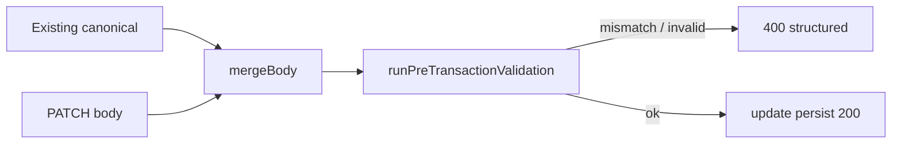

# PATCH schema drift HTTP coverage (DEC-078 / Phase 4 step 8)

```yaml
status: implemented
phase: 4 resilience audit — closure step 8
closes: SV-F-03 (partial — HTTP PATCH rows; SV-F-04 migrateCanonical still Phase 6)
related: phase4-resilience-audit.md § Schema drift, schema-version-compat.spec.ts
```

## Problem

| Finding        | Issue                                                                                                                                                            |
| -------------- | ---------------------------------------------------------------------------------------------------------------------------------------------------------------- |
| **SV-F-03**    | `POST /tours` adversarial matrix proven in `schema-version-compat.spec.ts`; **PATCH** used the same `runPreTransactionValidation` gate but had **no HTTP cases** |
| **SV-CRIT-02** | PATCH verdict was **Pass (inferred)** only — not contract-gated                                                                                                  |

`CanonicalTourService.updateTour` merges stored canonical with PATCH body, then runs the identical pre-TX validation gate as POST. Without PATCH specs, drift on update could regress to **500** unnoticed.

## Decision

| Item                | Choice                                                                                                                                   |
| ------------------- | ---------------------------------------------------------------------------------------------------------------------------------------- |
| Spec extension      | Add PATCH rows to `schema-version-compat.spec.ts` mirroring audit IDs **SV-01**, **SV-05**, **SV-09**                                    |
| SV-PATCH-01 / SV-09 | `schemaVersion: 2` on PATCH → **400** `SCHEMA_VERSION_MISMATCH`                                                                          |
| SV-PATCH-05         | PATCH `data` partial (missing `details` root) → **400** `VALIDATION_FAILURE`                                                             |
| SV-PATCH-OK         | Successful title merge → **200** (proves graceful PATCH path)                                                                            |
| Worker rehydrate    | `validation-worker-pool.ts` restores `SchemaVersionMismatchError` from worker thread (latent **500** on POST/PATCH when workers enabled) |
| Out of scope        | `migrateCanonical` wiring (**SV-F-04** / Phase 6); malformed JSON **500** (**SV-F-07**)                                                  |
| CI lock             | `guard:patch-schema-drift`                                                                                                               |

## Merge semantics (PATCH)



`schemaVersion` on PATCH overrides when explicit; omitted inherits stored `canonical.schemaVersion`. `data` replaces stored `data` when provided (no POST-style default-fill on partial `data`).

## Verification

```bash
cd apps/api && pnpm run guard:patch-schema-drift
export STORAGE_DRIVER=memory NODE_ENV=test
node --import tsx --test test/4-integration/schema-version-compat.spec.ts
```
