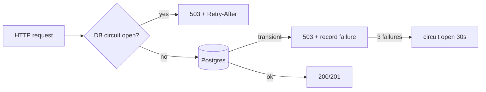

# Phase 5 evolution audit — P0 Phase 1 closure

```yaml
status: implemented
source: apps/api/docs/phase5-evolution-audit.md
closes: SH-GAP-07/08, RB-GAP-10, SH-GAP-04/05/15, CAE-GAP-05, CI-BYP-12/13, MD-GAP-12
autonomous_impact: operational toil #1–2 mitigated; infra blip misclassification reduced
```

## Scope (فاز اول / urgent P0)

| #   | Gap IDs                         | Deliverable                                                      | Status                     |
| --- | ------------------------------- | ---------------------------------------------------------------- | -------------------------- |
| 1   | SH-GAP-08, SH-GAP-07, RB-GAP-10 | Outbox `processing` reclaim + terminal `failed` replay           | **DONE** (DEC-071/072/086) |
| 2   | SH-GAP-04, SH-GAP-05, SH-GAP-15 | `isTransientDbError` + DB circuit breaker + `Retry-After` on 503 | **Phase 1** (DEC-094)      |
| 3   | CAE-GAP-05                      | `db:test-reset` production URL guard                             | **Phase 1** (DEC-095)      |
| 4   | CI-BYP-12, CI-BYP-13            | GHA `phase-4:gate` + `phase-5:gate`; `test:full` extends phase-5 | **Phase 1** (DEC-096)      |
| 5   | MD-GAP-12                       | Boot migration head preflight                                    | **Phase 1** (DEC-097)      |

## 1 — Outbox (pre-existing)

See [`outbox-processing-reclaim.md`](outbox-processing-reclaim.md) and [`outbox-failed-replay.md`](outbox-failed-replay.md).

## 2 — Transient DB classifier + circuit breaker (DEC-094)

| Class             | Codes / patterns                                                                                                  |
| ----------------- | ----------------------------------------------------------------------------------------------------------------- |
| **Transient**     | Prisma `P1001`, `P1002`, `P1017`; pool saturation (DEC-012); `ECONNRESET`, `ETIMEDOUT`, `EPIPE` in driver message |
| **Not transient** | Validation, `P2002`, business rules, open-TX bodies without idempotency                                           |

| Behavior     | Choice                                                                         |
| ------------ | ------------------------------------------------------------------------------ |
| HTTP mapping | Transient → **503** `service_unavailable` + `Retry-After: 1` (not **500**)     |
| Circuit      | **3** consecutive transient failures → open **30s**; half-open on next success |
| Wrapper      | `withTransientDbGuard` around `withPoolSaturationMapping` in `withTenantRls`   |
| Metrics      | `db_circuit_open_total`, `db_transient_error_total`                            |



**Verification:** `guard:transient-db-error` · `src/db/transient-db-error.spec.ts`

## 3 — `db:test-reset` prod guard (DEC-095)

| Guard                 | Rule                                                                                                       |
| --------------------- | ---------------------------------------------------------------------------------------------------------- |
| `NODE_ENV=production` | **exit 1** — never truncate in production                                                                  |
| Prod URL heuristics   | Host matches `prod`, `production`, `.rds.`, `azure`, `cloudsql` → **exit 1** unless `CONFIRM_TEST_RESET=1` |
| Safe default          | Local compose `127.0.0.1` / `localhost` on port **5434** with `NODE_ENV=test`                              |

**Verification:** `scripts/guard-db-test-reset-prod.mjs`

## 4 — CI parity (DEC-096)

| Item                                 | Change                                        |
| ------------------------------------ | --------------------------------------------- |
| `.github/workflows/phase-4-gate.yml` | Already ships Postgres + `phase-4:gate`       |
| `.github/workflows/phase-5-gate.yml` | **New** — Postgres bootstrap + `phase-5:gate` |
| `scripts/test-full.sh`               | Chain `phase-5:gate` after `phase-4:gate`     |

## 5 — Migration head preflight (DEC-097)

At production boot (`assertProductionDatabaseIntegrity`):

1. Query latest `finished_at` row in `"_prisma_migrations"`.
2. Compare `migration_name` to embedded `EXPECTED_PRISMA_MIGRATION_HEAD`.
3. Mismatch → `PRODUCTION_MIGRATION_HEAD_MISMATCH:<expected>:<actual>` — process exits before ingress.

**Verification:** `guard:migration-head-preflight` · `src/db/migration-head-preflight.spec.ts`

## Regression pack

```bash
cd apps/api
pnpm run guard:outbox-processing-reclaim
pnpm run guard:outbox-failed-replay
pnpm run guard:transient-db-error
pnpm run guard:migration-head-preflight
node --import tsx --test src/db/transient-db-error.spec.ts
node --import tsx --test src/db/migration-head-preflight.spec.ts
```
