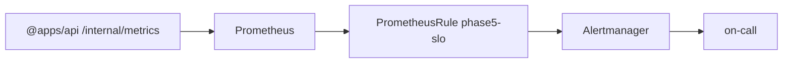

# Phase 5 SLO alerting — PrometheusRule + Alertmanager (DEC-123)

```yaml
status: implemented
phase: 5 evolution — Platform 5.5
closes: Observability prod alert gap (evolution audit)
extends: DEC-108, DEC-121
related: metrics-prometheus-export.md, prometheus-servicemonitor-adapter.md
```

## Problem

Metrics scaffold (DEC-108/121) enabled scrape and HPA but **no in-repo alert rules** for:

| Signal                                                                         | Risk                                                               |
| ------------------------------------------------------------------------------ | ------------------------------------------------------------------ |
| `outbox_failed_total`                                                          | Poison / exhausted publishes stuck without ops notice              |
| `projection_inconsistency_total`                                               | Read model drift vs canonical SoT                                  |
| `db_circuit_open`                                                              | Transient DB storm — API degrading with circuit latched open       |
| `health_probe_p99_ms` / `health_probe_slow_total`                              | NN-01 — wedged event loop inflates `/health` without failing probe |
| `log_shutdown_flush_timed_out_total`                                           | FOF-LOG-03 — SIGTERM flush timeout; tail loss risk                 |
| `db_pool_saturated_total`                                                      | A4 — DB pool 503 storm rate; nightly leak probe companion          |
| `admin_pool_read_p99_ms` / `admin_pool_read_slow_total`                        | B1 — NN-03 admin registry read latency on cache miss               |
| `validation_queue_depth_max_per_tenant` / `validation_queue_shed_total`        | B2 — NN-04 queue depth skew and shed bursts                        |
| `tour_write_in_flight_max_per_tenant` / `tour_write_concurrency_shed_total`    | B3 — NN-05 bulk POST /tours skew and shed bursts                   |
| `outbox_relay_in_flight_max_per_tenant` / `outbox_relay_tenant_deferred_total` | B4 — NN-06 relay skew and defer bursts                             |
| `outbox_relay_pool_headroom` / `db_pool_connection_limit_config`               | C2 — OB-COND-02 publish vs pool sizing                             |
| `http_request_body_rejected_total` / `http_response_body_rejected_total`       | B5 — NN-07 JSON ingress/egress reject bursts                       |

## Decision

| Item          | Choice                                                                         |
| ------------- | ------------------------------------------------------------------------------ |
| Rule CRD      | `PrometheusRule` `app-tour-phase5-slo` in `app-tour` namespace                 |
| Routing label | `prometheus: app-tour` + `release: prometheus` (kube-prometheus-stack default) |
| Alertmanager  | Receives fired rules via Prometheus; route `severity=critical` → on-call       |

### Alert catalog

| Alert                                    | Expr (summary)                                                                    | `for` | Severity |
| ---------------------------------------- | --------------------------------------------------------------------------------- | ----- | -------- |
| `AppTourOutboxFailedRows`                | `sum(outbox_failed_total) > 0`                                                    | 5m    | critical |
| `AppTourProjectionDrift`                 | `sum(rate(projection_inconsistency_total[5m])) > 0`                               | 2m    | warning  |
| `AppTourDbCircuitOpen`                   | `max(db_circuit_open) == 1`                                                       | 1m    | critical |
| `AppTourHealthProbeLatencyHigh`          | `max(health_probe_p99_ms) > 500`                                                  | 5m    | warning  |
| `AppTourHealthProbeSlowBursts`           | `increase(health_probe_slow_total[5m]) > 5`                                       | 2m    | warning  |
| `AppTourLogShutdownFlushTimeout`         | `increase(log_shutdown_flush_timed_out_total[1h]) > 0`                            | 5m    | warning  |
| `AppTourDbPoolSaturationStorm`           | `increase(db_pool_saturated_total[5m]) > 50`                                      | 2m    | warning  |
| `AppTourAdminPoolReadLatencyHigh`        | `max(admin_pool_read_p99_ms) > 500`                                               | 5m    | warning  |
| `AppTourAdminPoolReadSlowBursts`         | `increase(admin_pool_read_slow_total[5m]) > 10`                                   | 2m    | warning  |
| `AppTourValidationQueueDepthHigh`        | `validation_queue_depth_total > 200`                                              | 5m    | warning  |
| `AppTourValidationQueueDepthSkew`        | `validation_queue_depth_max_per_tenant > 50`                                      | 5m    | warning  |
| `AppTourValidationQueueShedBursts`       | `sum(increase(validation_queue_shed_total[5m])) > 20`                             | 2m    | warning  |
| `AppTourTourWriteInFlightHigh`           | `tour_write_in_flight_total > 20`                                                 | 5m    | warning  |
| `AppTourTourWriteInFlightSkew`           | `tour_write_in_flight_max_per_tenant > 6`                                         | 5m    | warning  |
| `AppTourTourWriteConcurrencyShedBursts`  | `sum(increase(tour_write_concurrency_shed_total[5m])) > 15`                       | 2m    | warning  |
| `AppTourOutboxRelayInFlightHigh`         | `outbox_relay_in_flight_total > 12`                                               | 5m    | warning  |
| `AppTourOutboxRelayInFlightSkew`         | `outbox_relay_in_flight_max_per_tenant > 3`                                       | 5m    | warning  |
| `AppTourOutboxRelayDeferredBursts`       | `sum(increase(outbox_relay_tenant_deferred_total[5m])) > 20`                      | 2m    | warning  |
| `AppTourHttpRequestBodyRejectedBursts`   | `increase(http_request_body_rejected_total[5m]) > 10`                             | 2m    | warning  |
| `AppTourHttpResponseBodyRejectedBursts`  | `increase(http_response_body_rejected_total[5m]) > 5`                             | 2m    | warning  |
| `AppTourOutboxRelayPoolHeadroomNegative` | `outbox_relay_pool_headroom < 0`                                                  | 10m   | warning  |
| `AppTourOutboxRelayPoolContentionStorm`  | `outbox_relay_in_flight_total > 8 and increase(db_pool_saturated_total[5m]) > 30` | 2m    | warning  |

### Application gauge (DEC-123)

`outbox_failed_total` — admin DB count of `outbox_events.status = 'failed'`, refreshed on relay tick and metrics scrape (same pattern as `outbox_pending_total`).

### Ops prerequisites

1. DEC-121 `ServiceMonitor` scraping `/internal/metrics`.
2. Prometheus Operator installed; `PrometheusRule` CRD available.
3. Alertmanager receiver configured for `severity=critical` (PagerDuty / Slack — out of repo).



## Verification

```bash
cd apps/api
pnpm run guard:deploy-phase5-slo-alerts
pnpm run phase-5:evolution-gate

kubectl apply -f deploy/alerts/phase5-slo.yaml
kubectl get prometheusrule app-tour-phase5-slo -n app-tour
# amtool alert add AppTourDbCircuitOpen ...
```
