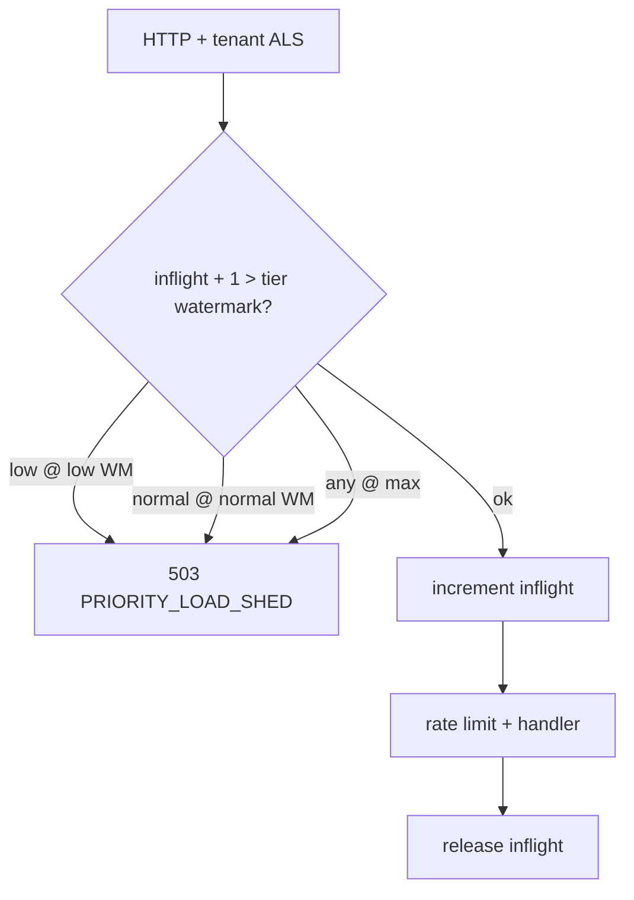

# Tenant priority load shed (DEC-114 / evolution Phase 4.5)

```yaml
status: implemented
phase: 5 evolution — Phase 4.5
closes: SCAL-LIM-05, SCAL-LIM-12 (partial)
related: rate-limiting.md, phase5-evolution-audit.md § Scalability Limit
```

## Problem

Under spike load all tenants shared the same **429** rate-limit class and **503** pool saturation with **no priority** — bulk low-priority importers could starve high-priority tenants ([SCAL-LIM-05](phase5-evolution-audit.md)).

## Decision

| Item            | Choice                                                                        |
| --------------- | ----------------------------------------------------------------------------- |
| Tier source     | `tenants.theme.priorityTier` — `low` \| `normal` \| `high` (default `normal`) |
| Admission       | `acquireWeightedFairAdmission(tenantId)` in `runWithHttpRequestContext`       |
| Global inflight | Process-wide counter; shed before business logic                              |
| Low tier        | **503** when `inflight > LOW_WATERMARK`                                       |
| Normal tier     | **503** when `inflight > NORMAL_WATERMARK`                                    |
| High tier       | **503** only at hard `GLOBAL_HTTP_INFLIGHT_MAX`                               |
| Response        | `PriorityLoadShedError` → **503** + `Retry-After` + code `PRIORITY_LOAD_SHED` |
| Exempt          | `/health` (no `runWithHttpRequestContext`)                                    |

### Environment

| Variable                                 | Default          | Role                        |
| ---------------------------------------- | ---------------- | --------------------------- |
| `PRIORITY_LOAD_SHED_ENABLED`             | `true`           | Master switch               |
| `GLOBAL_HTTP_INFLIGHT_MAX`               | 64               | Hard cap                    |
| `GLOBAL_HTTP_LOW_TIER_SHED_WATERMARK`    | 38 (~60% of max) | Shed `low` first            |
| `GLOBAL_HTTP_NORMAL_TIER_SHED_WATERMARK` | 58 (~90% of max) | Shed `normal` before `high` |
| `PRIORITY_LOAD_SHED_RETRY_AFTER_SEC`     | 2                | Client backoff hint         |

## Flow



## Integration test isolation

`weighted-fair-admission.spec.ts` seeds `priorityTier` via `seedTenantRegistryCacheForTests` and asserts watermark ordering (low sheds before normal; high survives until hard max).

When `DATABASE_URL` is set (phase-4/5 CI gates), **UUID-shaped** tenant ids take the Postgres branch in `resolveRegisteredTenant`. Seeded `tenants` rows can return `theme.priorityTier: normal` and override the in-memory cache, so shed assertions fail even though production admission still reads cache-first for slug ids.

The spec therefore uses **slug** tenant ids (`dec114-tenant-low`, `dec114-tenant-high`) so tier resolution stays on the registry cache path under full gate runs.

## Verification

```bash
cd apps/api
pnpm run guard:priority-load-shed
node --import tsx --test src/http/weighted-fair-admission.spec.ts src/tenant/tenant-priority-tier.spec.ts
pnpm run phase-5:evolution-gate
```
