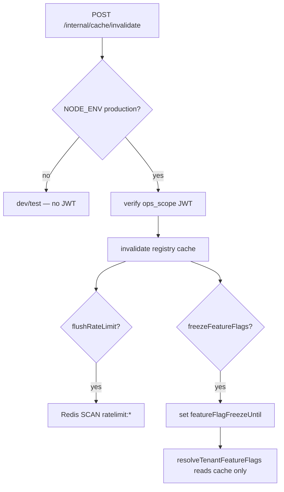

# Production cache invalidate + feature-flag freeze (DEC-120)

```yaml
status: implemented
phase: 5 evolution — Platform 5.2
closes: RB-GAP-11, RB-GAP-12, RB-GAP-13 (prod path)
extends: DEC-106
related: internal-cache-invalidate.md, jwt-dual-key-verify.md DEC-107
```

## Problem

| Gap           | Issue                                                                                     |
| ------------- | ----------------------------------------------------------------------------------------- |
| **RB-GAP-12** | Tenant registry invalidation API dev/test only — prod rollback needs manual ops           |
| **RB-GAP-13** | Redis `ratelimit:*` flush only via runbook `SCAN` in production                           |
| **RB-GAP-11** | Feature flags re-read live `tenants.theme` during rollback — behavior can flip mid-revert |

## Decision

`POST /internal/cache/invalidate` is **dual-mode**:

| Environment            | Auth              | Behavior                                                             |
| ---------------------- | ----------------- | -------------------------------------------------------------------- |
| `development` / `test` | None (DEC-106)    | Same as before                                                       |
| `production`           | RS256 service JWT | Registry invalidate + optional Redis flush + optional feature freeze |

### Service JWT (production)

Uses the same PEM overlap window as member JWT (DEC-107):

| Claim       | Required value                                     |
| ----------- | -------------------------------------------------- |
| `iss`       | `AUTH_JWT_ISSUER`                                  |
| `aud`       | `AUTH_JWT_AUDIENCE`                                |
| `ops_scope` | `cache:invalidate` (string) or array containing it |
| `sub`       | Non-empty service subject (e.g. `svc-rollback`)    |

Missing or invalid JWT → **401** `UNAUTHORIZED_CACHE_INVALIDATE_SERVICE_JWT`.

Mint tokens with the **platform ops** private key (not end-user IdP). Overlap rotation: verify tries `AUTH_JWT_PUBLIC_KEY` then `AUTH_JWT_PUBLIC_KEY_PREVIOUS`.

### Request body (extended)

| Field                             | Effect                                                           |
| --------------------------------- | ---------------------------------------------------------------- |
| `tenantId` + optional `subdomain` | `invalidateTenantRegistryCache`                                  |
| `flushRateLimit: true`            | `SCAN` + `DEL` `ratelimit:*` when `REDIS_URL` set                |
| `freezeFeatureFlags: true`        | Activates in-process freeze (see below)                          |
| `featureFlagFreezeSeconds`        | Optional 1–3600; default `FEATURE_FLAG_FREEZE_DEFAULT_SEC` (600) |

### Feature-flag freeze (RB-GAP-11)

When freeze is active, `resolveTenantFeatureFlags` **does not** query Postgres for theme JSON:

1. Use cached `tenants.theme` from registry cache if present.
2. On cache miss → default flags (`advancedRuleEngine: true`).

Freeze sources:

| Source | Mechanism                                                                       |
| ------ | ------------------------------------------------------------------------------- |
| API    | `freezeFeatureFlags: true` on authenticated prod invalidate                     |
| Boot   | `FEATURE_FLAG_FREEZE_UNTIL` ISO-8601 timestamp (ops-set during rollback window) |

Clear freeze: wait for TTL expiry or restart pods without `FEATURE_FLAG_FREEZE_UNTIL`.



## Environment

| Variable                          | Default | Role                                     |
| --------------------------------- | ------- | ---------------------------------------- |
| `FEATURE_FLAG_FREEZE_DEFAULT_SEC` | `600`   | API freeze duration when seconds omitted |
| `FEATURE_FLAG_FREEZE_UNTIL`       | unset   | Boot-time freeze deadline (ISO)          |

## Ingress

`/internal/*` must stay off public ingress (DEC-GAP-02). Production invalidate is for **cluster-internal** rollback automation (CronJob / Argo post-promotion hook), not browser clients.

## Verification

```bash
cd apps/api
pnpm run guard:internal-cache-invalidate
pnpm run phase-5:evolution-gate
node --import tsx --test src/internal/verify-cache-invalidate-service-jwt.spec.ts
node --import tsx --test src/tenant/feature-flag-freeze.spec.ts
node --import tsx --test test/4-integration/internal-cache-invalidate.spec.ts
```
