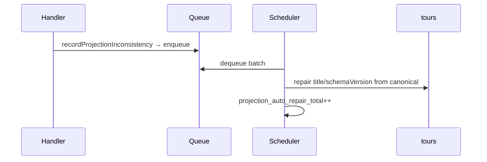

# Projection auto-reconcile scheduler (DEC-115 / evolution Phase 4.6)

```yaml
status: implemented
phase: 5 evolution — Phase 4.6
closes: phase4 F-04 (partial)
extends: outbox-projection-reconcile.md (DEC-088)
```

## Problem

When a downstream idempotent handler failed after outbox `done`, `projection_inconsistency_total` incremented but ops had to **manually** run `reconcile:tour-projection` — tour `title` / `schema_version` could drift from canonical SoT ([F-04](phase4-resilience-audit.md)).

## Decision

| Item      | Choice                                                                            |
| --------- | --------------------------------------------------------------------------------- |
| Trigger   | `enqueueProjectionAutoReconcile` on `recordProjectionInconsistency`               |
| Repair    | `deriveTourProjections(canonical)` → update `tours.title` / `schema_version` only |
| Scheduler | `startProjectionAutoReconcileIfEnabled` — `setInterval` drain queue               |
| Batch     | Up to `PROJECTION_AUTO_RECONCILE_BATCH_SIZE` tasks per tick                       |
| Metric    | `projection_auto_repair_total{tenant_id}`                                         |
| CLI       | `reconcile:tour-projection --repair` optional explicit repair                     |

### Environment

| Variable                                | Default                                          | Role              |
| --------------------------------------- | ------------------------------------------------ | ----------------- |
| `PROJECTION_AUTO_RECONCILE_ENABLED`     | on when `STORAGE_DRIVER=prisma` + `DATABASE_URL` | Master switch     |
| `PROJECTION_AUTO_RECONCILE_INTERVAL_MS` | 30000                                            | Scheduler cadence |
| `PROJECTION_AUTO_RECONCILE_BATCH_SIZE`  | 10                                               | Tasks per tick    |

## Flow



## Verification

```bash
cd apps/api
pnpm run guard:projection-auto-reconcile
node --import tsx --test src/outbox/reconcile-tour-projection.spec.ts src/outbox/projection-reconcile-queue.spec.ts
pnpm run phase-5:evolution-gate
```
