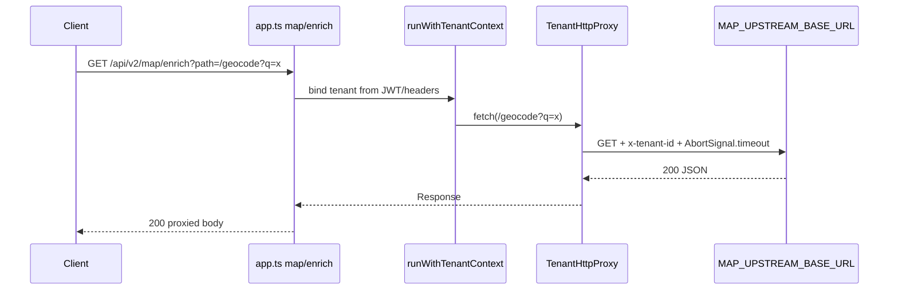

# TenantHttpProxy production wiring (DEC-093 / Wave D)

```yaml
status: implemented
phase: 4 resilience — Wave D
closes: PI-03
related: tenant-http-proxy.md, proxy-upstream-timeout.md
fail_closed_auth: "Map enrich binds ALS via resolveTenantContextFromRequest + runWithHttpRequestContext (same as tenant-config). Tenant id must resolve a registered workspace type — random UUIDs yield WORKSPACE_TYPE_UNRESOLVED (404), not a proxy miss."
```

## Problem

`TenantHttpProxy` (DEC-075 timeout + circuit breaker) existed with integration tests but **`main.ts` never constructed it** (PI-03). Map/enrichment could not ride the bounded outbound seam on the real HTTP server — wiring without DI would duplicate timeout logic or bypass ALS tenant header injection.

## Decision

| Item         | Choice                                                                                            |
| ------------ | ------------------------------------------------------------------------------------------------- |
| Env          | `MAP_UPSTREAM_BASE_URL` — upstream base URL (map mock or real geocoder)                           |
| Bootstrap    | `main.ts` constructs `TenantHttpProxy` when env set; passes via `AppDeps.tenantHttpProxy`         |
| Route        | `GET /api/v2/map/enrich?path=<upstream-path>`                                                     |
| Auth         | Same as `/api/v2/tenant-config` — `resolveTenantContextFromRequest` + `runWithHttpRequestContext` |
| Cache        | `cacheResponses: true` for GET                                                                    |
| Unconfigured | Route returns **503** `MAP_UPSTREAM_NOT_CONFIGURED` when proxy not injected                       |
| Proxy errors | `PROXY_UPSTREAM_TIMEOUT` → **504**; `PROXY_CIRCUIT_OPEN` → **503**                                |
| Guard        | `guard:proxy-production-wire`                                                                     |
| Spec         | `test/4-integration/proxy-production-wire.spec.ts`                                                |

## Flow



## Configuration

```bash
# apps/api/.env.example
MAP_UPSTREAM_BASE_URL=https://map-api.example.com
PROXY_UPSTREAM_TIMEOUT_MS=5000
PROXY_CIRCUIT_FAILURE_THRESHOLD=5
PROXY_CIRCUIT_OPEN_MS=30000
```

When `MAP_UPSTREAM_BASE_URL` is unset (typical local dev without map vendor), the server boots normally; map enrich returns **503** until configured.

## Verification

```bash
cd apps/api
NODE_ENV=test STORAGE_DRIVER=memory \
  node --import tsx --test test/4-integration/proxy-production-wire.spec.ts
pnpm run guard:proxy-production-wire
```

| Assertion                                                       | Proves                           |
| --------------------------------------------------------------- | -------------------------------- |
| Mock upstream receives `x-tenant-id` from ALS (registered tenant) | Production route uses proxy seam |
| Spec uses a **registry** tenant id (e.g. operator smoke `…014`) — not `integrationTenantId()` | Avoids false 404 `WORKSPACE_TYPE_UNRESOLVED` |
| `main.ts` passes `tenantHttpProxy` into `createRequestListener` | DI wiring (PI-03 closed)         |
| Without proxy dep → 503 `MAP_UPSTREAM_NOT_CONFIGURED`           | Fail-closed when env absent      |

## Phase boundaries

| Capability                   | Phase                      |
| ---------------------------- | -------------------------- |
| DI + single map enrich route | **5** (this doc)           |
| Egress URL allowlist (SSRF)  | **6+**                     |
| Full geocoding BFF parity    | legacy / future `apps/web` |
