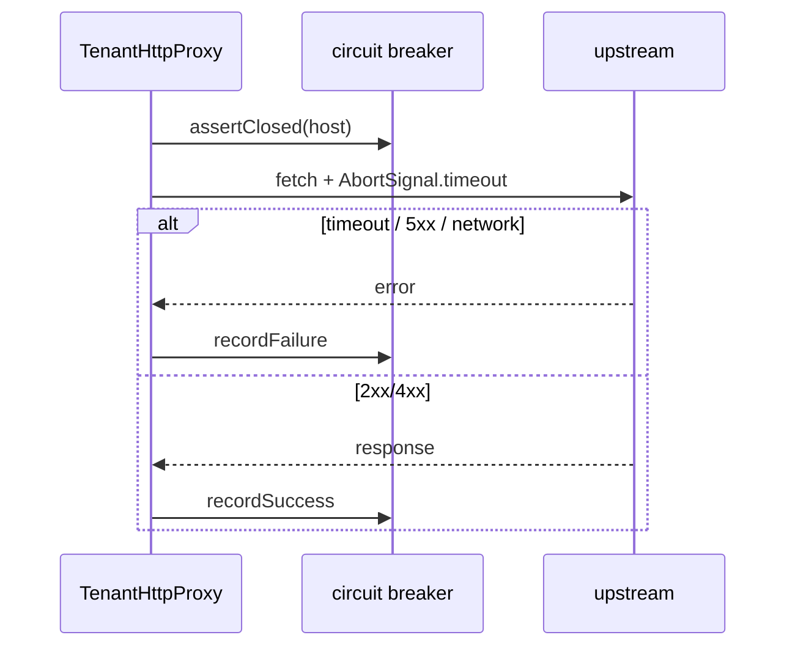

# Proxy upstream timeout + circuit breaker (DEC-075 / Phase 4 step 5)

```yaml
status: implemented
phase: 4 resilience audit — closure step 5
closes: PI-01
related: tenant-http-proxy.md, phase4-resilience-audit.md § proxy
```

## Problem

`TenantHttpProxy.fetch` called `fetch` without `AbortSignal` or circuit breaker. A hung map/geocode upstream could hold request continuations until OS defaults — **systemic** once map routes wire ([PI-01](phase4-resilience-audit.md)).

## Decision

| Item            | Choice                                                                                                              |
| --------------- | ------------------------------------------------------------------------------------------------------------------- |
| Timeout         | `PROXY_UPSTREAM_TIMEOUT_MS` (default **5000** ms) via `AbortSignal.timeout` when caller omits `signal`              |
| Circuit breaker | Per proxy instance / upstream host — `PROXY_CIRCUIT_FAILURE_THRESHOLD` (**5**), `PROXY_CIRCUIT_OPEN_MS` (**30000**) |
| Trip condition  | Network error, abort/timeout, HTTP **≥ 500**                                                                        |
| Open behavior   | `ProxyCircuitOpenError` — fast-fail until cooldown                                                                  |
| Metrics         | `proxy_upstream_timeout_total`, `proxy_upstream_circuit_open_total`                                                 |

## Flow



## Verification

```bash
cd apps/api && pnpm run guard:proxy-upstream-timeout
node --import tsx --test src/proxy/tenant-http-proxy.spec.ts
node --import tsx --test test/4-integration/proxy-upstream-timeout.spec.ts
```
