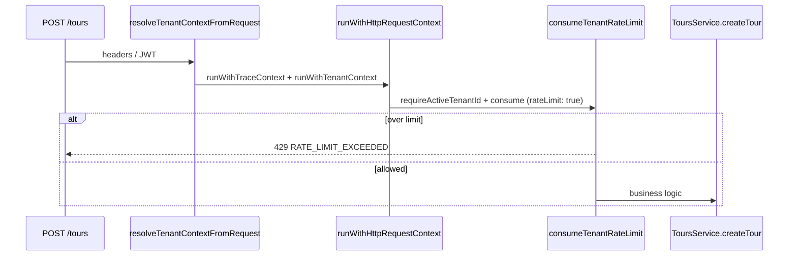
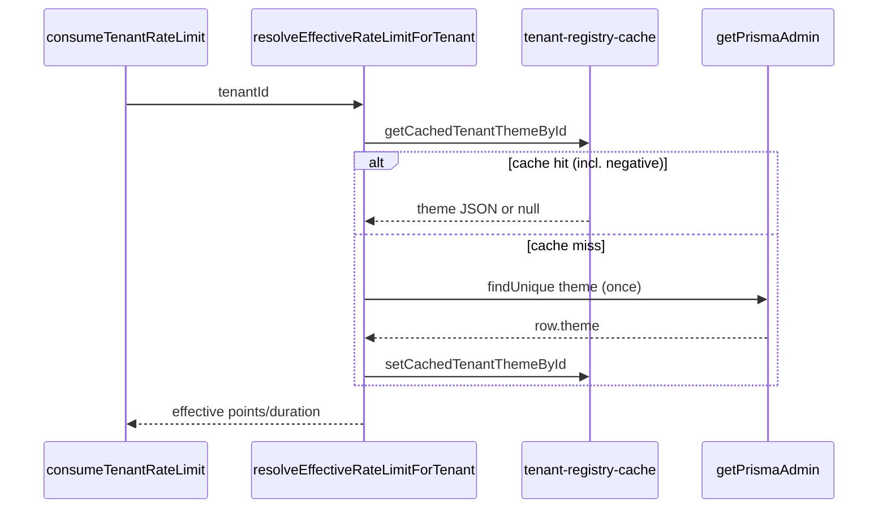

# Per-tenant HTTP rate limiting (DEC-015)

> **Implementation:** `apps/api/src/middleware/tenant-rate-limiter.ts`  
> **HTTP bind order:** `apps/api/src/http/bind-request-context.ts` (`rateLimit: true` after auth + tenant ALS)  
> **Phase 7.6 target:** Redis tier keys — [`docs/phase-7/subphases/7.6-rate-limits.md`](../../phase-7/subphases/7.6-rate-limits.md)

## Problem

Without per-tenant request throttling, one tenant’s burst on `POST /tours` can saturate the Node event loop and deny service to others (`noise-neighbor.spec.ts`, `noisy-neighbor-latency.spec.ts`, `tenant-rate-limiting.spec.ts`).

## Algorithm

| Property  | Value                                                                                                                    |
| --------- | ------------------------------------------------------------------------------------------------------------------------ |
| Model     | **Token bucket** via [`rate-limiter-flexible`](https://github.com/animir/node-rate-limiter-flexible) `RateLimiterMemory` |
| Key       | `tenant_id` from ALS (`requireActiveTenantId()` after HTTP bind)                                                         |
| Isolation | One bucket **per tenant** — not a global shared bucket                                                                   |
| Blocking  | `consume()` is async; does not block the event loop synchronously                                                        |

Each accepted request consumes **one point**. When the bucket is empty, the library rejects with `RateLimiterRes` and the API returns HTTP **429**.

## Store port (Redis migration)

```typescript
export interface RateLimiterStore {
  consume(
    tenantKey: string,
    options?: { readonly points: number; readonly durationSec: number }
  ): Promise<void>;
}
```

| Phase                  | Store                    | Notes                                                                                                                                      |
| ---------------------- | ------------------------ | ------------------------------------------------------------------------------------------------------------------------------------------ |
| 5.6 interim (trunk)    | `MemoryRateLimiterStore` | In-process; one `RateLimiterMemory` per distinct `(points, durationSec)` config                                                            |
| 7.6 / P1-1             | `RedisRateLimiterStore`  | When `REDIS_URL` is set — [`redis-rate-limiter-store.ts`](../../../apps/api/src/middleware/redis-rate-limiter-store.ts) + `ioredis` client |
| 5.6 interim (no Redis) | `MemoryRateLimiterStore` | Default when `REDIS_URL` unset                                                                                                             |

**Redis activation:** set `REDIS_URL=redis://127.0.0.1:6379` (or managed URL). Without it, trunk stays in-memory (documented BLOCKER for multi-replica fairness in 7.6 until Redis is provisioned).

## Production fail-closed (DEC-065 / SCAL-DEBT-04)

When `NODE_ENV=production` and tenant rate limiting is **enabled** (`TENANT_RATE_LIMIT_ENABLED` not `false`), boot calls `assertProductionRedisUrl()` and throws `PRODUCTION_REDIS_URL_REQUIRED` if `REDIS_URL` is missing or empty. This prevents unbounded in-memory limiter keys (RL-DOS-02) on public ingress.

| Production misconfig                | Error                                                         |
| ----------------------------------- | ------------------------------------------------------------- |
| Rate limit on + missing `REDIS_URL` | `PRODUCTION_REDIS_URL_REQUIRED`                               |
| `TENANT_RATE_LIMIT_ENABLED=false`   | Guard skipped — ops must accept per-process limiter semantics |

CI lock: `pnpm run guard:production-redis-url` from `apps/api`.

## Runtime Redis fallback (DEC-083 / Wave B)

When Redis is configured but **unreachable at request time**, tiered policy avoids **500**:

| Tier                          | Default policy | On Redis blip                           |
| ----------------------------- | -------------- | --------------------------------------- |
| `write` (`POST/PATCH /tours`) | `fail_local`   | In-process memory limiter (bounded 429) |
| `read`                        | `fail_open`    | Allow request                           |

Override all tiers: `TENANT_RATE_LIMIT_REDIS_FAILURE_POLICY=fail_closed|fail_local|fail_open`.

Circuit: 3 consecutive Redis errors → 30s open → policy path without Redis. Metric: `rate_limiter_redis_fallback_total`.

See [`redis-rate-limiter-fallback.md`](redis-rate-limiter-fallback.md).

## HTTP pipeline order



Rate limiting runs **after** tenant authentication and ALS bind, **before** `ToursService.createTour`.

### Read tier — `GET /tours` and `GET /tours/:id` (P0-8)

Reads and writes use **independent token buckets** per tenant (`{tenantId}:read` vs `{tenantId}:write`). `TENANT_RATE_LIMIT_READ_POINTS` defaults to `TENANT_RATE_LIMIT_POINTS` when unset. List and get-by-id handlers use `rateLimit: 'read'` so a neighbor’s read storm is throttled without consuming the write bucket used by victim `POST /tours`.

| Route            | `rateLimit` | Module                                 |
| ---------------- | ----------- | -------------------------------------- |
| `POST /tours`    | `true`      | `tours.routes.ts` → `handleCreateTour` |
| `GET /tours`     | `read`      | `tours.routes.ts` → `handleListTours`  |
| `GET /tours/:id` | `read`      | `tours.routes.ts` → `handleGetTour`    |

List response omits full `canonical` per row — see [tours-list-endpoint.md](tours-list-endpoint.md).

Probe: `apps/api/test/2-observability/noise-neighbor.spec.ts` (500 parallel GET tenant A + POST tenant B).

## Environment variables

| Variable                         | Default            | Role                                       |
| -------------------------------- | ------------------ | ------------------------------------------ |
| `TENANT_RATE_LIMIT_ENABLED`      | `true`             | Set `false` to disable                     |
| `TENANT_RATE_LIMIT_POINTS`       | `50`               | Default max requests per tenant per window |
| `TENANT_RATE_LIMIT_DURATION_SEC` | `1`                | Window length (seconds)                    |
| `TENANT_RATE_LIMIT_READ_POINTS`  | _(same as points)_ | Optional separate cap for `GET /tours/:id` |

Effective default: **50 req/s** per tenant when env vars are unset.

## Per-tenant override (`tenants.theme`)

Overrides apply **per tenant** without changing the global env default.

| Store                         | JSON path                   | Example                                     |
| ----------------------------- | --------------------------- | ------------------------------------------- |
| Postgres `tenants.theme`      | `rateLimitRps`              | `{ "rateLimitRps": 200 }`                   |
| Same                          | `featureFlags.rateLimitRps` | `{ "featureFlags": { "rateLimitRps": 5 } }` |
| Static `DEV_TENANTS` registry | same keys on `theme`        | integration / local probes                  |

**Precedence:** `theme.rateLimitRps` → `theme.featureFlags.rateLimitRps` → env `TENANT_RATE_LIMIT_POINTS`.

Resolution mirrors `resolveTenantFeatureFlags`: registry first, then Postgres when `DATABASE_URL` is set. With `STORAGE_DRIVER=memory` and no `DATABASE_URL`, HTTP probes use env defaults only (random `integrationTenantId` rows are not required).

**Admin DB amplification (RL-DOS-01 / DEC-053):** `resolveEffectiveRateLimitForTenant` uses `resolveTenantThemeJsonById` — **5s TTL read-through cache** + **negative cache** for unknown UUIDs (`tenant-registry-cache.ts`). Theme cache is consulted **before** any Postgres branch (including test seeds via `setCachedTenantThemeById`); DB `findUnique` runs only on cache miss. No uncached `findUnique` per HTTP consume on cache hit.



## 429 contract

**Header:** `Retry-After` (seconds, RFC 7231)

**Body:**

```json
{
  "error": "Rate limit exceeded",
  "code": "RATE_LIMIT_EXCEEDED",
  "retryAfter": "1"
}
```

`retryAfter` is seconds as a string. Distinct from tour capacity 429 (`TOUR_CAPACITY_EXCEEDED_*`).

## Performance probes

| Spec                              | Scenario                                             | SLO                                                                                                                                                                  |
| --------------------------------- | ---------------------------------------------------- | -------------------------------------------------------------------------------------------------------------------------------------------------------------------- |
| `tenant-rate-limiter.spec.ts`     | 20 concurrent A + 5 concurrent B, limit 10/s         | Exactly `LIMIT`×201 and remainder `RATE_LIMIT_EXCEEDED` for A; all B succeed                                                                                         |
| `tenant-rate-limiting.spec.ts`    | A flooded, B concurrent                              | A: mix of 201 + `RATE_LIMIT_EXCEEDED`; B: 2xx and latency ≤ `max(p50 × TENANT_B_LATENCY_RATIO_MAX, TENANT_B_LATENCY_MIN_BUDGET_MS)` (defaults **2.0** and **500ms**) |
| `tenant-rate-limiter-100.spec.ts` | **100** unique tenants × 1 concurrent POST (DEC-059) | All **201**; p95 ≤ **8s**; admin lookups ≤ **100** when Postgres; second wave **0** new admin lookups                                                                |
| `noise-neighbor.spec.ts`          | 500× GET A + POST B (Postgres)                       | B write p95 ≤ baseline × `RATIO_THRESHOLD` (default **4**)                                                                                                           |

CPU-only fairness (no HTTP) uses **10%** slack in `noisy-neighbor-latency.spec.ts` (`BASELINE_RATIO_MAX=1.10` default). Phase 5/4 gates inject **1.25** / **1.30** — see [`baseline-ratio-tiering.md`](baseline-ratio-tiering.md) (CON-06). HTTP probes use a **ratio plus floor** because solo baseline p50 understates event-loop scheduling under a concurrent burst on the same listener.

```bash
cd apps/api && NODE_ENV=test STORAGE_DRIVER=memory \
  node --import tsx --test test/3-performance/tenant-rate-limiting.spec.ts \
  test/3-performance/tenant-rate-limiter.spec.ts

# 100-tenant flood (DEC-059 / SCAL-DEBT-14)
cd apps/api && NODE_ENV=test STORAGE_DRIVER=memory \
  node --import tsx --test test/3-performance/tenant-rate-limiter-100.spec.ts
```

## Cross-references

- **DEC-015** — [`IMPLEMENTATION-DECISIONS.md`](IMPLEMENTATION-DECISIONS.md)
- Trace ALS order — [`trace-request-context.md`](trace-request-context.md)
- Feature flags (same theme JSON) — [`feature-flag-degradation.md`](feature-flag-degradation.md)
