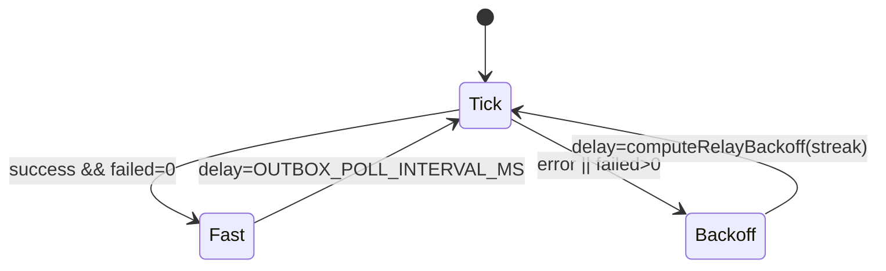

# Relay / poll exponential backoff + jitter (DEC-111 / evolution Phase 4.2)

```yaml
status: implemented
phase: 5 evolution — Phase 4.2
closes: SH-GAP-06, SH-GAP-09, SH-GAP-10, SH-GAP-11, SH-GAP-12
related: outbox-publish-auto-retry.md, graceful-shutdown-outbox-drain.md
```

## Problem

Fixed-interval polling amplified load during outages:

| Site                  | Before                     | Risk                                                   |
| --------------------- | -------------------------- | ------------------------------------------------------ |
| Outbox relay tick     | `setInterval` @ 1s forever | DB blip → error storm every 1s (SH-GAP-06/09)          |
| Shutdown drain loop   | `setTimeout(50)` fixed     | Tight spin under DB failure (SH-GAP-10)                |
| HTTP idempotency wait | `setTimeout(25)` × 30s     | Up to ~1200 DB polls per duplicate POST (SH-GAP-11/12) |

Modern pattern: **exponential backoff with capped jitter** — same helper across background loops.

## Decision

| Item             | Choice                                                                                       |
| ---------------- | -------------------------------------------------------------------------------------------- |
| Helper           | `computeRelayBackoff({ attempt, baseMs, maxMs })` in `resilience/compute-relay-backoff.ts`   |
| Formula          | `min(maxMs, baseMs × 2^(attempt−1)) + jitter` where jitter ∈ `[0, capped × 0.25]`            |
| Relay scheduler  | `setTimeout` chain (replaces fixed `setInterval`); backoff on tick **error** or `failed > 0` |
| Shutdown drain   | backoff between drain iterations (`OUTBOX_SHUTDOWN_DRAIN_BACKOFF_*`)                         |
| Idempotency poll | backoff per wait iteration (`HTTP_IDEMPOTENCY_POLL_*`)                                       |
| Success reset    | Relay `failureStreak = 0` when tick completes without error and `failed === 0`               |

### Environment

| Variable                                | Default | Role                         |
| --------------------------------------- | ------- | ---------------------------- |
| `OUTBOX_POLL_INTERVAL_MS`               | 1000    | Relay base delay (unchanged) |
| `OUTBOX_POLL_BACKOFF_MAX_MS`            | 8000    | Relay backoff cap            |
| `OUTBOX_SHUTDOWN_DRAIN_BACKOFF_BASE_MS` | 50      | Shutdown loop base           |
| `OUTBOX_SHUTDOWN_DRAIN_BACKOFF_MAX_MS`  | 500     | Shutdown loop cap            |
| `HTTP_IDEMPOTENCY_POLL_BASE_MS`         | 25      | Idempotency wait base        |
| `HTTP_IDEMPOTENCY_POLL_MAX_MS`          | 500     | Idempotency wait cap         |

## Flow (relay)



## Modules

| Module                                | Change                         |
| ------------------------------------- | ------------------------------ |
| `resilience/compute-relay-backoff.ts` | Shared backoff + env readers   |
| `outbox/start-outbox-relay.ts`        | Dynamic `setTimeout` scheduler |
| `outbox/outbox-processing-reclaim.ts` | Drain loop backoff             |
| `http/http-idempotency.ts`            | Prisma + memory wait backoff   |

## Verification

```bash
cd apps/api
pnpm run guard:relay-backoff
node --import tsx --test src/resilience/compute-relay-backoff.spec.ts
pnpm run phase-5:evolution-gate
```
