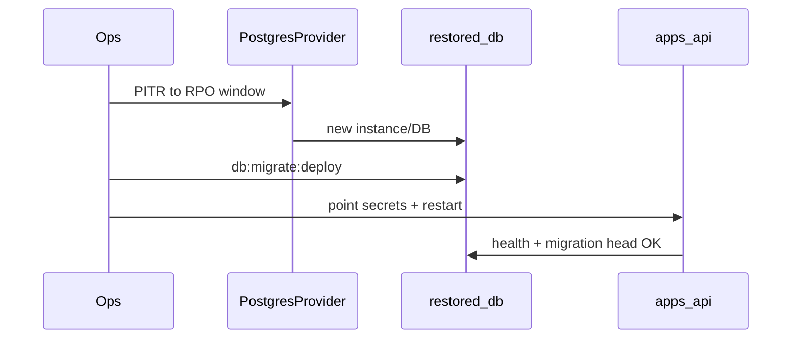

# RPO/RTO — canonical Postgres SoT (DEC-125)

```yaml
status: implemented
phase: 5 evolution — Platform 5.8
closes: CAE-GAP-14
related: production-deploy-checklist.md, migration-head-preflight.md DEC-097
```

## Problem

Canonical tour SoT (`tours`, `outbox_events`, `audit_events`) had **no documented** recovery point/time objectives. Ops relied on out-of-band Postgres PITR without in-repo verification ([CAE-GAP-14](phase5-evolution-audit.md)).

## Decision

| Objective | Target           | Mechanism                                                 |
| --------- | ---------------- | --------------------------------------------------------- |
| **RPO**   | ≤ **15 minutes** | Managed Postgres WAL / PITR (ops provider)                |
| **RTO**   | ≤ **60 minutes** | Restore snapshot → `db:migrate:deploy` verify → API smoke |

### Scope tables (canonical SoT)

| Table                     | Role                       |
| ------------------------- | -------------------------- |
| `tenants`                 | Registry metadata          |
| `tours`                   | Canonical JSONB document   |
| `outbox_events`           | Transactional outbox       |
| `audit_events`            | Forensic append-only trail |
| `processed_domain_events` | Idempotent consumer cursor |

### Forbidden recovery actions

| Action                                 | Why                                         |
| -------------------------------------- | ------------------------------------------- |
| `prisma migrate reset` on production   | Destructive — forward-only policy (DEC-124) |
| `pnpm run db:test-reset` on production | DEC-095 prod URL guard — dev/test only      |
| Hand-edit applied `migration.sql`      | Checksum drift blocks deploy (MD-GAP-11)    |

## Recovery playbook (operator)

1. **Detect** — SLO alert, admin error, or storage failure.
2. **Stabilize** — stop ingress / blue-green hold (DEC-118).
3. **Restore** — provider PITR or snapshot to **new** database endpoint.
4. **Verify schema** — `pnpm --filter @apps/api run db:migrate:deploy` on restored DB (idempotent).
5. **Boot check** — API `migration-head-preflight` (DEC-097) + `GET /health`.
6. **Cutover** — update `DATABASE_URL` / `DATABASE_URL_ADMIN` secrets; rolling restart.
7. **Replay** — outbox failed replay if needed (DEC-086).



## Monthly restore drill

Automated smoke (in-repo):

| Artifact                                                                                              | Role                                          |
| ----------------------------------------------------------------------------------------------------- | --------------------------------------------- |
| [`scripts/restore-drill-smoke.sh`](../../../scripts/restore-drill-smoke.sh)                           | `pg_dump` → restore to temp DB → count verify |
| [`.github/workflows/restore-drill-monthly.yml`](../../../.github/workflows/restore-drill-monthly.yml) | Cron 1st of month + `workflow_dispatch`       |

Drill proves **backup/restore mechanics** on disposable CI Postgres — not production data.

## Verification

```bash
pnpm --filter @apps/api run guard:rpo-rto-restore-drill
bash scripts/restore-drill-smoke.sh   # requires DATABASE_URL_ADMIN + pg_dump/psql
```
