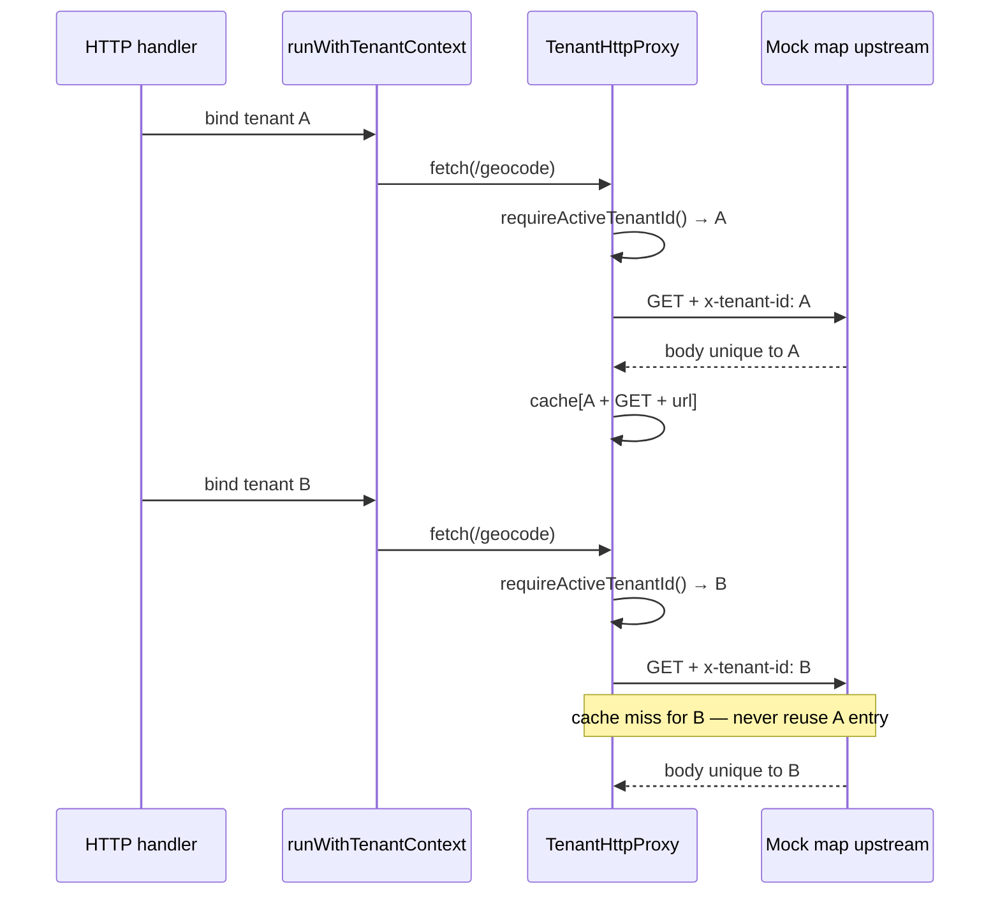

# Tenant HTTP proxy (outbound external API seam)

```yaml
agent_load_tier: T2_behavioral
scope: outbound map / enrichment HTTP via ALS-bound tenant header + per-tenant response cache
cross_ref:
  tenant_als: apps/api/src/tenant/tenant-request-context.ts
  async_propagation: apps/api/test/0-functional/async-propagation.spec.ts
  verification: apps/api/test/4-integration/proxy-tenant-isolation.spec.ts
```

## Purpose

Tour flows eventually call **external HTTP APIs** (map geocoding, enrichment, etc.) from request-scoped work already bound with `runWithTenantContext`. The proxy seam ensures:

1. **`x-tenant-id` is injected on every outbound request** from `requireActiveTenantId()` — callers must not pass a spoofed tenant header that overrides ALS.
2. **Optional GET response cache is keyed by `(tenantId, method, url)`** — Tenant B must never receive Tenant A’s cached body for the same upstream path.

This is the Phase 5 **minimal** implementation; production map credentials, egress allowlists, and OTel propagation remain Phase 6+.

## Module location

| Artifact                 | Path                                            |
| ------------------------ | ----------------------------------------------- |
| Proxy                    | `apps/api/src/proxy/tenant-http-proxy.ts`       |
| Outbound header constant | `TENANT_PROXY_OUTBOUND_HEADER` (`x-tenant-id`)  |
| ALS source               | `apps/api/src/tenant/tenant-request-context.ts` |

## Behavior



| Rule             | Detail                                                                                                                                        |
| ---------------- | --------------------------------------------------------------------------------------------------------------------------------------------- |
| Header injection | `headers.set("x-tenant-id", requireActiveTenantId())` after merging caller headers; ALS wins over inbound spoof attempts on the outbound leg. |
| Fail-closed      | `fetch` outside `runWithTenantContext` throws `TENANT_CONTEXT_NOT_BOUND`.                                                                     |
| Cache key        | `` `${tenantId}\0${method}\0${resolvedUrl}` `` — NUL separator prevents key collision.                                                        |
| Cache scope      | Only `GET` when `cacheResponses: true`; mutations never cached.                                                                               |
| `STORAGE_DRIVER` | Proxy is HTTP-only; integration test uses `memory` and an in-process mock upstream (no real map API).                                         |

## Upstream bounds (DEC-075 / PI-01)

See [`proxy-upstream-timeout.md`](proxy-upstream-timeout.md) — `AbortSignal.timeout`, per-host circuit breaker, timeout/circuit metrics.

## Verification

```bash
cd apps/api && NODE_ENV=test STORAGE_DRIVER=memory node --import tsx --test test/4-integration/proxy-tenant-isolation.spec.ts
pnpm run guard:proxy-upstream-timeout
node --import tsx --test test/4-integration/proxy-upstream-timeout.spec.ts
```

| Assertion                                                          | Proves                                            |
| ------------------------------------------------------------------ | ------------------------------------------------- |
| Mock upstream captures `x-tenant-id` per tenant                    | Automatic header injection                        |
| Tenant B body ≠ Tenant A after A cached same URL                   | No cross-tenant cache bleed                       |
| Second GET for same tenant hits cache (upstream call count stable) | Per-tenant cache works without cross-tenant reuse |

## Phase boundaries

| Capability                                              | Phase                               |
| ------------------------------------------------------- | ----------------------------------- |
| ALS-bound outbound `x-tenant-id` + per-tenant GET cache | **5** (this doc)                    |
| Egress URL allowlist / signed upstream                  | **6+**                              |
| BFF → API proxy (Next.js)                               | legacy `apps/web` — not this module |
