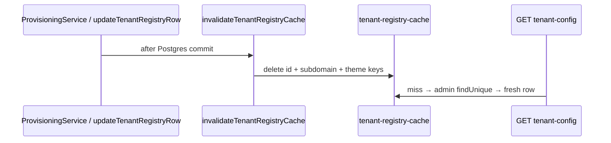

# Tenant registry cache invalidation (DEC-074 / Phase 4 step 4)

```yaml
status: implemented
phase: 4 resilience audit — closure step 4
closes: PU-F-01, PU-F-04 (partial)
related: registry-cache-bounds.md (DEC-068), phase4-resilience-audit.md § hot-reload
```

## Problem

`tenant-registry-cache.ts` serves `resolveRegisteredTenantById`, subdomain lookups, and `resolveTenantThemeJsonById` (rate limiter) with a **5s TTL**. Admin `tenants` writes (provision, theme update) did **not** evict cache entries — GET `/api/v2/tenant-config` and rate-limit theme reads could serve **stale** workspace/flags for up to TTL ([PU-F-01](phase4-resilience-audit.md)).

Integration tests masked the gap via `resetTenantRegistryCacheForTests()` ([PU-F-06](phase4-resilience-audit.md)).

## Decision

| Item         | Choice                                                                           |
| ------------ | -------------------------------------------------------------------------------- |
| API          | `invalidateTenantRegistryCache(tenantId, subdomain?)`                            |
| Maps cleared | `byId`, `themeById`, and `bySubdomain` when subdomain provided                   |
| Write hooks  | `ProvisioningService` upsert/create; `updateTenantRegistryRow` for admin updates |
| Metric       | `tenant_registry_cache_invalidated_total`                                        |

## Flow



## Ops note

Direct SQL or external admin tools must call `invalidateTenantRegistryCache` on the app instance (or wait 5s TTL). In-process writes through provisioning / `updateTenantRegistryRow` invalidate automatically.

## Verification

```bash
cd apps/api && pnpm run guard:tenant-registry-cache-invalidation
node --import tsx --test src/tenant/tenant-registry-cache-invalidation.spec.ts
```
